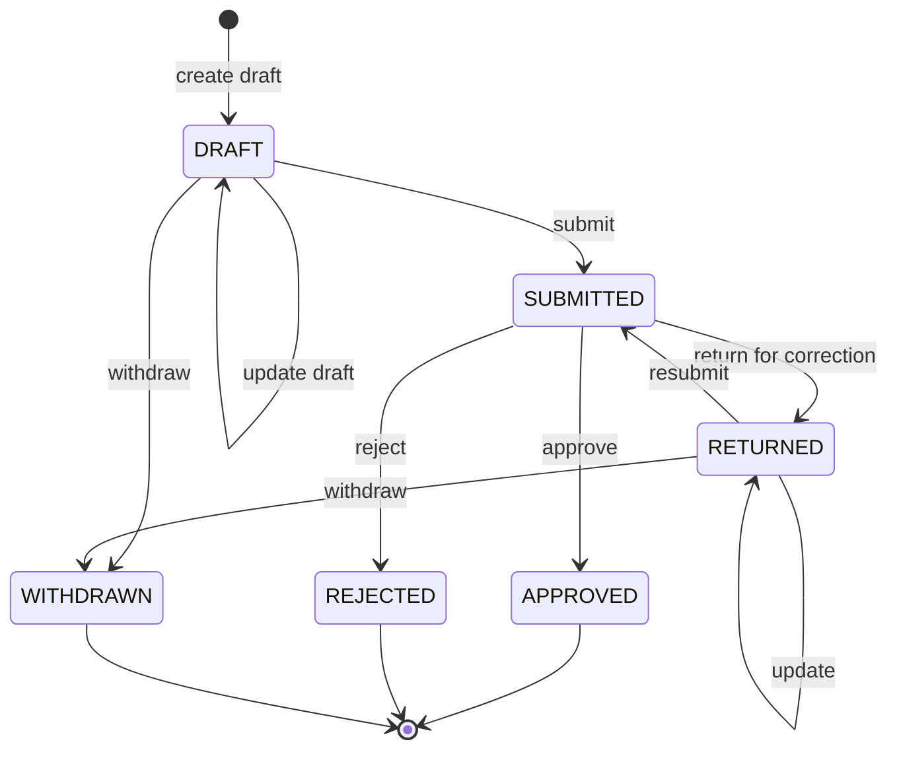
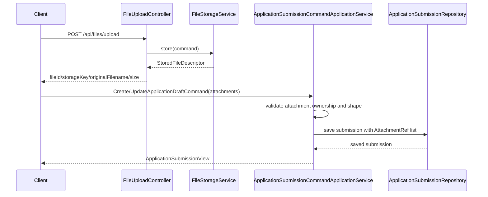

# ApplicationSubmission 最小蓝图

## 1. 文档目的

本文档用于定义 `ApplicationSubmission` 作为 rewrite 阶段第一个正式综测写入对象的最小蓝图，重点回答五个问题：

1. 最小领域模型应该包含哪些对象和字段
2. 第一阶段应该落哪些学生侧命令
3. 最小状态机如何约束状态流转
4. 代码应如何分包，以及第一批测试类应该如何命名
5. 文件上传结果如何最小化接入 `ApplicationSubmission`

当前定位说明：

- `UserPreference` 是 `P0-2` 阶段的“最小写入参考实现”，主要用于验证写入底座是否成立
- `ApplicationSubmission` 才是更接近真实综测业务的第一个正式写入对象
- 本文档只定义学生侧申请提交蓝图，不覆盖教师 / 管理侧审核动作；审核侧将在后续 `ApplicationReviewDecision` 蓝图中单独展开

## 2. 最小领域模型

### 2.1 聚合根

建议将学生侧申请聚合根命名为 `ApplicationSubmission`，表示“学生发起的一条综测申请”。

最小字段建议如下：

| 字段 | 类型 | 说明 |
|---|---|---|
| `applicationId` | `Long` | 申请主键 |
| `applicantUserId` | `Long` | 申请人用户 ID，必须等于当前登录学生 |
| `orgUnitId` | `Long` | 申请归属组织 |
| `categoryCode` | `String` | 综测类别编码 |
| `itemCode` | `String` | 申报项目编码 |
| `academicYear` | `String` | 学年 |
| `term` | `String` | 学期 |
| `title` | `String` | 申请标题或摘要 |
| `description` | `String` | 申请说明 |
| `evidenceAttachments` | `List<AttachmentRef>` | 佐证材料引用列表 |
| `status` | `ApplicationSubmissionStatus` | 当前状态 |
| `submittedAt` | `Instant` | 提交时间；草稿阶段可为空 |
| `createdAt` | `Instant` | 创建时间 |
| `updatedAt` | `Instant` | 更新时间 |
| `version` | `Long` | 乐观锁版本号 |

### 2.2 值对象

建议第一阶段至少引入以下值对象：

| 值对象 | 字段 | 说明 |
|---|---|---|
| `AttachmentRef` | `fileId`、`storageKey`、`originalFilename`、`contentType`、`size`、`uploadedBy` | 申请材料引用；由上传结果裁剪映射而来 |
| `SubmissionTerm` | `academicYear`、`term` | 学年学期组合，可用于唯一性和窗口判断 |

### 2.3 状态枚举

建议最小状态枚举为：

- `DRAFT`
- `SUBMITTED`
- `RETURNED`
- `APPROVED`
- `REJECTED`
- `WITHDRAWN`

说明：

- `RETURNED` 表示审核人退回补充后，学生可继续修改并再次提交
- `REJECTED` 在第一阶段定义为终态，不承载“继续改同一条”的语义

### 2.4 建议代码轮廓

```java
public record ApplicationSubmission(
        Long applicationId,
        Long applicantUserId,
        Long orgUnitId,
        String categoryCode,
        String itemCode,
        String academicYear,
        String term,
        String title,
        String description,
        List<AttachmentRef> evidenceAttachments,
        ApplicationSubmissionStatus status,
        Instant submittedAt,
        Instant createdAt,
        Instant updatedAt,
        Long version
) {
}
```

```java
public record AttachmentRef(
        String fileId,
        String storageKey,
        String originalFilename,
        String contentType,
        long size,
        Long uploadedBy
) {
}
```

```java
public enum ApplicationSubmissionStatus {
    DRAFT,
    SUBMITTED,
    RETURNED,
    APPROVED,
    REJECTED,
    WITHDRAWN
}
```

## 3. 最小命令集合

第一阶段建议只落学生侧 4 个命令，不把审核动作混入当前蓝图。

| 命令 | 用途 | 允许状态 | 说明 |
|---|---|---|---|
| `CreateApplicationDraftCommand` | 创建草稿 | 无 | 新建一条待编辑申请 |
| `UpdateApplicationDraftCommand` | 修改草稿或退回后申请 | `DRAFT`、`RETURNED` | 修改标题、说明、附件等内容 |
| `SubmitApplicationCommand` | 正式提交申请 | `DRAFT`、`RETURNED` | 从学生视角发起送审 |
| `WithdrawApplicationCommand` | 撤回申请 | `DRAFT`、`RETURNED` | 学生主动结束当前申请 |

建议命令字段如下：

### 3.1 CreateApplicationDraftCommand

| 字段 | 类型 | 说明 |
|---|---|---|
| `categoryCode` | `String` | 综测类别 |
| `itemCode` | `String` | 申报项目 |
| `orgUnitId` | `Long` | 归属组织 |
| `academicYear` | `String` | 学年 |
| `term` | `String` | 学期 |
| `title` | `String` | 标题 |
| `description` | `String` | 说明 |
| `attachments` | `List<AttachmentRef>` | 附件引用 |

### 3.2 UpdateApplicationDraftCommand

| 字段 | 类型 | 说明 |
|---|---|---|
| `applicationId` | `Long` | 目标申请 ID |
| `title` | `String` | 新标题 |
| `description` | `String` | 新说明 |
| `attachments` | `List<AttachmentRef>` | 最新附件集合 |
| `expectedVersion` | `Long` | 乐观锁版本 |

### 3.3 SubmitApplicationCommand

| 字段 | 类型 | 说明 |
|---|---|---|
| `applicationId` | `Long` | 目标申请 ID |
| `expectedVersion` | `Long` | 乐观锁版本 |

### 3.4 WithdrawApplicationCommand

| 字段 | 类型 | 说明 |
|---|---|---|
| `applicationId` | `Long` | 目标申请 ID |
| `reason` | `String` | 撤回原因 |
| `expectedVersion` | `Long` | 乐观锁版本 |

## 4. 最小状态机

建议第一阶段采用如下状态机：



状态语义如下：

| 状态 | 含义 | 学生是否可编辑 |
|---|---|---|
| `DRAFT` | 已创建但未正式提交 | 是 |
| `SUBMITTED` | 已提交，等待审核 | 否 |
| `RETURNED` | 被退回补充材料或修正信息 | 是 |
| `APPROVED` | 审核通过，终态 | 否 |
| `REJECTED` | 审核拒绝，终态 | 否 |
| `WITHDRAWN` | 学生主动撤回，终态 | 否 |

## 5. 最小业务规则

第一阶段建议先固定以下规则：

1. `applicantUserId` 必须等于当前登录用户
2. 学生只能操作自己的申请
3. 同一学生、同一 `itemCode`、同一学年学期，不允许存在多条活跃申请
4. `DRAFT` 和 `RETURNED` 才允许编辑
5. 提交前必须校验标题、说明、附件等必填项
6. 提交前必须校验申请窗口是否开放
7. 所有写操作都带 `expectedVersion`
8. `APPROVED`、`REJECTED`、`WITHDRAWN` 为终态，不允许继续编辑

其中“活跃申请”在第一阶段可定义为：

- `DRAFT`
- `SUBMITTED`
- `RETURNED`

## 6. 上传结果接入最小蓝图

### 6.1 设计目标

上传结果接入 `ApplicationSubmission` 的最小版本，建议只解决一个核心问题：

- 学生先通过上传接口拿到标准化文件元信息，再把“附件引用”带入申请草稿创建或修改命令中

第一阶段不建议让 `ApplicationSubmission` 直接持有 `MultipartFile` 或原始上传流，原因如下：

1. `ApplicationSubmission` 是正式业务写入对象，应该依赖稳定的附件引用，而不是瞬时 HTTP 对象
2. 上传链路和申请写入链路的失败语义不同，拆开后更容易重试和定位问题
3. 后续若需要做附件复用、清理孤儿文件、补审核留痕，也必须先把“文件已上传”和“文件已绑定申请”分成两个阶段

### 6.2 最小接入原则

建议采用“两段式接入”：

1. 先上传文件，得到 `StoredFileDescriptor`
2. 再把上传结果映射为 `AttachmentRef`，作为命令字段写入 `ApplicationSubmission`

也就是说，当前最小模型里：

- 上传接口负责“把文件放进 OSS 并返回元信息”
- `ApplicationSubmission` 负责“绑定哪些文件属于这条申请”
- 两者通过 `AttachmentRef` 这个值对象衔接

### 6.3 上传结果到附件引用的映射

建议将当前上传返回的 `StoredFileDescriptor` 裁剪映射为领域值对象 `AttachmentRef`：

| 上传结果字段 | 附件引用字段 | 说明 |
|---|---|---|
| `objectKey` | `storageKey` | 作为对象存储唯一定位键 |
| `originalFilename` | `originalFilename` | 用于申请回显 |
| `contentType` | `contentType` | 用于前端渲染或下载提示 |
| `size` | `size` | 用于展示和限额校验 |
| 当前登录用户 ID | `uploadedBy` | 用于校验附件归属 |
| 新生成的业务文件 ID | `fileId` | 用于申请侧稳定引用，不直接依赖 OSS key 当主键 |

关键点：

- `ApplicationSubmission` 内部不要直接存 `bucket`、`publicUrl`
- `bucket` 和 `publicUrl` 更像基础设施输出，可用于接口回显，但不宜成为申请聚合的核心身份标识
- 聚合内部真正稳定的引用建议是 `fileId + storageKey`

### 6.4 为什么需要 `fileId`

虽然当前上传接口已经返回 `objectKey`，但最小蓝图仍建议补一个业务侧 `fileId`，原因如下：

1. 后续 OSS key 规则可以调整，但业务引用 ID 不应随之变化
2. 如果未来对象存储从 OSS 切换到别的厂商，`fileId` 可以继续稳定存在
3. 审核、删除、附件去重、孤儿文件清理都更适合围绕业务文件 ID 展开

第一阶段可以接受两种落地策略：

- 过渡策略：先让前端回传 `storageKey`，文档中把 `fileId` 标记为“下一阶段补齐”
- 推荐策略：上传成功后立即生成并返回 `fileId`，后续申请命令只绑定 `fileId` 和必要展示字段

如果按“最小但可持续”的目标，我更推荐第二种。

### 6.5 最小附件绑定流程



### 6.6 命令模型如何调整

现有蓝图中的两个命令需要显式承接附件引用：

| 命令 | 当前字段 | 建议调整 |
|---|---|---|
| `CreateApplicationDraftCommand` | `attachments` | 明确为 `List<AttachmentRefPayload>` 或 `List<AttachmentRefCommand>` |
| `UpdateApplicationDraftCommand` | `attachments` | 继续保留，但语义改为“最新完整附件集合” |

建议不要让 `SubmitApplicationCommand` 再携带附件列表，而是要求：

- 附件必须在 `DRAFT` / `RETURNED` 阶段先绑定完成
- 提交命令只负责状态流转和最终校验

这样可以保持：

- `UpdateDraft` 负责内容编辑
- `Submit` 负责状态变更

### 6.7 最小请求体建议

若后续要给 `StudentApplicationSubmissionController` 落接口，建议草稿相关请求体中的附件字段形态如下：

```json
{
  "title": "2025 学年校级竞赛加分申请",
  "description": "提交获奖证书和成绩证明",
  "attachments": [
    {
      "fileId": "file_01JABCDEF123456789",
      "storageKey": "uploads/dev/application/20260514/uuid-award.pdf",
      "originalFilename": "award.pdf",
      "contentType": "application/pdf",
      "size": 245678,
      "uploadedBy": 1001
    }
  ]
}
```

其中：

- `uploadedBy` 最终仍要以后端当前登录用户为准，前端字段只能作为辅助信息
- 如果后续补了文件元数据表，这个请求体还可以继续收缩成只传 `fileId`

### 6.8 最小校验规则

上传结果接入申请时，第一阶段建议至少补以下校验：

1. 每个附件的 `uploadedBy` 必须等于当前登录用户
2. `attachments` 不能为空引用空对象，且 `storageKey` 不可为空
3. 同一条申请内不允许重复 `fileId` 或重复 `storageKey`
4. `DRAFT` / `RETURNED` 允许替换附件集合，终态和 `SUBMITTED` 不允许修改
5. 提交前至少校验“附件是否齐全”这一类业务必填规则

### 6.9 最小持久化建议

围绕附件接入，建议优先采用“主表 + 附件表”模型，而不是把附件 JSON 直接塞进主表字段：

| 表 | 用途 | 最小字段建议 |
|---|---|---|
| `application_submission` | 申请主表 | `application_id`、`applicant_user_id`、`status`、`version` 等 |
| `application_attachment` | 申请附件表 | `id`、`application_id`、`file_id`、`storage_key`、`original_filename`、`content_type`、`size`、`uploaded_by`、`sort_no` |

这样做的好处：

1. 更容易做附件增删改
2. 更容易回显、审核、导出
3. 后续如果要补“文件元数据表”或“孤儿文件清理”，不会被主表 JSON 结构绑死

### 6.10 与上传底座的职责边界

为了避免后续实现时职责串层，建议把边界固定如下：

| 层 | 职责 |
|---|---|
| `FileUploadController` | 接收 `MultipartFile` 并返回上传结果 |
| `FileUploadApplicationService` | 编排上传，不关心申请业务 |
| `ApplicationSubmissionCommandApplicationService` | 校验并绑定附件引用到申请 |
| `ApplicationSubmissionRepository` | 持久化申请与附件关系 |

一句话概括：

- 上传底座负责“文件进 OSS”
- 申请写入负责“文件归属于哪条申请”

## 7. 包结构建议

下面给出按照当前 multi-module 结构的建议包布局。

### 7.1 Domain

建议路径：

- `whut-eval-domain/src/main/java/edu/whut/eval/domain/application/model/`
- `whut-eval-domain/src/main/java/edu/whut/eval/domain/application/repository/`
- `whut-eval-domain/src/main/java/edu/whut/eval/domain/application/service/`

建议类清单：

| 包路径 | 建议类 |
|---|---|
| `edu.whut.eval.domain.application.model` | `ApplicationSubmission`、`AttachmentRef`、`ApplicationSubmissionStatus` |
| `edu.whut.eval.domain.application.repository` | `ApplicationSubmissionRepository` |
| `edu.whut.eval.domain.application.service` | `ApplicationSubmissionWindowPolicy`、`ActiveSubmissionPolicy` |

说明：

- `ApplicationSubmissionWindowPolicy` 用于抽象申请窗口是否开放
- `ActiveSubmissionPolicy` 用于抽象“同一项目同一学期是否允许重复活跃申请”

### 7.2 Application

建议路径：

- `whut-eval-application/src/main/java/edu/whut/eval/application/application/command/`
- `whut-eval-application/src/main/java/edu/whut/eval/application/application/service/`
- `whut-eval-application/src/main/java/edu/whut/eval/application/application/query/`

建议类清单：

| 包路径 | 建议类 |
|---|---|
| `edu.whut.eval.application.application.command` | `CreateApplicationDraftCommand`、`UpdateApplicationDraftCommand`、`SubmitApplicationCommand`、`WithdrawApplicationCommand`、`AttachmentRefCommand` |
| `edu.whut.eval.application.application.service` | `ApplicationSubmissionCommandApplicationService` |
| `edu.whut.eval.application.application.query` | `ApplicationSubmissionView` |

说明：

- `ApplicationSubmissionCommandApplicationService` 用于承接学生侧写命令
- `ApplicationSubmissionView` 只承载写接口返回必须字段，不直接暴露领域对象
- `AttachmentRefCommand` 用于承接上传结果到申请命令的输入映射

### 7.3 Infra

建议路径：

- `whut-eval-infra/src/main/java/edu/whut/eval/infra/persistence/dataobject/`
- `whut-eval-infra/src/main/java/edu/whut/eval/infra/persistence/mapper/`
- `whut-eval-infra/src/main/java/edu/whut/eval/infra/persistence/repository/`
- `whut-eval-infra/src/main/java/edu/whut/eval/infra/cache/`

建议类清单：

| 包路径 | 建议类 |
|---|---|
| `edu.whut.eval.infra.persistence.dataobject` | `ApplicationSubmissionDO`、`ApplicationAttachmentDO` |
| `edu.whut.eval.infra.persistence.mapper` | `ApplicationSubmissionMapper`、`ApplicationAttachmentMapper` |
| `edu.whut.eval.infra.persistence.repository` | `MybatisPlusApplicationSubmissionRepository` |
| `edu.whut.eval.infra.cache` | `ApplicationSubmissionCacheGateway` 或 `NoopApplicationSubmissionCacheGateway` |

说明：

- 如果第一阶段不做附件独立表，也可以先把附件序列化到主表字段中
- 但从后续审核、回显、导出角度看，更建议尽早拆出 `ApplicationAttachmentDO`

### 7.4 Interfaces

建议路径：

- `whut-eval-interfaces/src/main/java/edu/whut/eval/interfaces/student/`
- `whut-eval-interfaces/src/main/java/edu/whut/eval/interfaces/student/request/`

建议类清单：

| 包路径 | 建议类 |
|---|---|
| `edu.whut.eval.interfaces.student` | `StudentApplicationSubmissionController` |
| `edu.whut.eval.interfaces.student.request` | `CreateApplicationDraftRequest`、`UpdateApplicationDraftRequest`、`SubmitApplicationRequest`、`WithdrawApplicationRequest` |

建议路由：

- `POST /api/student/applications/drafts`
- `PUT /api/student/applications/{applicationId}/draft`
- `POST /api/student/applications/{applicationId}/submit`
- `POST /api/student/applications/{applicationId}/withdraw`

## 8. 第一批测试类清单

第一阶段建议先覆盖“最小可运行闭环”，测试拆分为应用服务、Repository 集成、WebMvc 三层。

### 8.1 应用服务测试

| 测试类 | 覆盖目标 |
|---|---|
| `ApplicationSubmissionCommandApplicationServiceTest` | 命令编排主链路 |
| `ApplicationSubmissionStateMachineTest` | 领域状态流转合法性 |

第一批建议覆盖用例：

1. 创建草稿成功
2. 重复活跃申请被拒绝
3. 草稿修改成功
4. `RETURNED` 状态允许修改
5. 非本人修改被拒绝
6. 草稿提交成功
7. 申请窗口关闭时提交被拒绝
8. 非法状态提交被拒绝
9. 草稿撤回成功
10. 终态申请不可再次编辑
11. 非本人上传的附件绑定被拒绝
12. 同一条申请重复附件引用被拒绝

### 8.2 Repository 集成测试

| 测试类 | 覆盖目标 |
|---|---|
| `MybatisPlusApplicationSubmissionRepositoryIntegrationTest` | 主表/附件表读写一致性与唯一性约束 |

第一批建议覆盖用例：

1. 保存草稿成功并可回读
2. 附件集合保存成功
3. 可按 `applicationId` 正确回读
4. 可正确判断活跃申请是否存在
5. 乐观锁版本字段能正确更新
6. 附件排序与完整替换语义正确

### 8.3 WebMvc 测试

| 测试类 | 覆盖目标 |
|---|---|
| `StudentApplicationSubmissionControllerWebMvcTest` | HTTP 入参解析与错误码映射 |

第一批建议覆盖用例：

1. 创建草稿成功返回 `200`
2. 重复活跃申请返回 `409`
3. 非法请求体返回 `400`
4. 提交成功返回 `200`
5. 撤回成功返回 `200`
6. 附件字段缺失或重复时返回 `400` / `409`

## 9. 建议验收顺序

建议按以下顺序推进：

1. 先确定 `AttachmentRef` 最终字段口径，以及上传结果到附件引用的映射
2. 再落 `ApplicationSubmission` 领域模型和状态枚举
3. 然后补 4 个学生侧命令、`AttachmentRefCommand` 和 `ApplicationSubmissionCommandApplicationService`
4. 再补 `Repository` 与附件表读写实现、H2 集成测试
5. 最后补 `StudentApplicationSubmissionController` 和 `WebMvc` 测试

## 10. 一句话结论

`ApplicationSubmission` 接入上传结果的最小版本，应当坚持“先上传、后绑定”的两段式模型：上传底座只负责把文件放进 OSS，申请聚合只负责绑定稳定的附件引用；这样才能在不把 HTTP/OSS 细节污染进正式业务聚合的前提下，平滑走向后续附件归档、审核留痕和孤儿文件治理。
