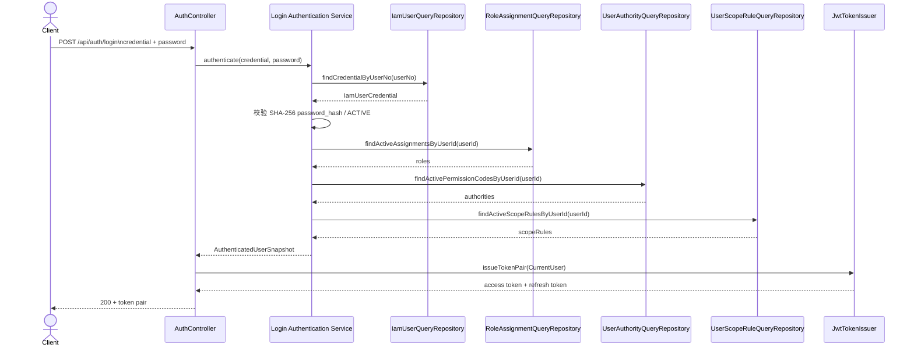
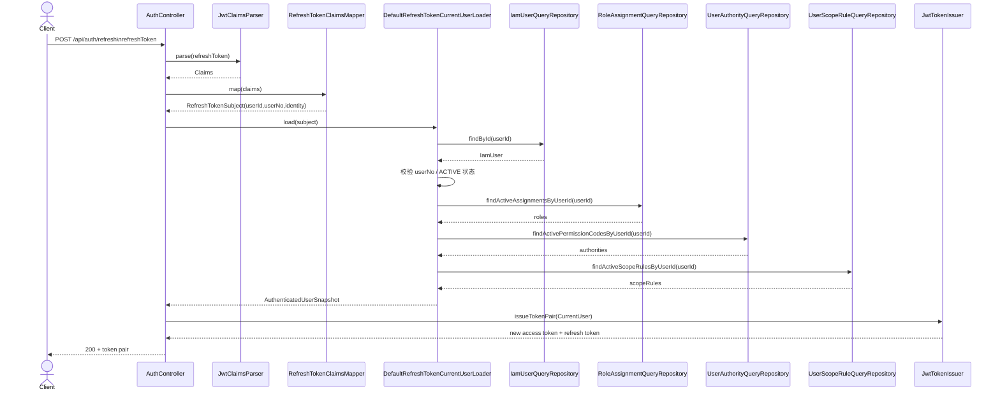
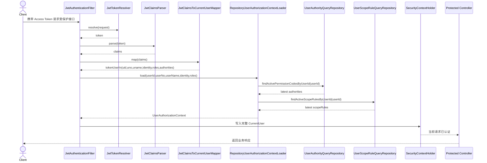
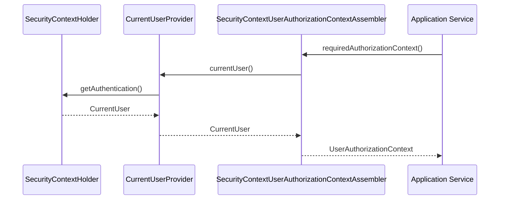
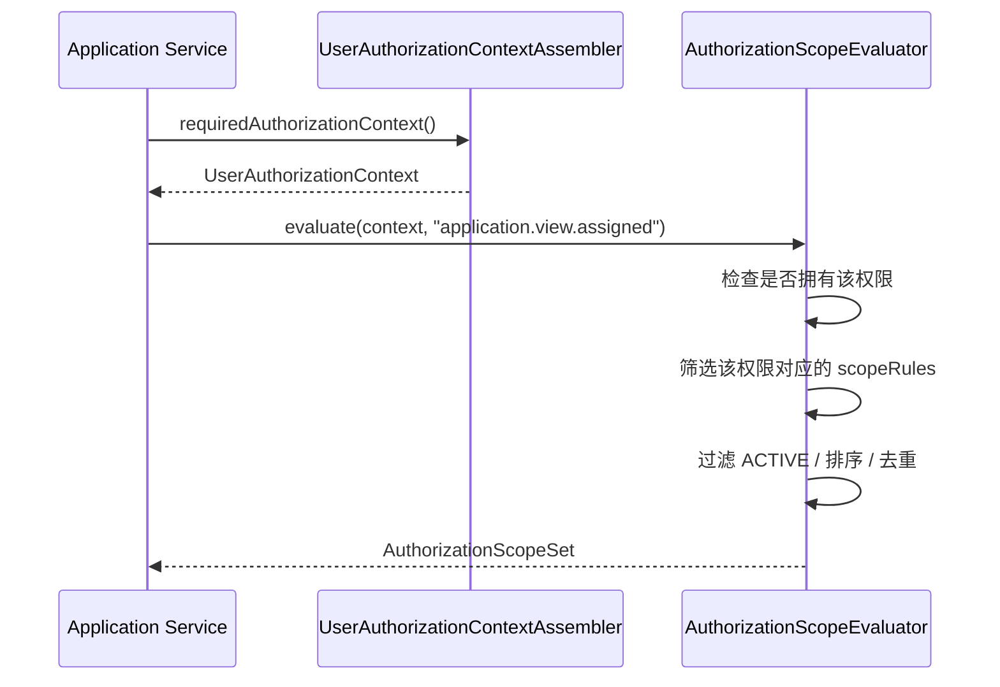
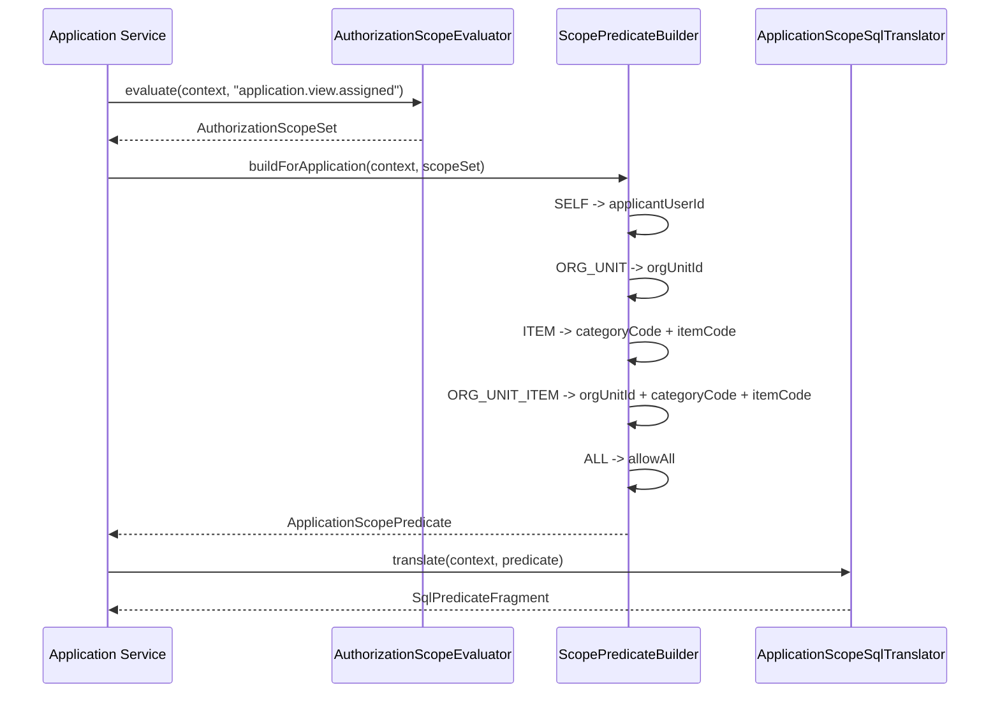
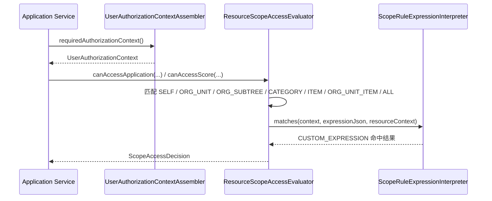
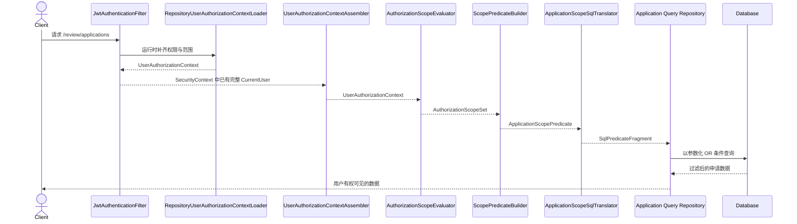

# 认证、权限与可见范围时序图评审版

## 1. 文档定位

本文档是 [认证、权限与可见范围链路说明](./auth-login-permission-scope-flow.md) 的时序图版，面向团队评审场景。

阅读目标：

- 快速看懂当前认证底座已经打通到什么程度
- 快速看懂权限与范围是在哪个阶段查库、在哪个阶段进入运行时上下文
- 快速识别当前授权内核已完成部分与业务接线边界

## 2. 当前结论

当前系统的状态可以先用三句话概括：

1. `login` 已接通真实认证服务，当前按 `user_no + SHA-256 password_hash` 完成账号密码校验并签发 token。
2. `refresh` 已经打通，能重载最新角色、权限、范围并重新签发 token。
3. 普通受保护请求已经会在进入 `SecurityContext` 前按 `userId` 动态补齐最新权限和范围。

---

## 3. 时序图一：当前 Login 闭环

### 评审关注点

- 当前 login 和 refresh 共用同一套“查角色/权限/范围 -> 组装 `CurrentUser` -> 签发 token”思路。
- 第一版密码校验按 `SHA-256` 摘要实现，后续如果升级口令算法，需要单独考虑迁移。
- 当前已完成的是认证闭环，后续剩余工作主要是把认证结果接到真实业务流程。

---

## 4. 时序图二：Refresh Token 闭环

### 评审关注点

- Refresh 只信最小身份，不信权限快照。
- 当前 refresh 后一定会拿到数据库里的最新：
  - `roles`
  - `authorities`
  - `scopeRules`
- 用户禁用、权限撤销、范围规则调整，都会在 refresh 后立即生效。

---

## 5. 时序图三：普通受保护请求认证链路

这是当前普通请求已经真实使用的链路。

### 评审关注点

- 当前普通请求不是“完全只信 Access Token”。
- 当前真实生效的权限和范围来自数据库运行时补齐，而不是 token 中的旧快照。
- 这样做的代价是每次受保护请求都要多查一次权限和范围，但好处是权限变更更快生效。

---

## 6. 时序图四：业务层读取授权上下文

这是认证层进入业务层的交接点。

### 评审关注点

- 应用服务后面消费的是 `UserAuthorizationContext`，不应该直接耦合 JWT claims 细节。
- 这一层是后续接 `AuthorizationService`、`ScopeResolver`、查询谓词构建器的稳定入口。

---

## 7. 时序图五：权限与范围计算链路

这条链路已经打通到“生成可消费范围集合”。

### 评审关注点

- 范围计算前提永远是“先有权限”。
- `AuthorizationScopeSet` 是“这个权限能作用于哪些范围”的聚合结果，不是最终 SQL。

---

## 8. 时序图六：范围集合转查询条件

这条链路已经打通到“参数化 SQL 片段”，但真实业务仓储还没有正式接线。

### 评审关注点

- 当前不只产出 `ApplicationScopePredicate`，还可以继续翻译成 `SqlPredicateFragment`。
- 当前设计是“多个 OR 子句”，不是简单的交叉集合。
- 后续真实查询仓储接线时必须保持 `OR` 语义，不能误写成统一 `AND`。

---

## 9. 时序图七：单条资源范围校验

这条链路适用于审批单条申请、查看单条成绩等场景，当前已经落地。

### 评审关注点

- 单条资源校验与列表查询复用同一套范围语义，避免两个授权模型分叉。
- `CUSTOM_EXPRESSION` 第一版是受控 JSON DSL，不支持任意脚本表达式。
- 业务在审批或详情场景接线时，应优先复用这个判定器，而不是手写额外 if/else。

---

## 10. 时序图八：完整“可见范围”当前链路

这是当前已经成型的授权内核链路，真实业务查询仓储仍差正式接线。

### 评审关注点

- 授权内核层面的最后一跳已经补齐，当前缺口变成真实申请/成绩查询仓储尚未正式消费 translator 输出。
- 一旦业务查询仓储接线，申请列表和成绩列表就能直接复用当前授权底座。

---

## 11. 当前已完成与边界

### 11.1 已完成

- 真实登录认证服务
- Access / Refresh Token 分离
- Refresh 时全量查库重载
- 普通请求运行时权限补齐
- 普通请求运行时范围补齐
- `CurrentUser -> UserAuthorizationContext` 装配
- `scopeRules -> AuthorizationScopeSet` 评估
- `AuthorizationScopeSet -> ApplicationScopePredicate` 转换
- `AuthorizationScopeSet -> ScoreScopePredicate` 转换
- `ApplicationScopePredicate -> SqlPredicateFragment` 翻译
- `ScoreScopePredicate -> SqlPredicateFragment` 翻译
- 单条资源范围校验
- `CUSTOM_EXPRESSION` 受控 JSON DSL 解释器

### 11.2 当前边界

- 真实申请查询仓储尚未正式消费 `ApplicationScopeSqlTranslator`
- 真实成绩查询仓储尚未正式消费 `ScoreScopeSqlTranslator`
- 组织树相关能力仍依赖 `org_path` 语义，后续是否抽象专门查询能力待业务接线时确定
- `CUSTOM_EXPRESSION` 当前只支持第一版 JSON DSL，后续扩展需保持运行时解释与 SQL 翻译语义一致

---

## 12. 评审建议问题清单

团队评审时建议重点讨论下面 6 个问题：

1. 普通请求是否接受“每次查库补齐权限与范围”的性能成本？
2. 是否需要在后续加入短期缓存，降低 `UserAuthorityQueryRepository` / `UserScopeRuleQueryRepository` 查询频率？
3. `roles` 是否也要像 `authorities` 一样改成请求期重载？
4. 真实申请/成绩查询仓储如何统一消费 translator 产出的 `SqlPredicateFragment`？
5. `ORG_SUBTREE` 是否继续依赖 `org_path`，还是需要单独引入组织树查询能力？
6. `CUSTOM_EXPRESSION` 下一版是否要增加更多运算符，还是继续保持最小 DSL？

---

## 13. 一句话评审结论

当前项目已经完成：

- 真实登录
- 认证底座
- 权限重载
- 范围重载
- 范围解释
- 范围到查询谓词转换
- 范围到参数化 SQL 片段翻译
- 单条资源范围判定

当前项目当前边界：

- 真实业务查询仓储接线
- 业务审批/详情接口正式复用授权判定器

所以从评审角度看，当前最适合进入下一阶段的是：

- 把申请查询正式接到 `ApplicationScopeSqlTranslator`
- 而不是继续扩展新的认证模型分支
