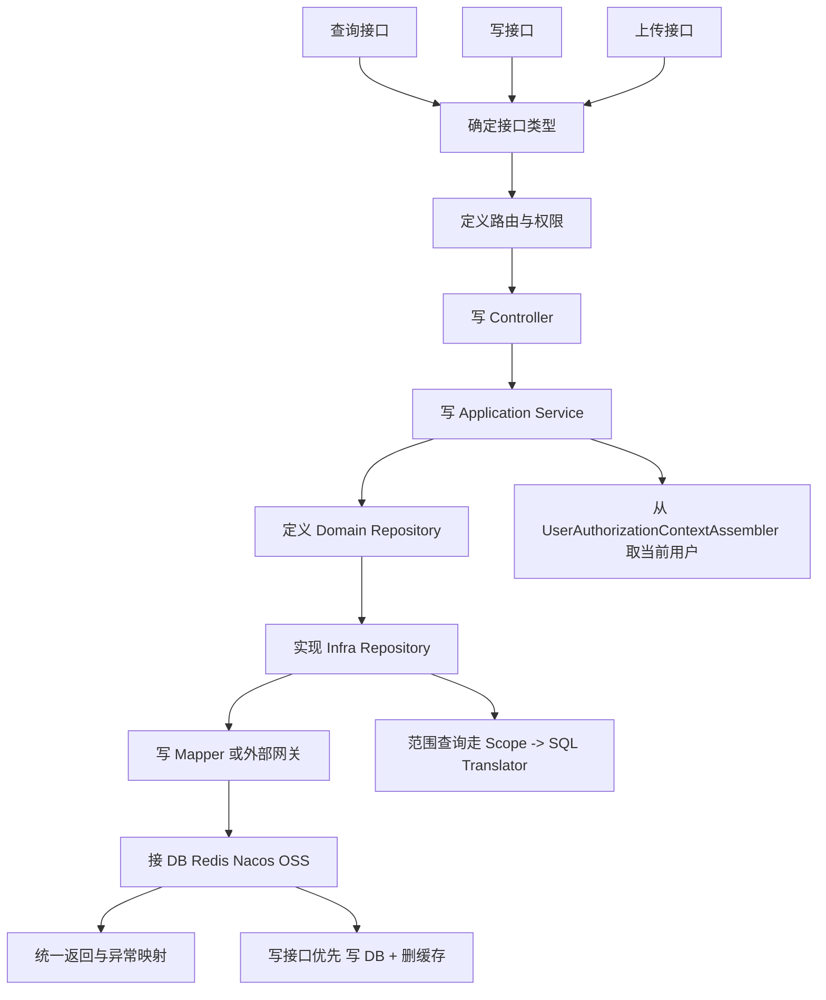

# 接口开发 30 分钟上手版

## 1. 这份文档解决什么问题

给第一次在本项目里写接口的同学一个最短路径。

你只需要先记住三件事：

1. 先判断这是查询、写入、上传，还是缓存切面。
2. 再决定代码落在哪一层，不要把所有逻辑都堆在 `Controller`。
3. 遇到“当前用户、权限、范围、配置、缓存”时，沿用项目现成入口，不要绕开。

完整版说明见：

- [interface-development-example.md](file:///Users/bytedance/whut/whutXX/rewrite/whut-comprehensive-evaluation/docs/reference/interface-development-example.md)

## 2. 开发流程图

先看全局流程，再写代码。



一句话理解：

- `Controller` 收参数。
- `Application Service` 编排业务。
- `Repository` 隔离持久化细节。
- `Mapper / Gateway` 真正接 DB、Redis、Nacos、OSS。

## 3. 先做判断

开始写之前，先回答这 4 个问题：

1. 这是查询接口还是写接口？
2. 是否需要登录态？
3. 是否需要显式权限码？
4. 是否需要数据可见范围？

判断口诀：

- 只查数据：优先参考 `StudentQueryController`。
- 要写数据库：优先参考 `StudentPreferenceController`。
- 要传文件：优先参考 `FileUploadController`。
- 要用 Redis：优先参考 `MybatisPlusIamUserQueryRepository`。

## 4. 最小分层模板

### 4.1 查询接口最小模板

适用场景：

- 当前用户查询自己可见的数据
- 需要权限码
- 需要范围控制

#### Controller

```java
@RestController
@RequestMapping("/api/student/query")
@Validated
public class XxxQueryController {

    private final XxxQueryApplicationService xxxQueryApplicationService;

    public XxxQueryController(XxxQueryApplicationService xxxQueryApplicationService) {
        this.xxxQueryApplicationService = xxxQueryApplicationService;
    }

    @PreAuthorize("hasAuthority(T(edu.whut.eval.application.auth.AuthorizationPermissionCodes).APPLICATION_VIEW_SELF)")
    @GetMapping("/xxx")
    public ApiResponse<PageResult<XxxView>> page(@RequestParam(defaultValue = "1") long pageNo,
                                                 @RequestParam(defaultValue = "20") long pageSize,
                                                 @RequestParam(required = false) String keyword) {
        return ApiResponse.success(
                xxxQueryApplicationService.page(
                        new XxxPageQuery(pageNo, pageSize, keyword),
                        AuthorizationPermissionCodes.APPLICATION_VIEW_SELF
                )
        );
    }
}
```

#### Query

```java
public class XxxPageQuery {

    private final long pageNo;
    private final long pageSize;
    private final String keyword;

    public XxxPageQuery(long pageNo, long pageSize, String keyword) {
        if (pageNo < 1) {
            throw new IllegalArgumentException("pageNo must be greater than 0");
        }
        if (pageSize < 1) {
            throw new IllegalArgumentException("pageSize must be greater than 0");
        }
        this.pageNo = pageNo;
        this.pageSize = pageSize;
        this.keyword = keyword;
    }

    public long getOffset() {
        return (pageNo - 1) * pageSize;
    }
}
```

#### Application Service

```java
@Service
public class XxxQueryApplicationService {

    private final UserAuthorizationContextAssembler userAuthorizationContextAssembler;
    private final XxxQueryRepository xxxQueryRepository;

    public PageResult<XxxView> page(XxxPageQuery query, String permissionCode) {
        UserAuthorizationContext authorizationContext = userAuthorizationContextAssembler.requiredAuthorizationContext();
        if (!authorizationContext.hasAuthority(permissionCode)) {
            throw new AccessDeniedAppException("当前用户无权限访问列表");
        }
        return xxxQueryRepository.pageAccessible(
                new XxxAccessContext(
                        authorizationContext.getUserId(),
                        authorizationContext.getUserNo(),
                        authorizationContext.getIdentity(),
                        authorizationContext.getRoles(),
                        authorizationContext.getAuthorities(),
                        authorizationContext.getScopeRules(),
                        permissionCode
                ),
                query
        );
    }
}
```

#### Domain Repository

```java
public interface XxxQueryRepository {

    PageResult<XxxView> pageAccessible(XxxAccessContext accessContext, XxxPageQuery query);
}
```

#### Infra Repository

```java
@Repository
public class MybatisPlusXxxQueryRepository implements XxxQueryRepository {

    private final AuthorizationScopeEvaluator authorizationScopeEvaluator;
    private final ScopePredicateBuilder scopePredicateBuilder;
    private final XxxScopeSqlTranslator xxxScopeSqlTranslator;
    private final XxxQueryMapper xxxQueryMapper;

    @Override
    public PageResult<XxxView> pageAccessible(XxxAccessContext accessContext, XxxPageQuery query) {
        UserAuthorizationContext authorizationContext = new UserAuthorizationContext(
                accessContext.getUserId(),
                accessContext.getUserNo(),
                null,
                accessContext.getIdentity(),
                accessContext.getRoles(),
                accessContext.getAuthorities(),
                accessContext.getScopeRules()
        );
        AuthorizationScopeSet scopeSet = authorizationScopeEvaluator.evaluate(
                authorizationContext,
                accessContext.getPermissionCode()
        );
        XxxScopePredicate predicate = scopePredicateBuilder.buildForXxx(authorizationContext, scopeSet);
        SqlPredicateFragment fragment = xxxScopeSqlTranslator.translate(authorizationContext, predicate);

        long total = xxxQueryMapper.count(fragment.getExpression(), fragment.getParameters(), query);
        List<XxxView> records = xxxQueryMapper.select(
                fragment.getExpression(),
                fragment.getParameters(),
                query,
                query.getOffset(),
                query.getPageSize()
        );
        return new PageResult<>(total, records);
    }
}
```

#### Mapper

```java
@Mapper
public interface XxxQueryMapper {

    long count(@Param("expression") String expression,
               @Param("parameters") Map<String, Object> parameters,
               @Param("query") XxxPageQuery query);

    List<XxxView> select(@Param("expression") String expression,
                         @Param("parameters") Map<String, Object> parameters,
                         @Param("query") XxxPageQuery query,
                         @Param("offset") long offset,
                         @Param("limit") long limit);
}
```

#### SQL Provider 关键规则

```java
private String buildSql(String selectFromSql, Map<String, Object> params, boolean paged) {
    String expression = params == null ? "" : (String) params.get("expression");
    XxxPageQuery query = params == null ? null : (XxxPageQuery) params.get("query");
    List<String> conditions = new ArrayList<>();
    if (expression != null && !expression.isBlank()) {
        conditions.add("(" + expression + ")");
    }
    appendQueryFilters(conditions, query);

    StringBuilder sql = new StringBuilder(selectFromSql);
    if (!conditions.isEmpty()) {
        sql.append(" WHERE ").append(String.join(" AND ", conditions));
    }
    return sql.toString();
}
```

这里必须记住：

- 业务过滤条件和范围条件是 `AND`。
- 认证、权限、范围是三层，不是一层。

### 4.2 写接口最小模板

适用场景：

- `POST / PUT / DELETE`
- 要写 DB
- 可能有事务和缓存失效

#### Request

```java
public class CreateXxxRequest {

    @NotBlank(message = "name 不能为空")
    private String name;

    @NotNull(message = "enabled 不能为空")
    private Boolean enabled;

    public String getName() {
        return name;
    }

    public Boolean getEnabled() {
        return enabled;
    }
}
```

#### Controller

```java
@RestController
@Validated
@RequestMapping("/api/student/xxx")
public class XxxCommandController {

    private final XxxCommandApplicationService xxxCommandApplicationService;

    @PostMapping
    public ApiResponse<XxxView> create(@Valid @RequestBody CreateXxxRequest request) {
        return ApiResponse.success(
                xxxCommandApplicationService.create(
                        new CreateXxxCommand(request.getName(), request.getEnabled())
                )
        );
    }
}
```

#### Application Service

```java
@Service
public class XxxCommandApplicationService {

    private final UserAuthorizationContextAssembler userAuthorizationContextAssembler;
    private final XxxRepository xxxRepository;
    private final XxxCacheGateway xxxCacheGateway;

    @Transactional
    public XxxView create(CreateXxxCommand command) {
        UserAuthorizationContext authorizationContext = userAuthorizationContextAssembler.requiredAuthorizationContext();
        Long userId = authorizationContext.getUserId();

        if (xxxRepository.existsByUserId(userId)) {
            throw new ConflictException("当前用户已存在记录，请改用更新接口");
        }

        Xxx saved = xxxRepository.save(new Xxx(null, userId, command.getName(), command.getEnabled()));
        xxxCacheGateway.evictByUserId(userId);
        return new XxxView(saved.id(), saved.userId(), saved.name(), saved.enabled());
    }
}
```

#### Repository

```java
public interface XxxRepository {

    boolean existsByUserId(Long userId);

    Xxx save(Xxx xxx);
}
```

#### Mapper

```java
@Mapper
public interface XxxMapper {

    @Select("SELECT COUNT(1) > 0 FROM xxx WHERE user_id = #{userId}")
    boolean existsByUserId(@Param("userId") Long userId);

    @Insert("INSERT INTO xxx (user_id, name, enabled) VALUES (#{userId}, #{name}, #{enabled})")
    @Options(useGeneratedKeys = true, keyProperty = "id")
    int insert(XxxDO xxxDO);
}
```

写接口口诀：

- 事务放 `Application Service`
- 先写 DB
- 再删缓存

### 4.3 上传接口最小模板

适用场景：

- 接 `multipart/form-data`
- 要读 Nacos typed config
- 要写 OSS 和 `file_asset`

#### Controller

```java
@RestController
@Validated
@RequestMapping("/api/files")
public class XxxFileController {

    private static final Logger log = LoggerFactory.getLogger(XxxFileController.class);
    private final FileUploadApplicationService fileUploadApplicationService;

    @PostMapping(value = "/upload", consumes = MediaType.MULTIPART_FORM_DATA_VALUE)
    public ApiResponse<StoredFileDescriptorView> upload(@RequestParam("file") MultipartFile file,
                                                        @RequestParam(value = "bizType", required = false) String bizType)
            throws IOException {
        AppLog.info(log, "file.upload.request.received",
                "bizType", bizType,
                "originalFilename", file.getOriginalFilename(),
                "contentType", file.getContentType(),
                "size", file.getSize());
        if (file.isEmpty()) {
            throw new ValidationException("上传文件不能为空");
        }
        StoredFileDescriptor descriptor = fileUploadApplicationService.upload(new UploadFileCommand(
                file.getInputStream(),
                file.getSize(),
                file.getOriginalFilename(),
                file.getContentType(),
                bizType
        ));
        return ApiResponse.success(new StoredFileDescriptorView(
                descriptor.getFileId(),
                descriptor.getBucket(),
                descriptor.getObjectKey(),
                descriptor.getPublicUrl(),
                descriptor.getOriginalFilename(),
                descriptor.getContentType(),
                descriptor.getSize()
        ));
    }
}
```

#### Application Service

```java
@Service
public class FileUploadApplicationService {

    private final UserAuthorizationContextAssembler userAuthorizationContextAssembler;
    private final FileStorageService fileStorageService;
    private final FileAssetRegistry fileAssetRegistry;

    public StoredFileDescriptor upload(UploadFileCommand command) {
        UserAuthorizationContext authorizationContext = userAuthorizationContextAssembler.requiredAuthorizationContext();
        StoredFileDescriptor storedFileDescriptor = fileStorageService.store(command);
        return fileAssetRegistry.registerUploadedFile(
                storedFileDescriptor,
                authorizationContext.getUserId(),
                authorizationContext.getIdentity()
        );
    }
}
```

#### 读配置

```java
@Component
public class OssStorageConfigProvider {

    public static final String DEFINITION_NAME = "oss-storage-config";

    private final TypedConfigRepository typedConfigRepository;

    public OssStorageConfig requiredConfig() {
        return typedConfigRepository.find(DEFINITION_NAME, OssStorageConfig.class)
                .orElseThrow(() -> new ConfigLoadException(
                        "Required typed config not found: " + DEFINITION_NAME
                ));
    }
}
```

#### OSS + DB

```java
StoredOssObject storedObject = ossObjectStorageClient.putObject(
        config,
        objectKey,
        command.getInputStream(),
        command.getSize(),
        command.getContentType()
);

fileAssetWriteMapper.insert(fileAssetDO);
```

上传接口口诀：

- 先传 OSS
- 再登记 `file_asset`
- 上传人信息来自上下文，不来自前端

### 4.4 Redis 缓存最小模板

适用场景：

- 读多写少
- 典型 cache-aside

#### Cache Gateway

```java
@Component
public class RedisXxxCacheGateway {

    private static final Duration TTL = Duration.ofMinutes(10);
    private final RedisTemplate<String, Object> redisTemplate;

    public Optional<Xxx> get(String key) {
        Object value = redisTemplate.opsForValue().get(key);
        if (value instanceof Xxx xxx) {
            return Optional.of(xxx);
        }
        return Optional.empty();
    }

    public void put(String key, Xxx value) {
        redisTemplate.opsForValue().set(key, value, TTL);
    }

    public void evict(String key) {
        redisTemplate.delete(key);
    }
}
```

#### Cache-Aside

```java
public Optional<Xxx> findByKey(String key) {
    Optional<Xxx> cached = xxxCacheGateway.get(key);
    if (cached.isPresent()) {
        return cached;
    }
    XxxDO record = xxxMapper.selectByKey(key);
    if (record == null) {
        return Optional.empty();
    }
    Xxx domain = toDomain(record);
    xxxCacheGateway.put(key, domain);
    return Optional.of(domain);
}
```

#### 写后失效

```java
xxxMapper.update(...);
xxxCacheGateway.evict(key);
```

缓存口诀：

- 读：先缓存，后 DB，最后回填缓存
- 写：先 DB，后删缓存

## 5. 当前用户、权限、范围怎么拿

业务层统一从这里拿：

```java
public interface UserAuthorizationContextAssembler {

    Optional<UserAuthorizationContext> currentAuthorizationContext();

    default UserAuthorizationContext requiredAuthorizationContext() {
        return currentAuthorizationContext().orElseThrow(AuthenticationFailedException::new);
    }
}
```

当前用户长这样：

```java
public class UserAuthorizationContext {

    private final Long userId;
    private final String userNo;
    private final String userName;
    private final String identity;
    private final Set<String> roles;
    private final Set<String> authorities;
    private final List<IamScopeRule> scopeRules;

    public boolean hasAuthority(String authorityCode) {
        return authorityCode != null && authorities.contains(authorityCode);
    }
}
```

一句话记忆：

- 要用户 ID：`authorizationContext.getUserId()`
- 要权限：`authorizationContext.hasAuthority(permissionCode)`
- 要范围：`authorizationContext.getScopeRules()`

## 6. 日志、异常、返回格式最小模板

### 6.1 日志

```java
AppLog.info(log, "xxx.request.received", "userId", userId, "bizId", bizId);
AppLog.warn(log, "xxx.request.rejected", "reason", "invalid-status", "bizId", bizId);
AppLog.error(log, exception, "xxx.request.failed", "bizId", bizId);
```

### 6.2 统一返回

```java
public record ApiResponse<T>(boolean success, String code, String message, T data) {

    public static <T> ApiResponse<T> success(T data) {
        return new ApiResponse<>(true, "OK", "success", data);
    }
}
```

### 6.3 常用异常

```java
throw new ValidationException("请求参数不合法");
throw new AccessDeniedAppException("当前用户无权限访问");
throw new ConflictException("资源状态冲突");
```

## 7. 新人开发 checklist

开始写接口前，过一遍：

1. 路由前缀对不对。
2. 是否要加 `@PreAuthorize`。
3. 是否要从 `UserAuthorizationContextAssembler` 取当前用户。
4. 查询是否需要范围控制。
5. SQL 是否把业务过滤和范围过滤做了 `AND`。
6. 写接口是否加了事务。
7. 写成功后是否要删缓存。
8. 是否应该读 typed config，而不是写死配置。
9. 是否补了结构化日志。
10. 是否复用了统一异常和 `ApiResponse`。

## 8. 最短阅读顺序

如果你只有 30 分钟，按这个顺序看源码：

1. `StudentQueryController`
2. `ApplicationQueryApplicationService`
3. `MybatisPlusApplicationQueryRepository`
4. `ApplicationQuerySqlProvider`
5. `FileUploadController`
6. `OssFileStorageService`
7. `StudentPreferenceController`
8. `UserPreferenceCommandApplicationService`
9. `MybatisPlusIamUserQueryRepository`
10. `RedisUserCacheGateway`

看完这 10 个点，再开始写，大概率不会把层次写乱。
