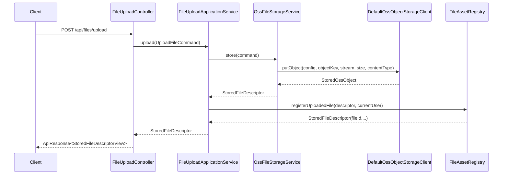

# 对象存储与上传验收说明

## 1. 文档目的

本文档用于收口 `rewrite/whut-comprehensive-evaluation` 当前已经落地的阿里云 OSS 对象存储配置方式、最小上传链路和验收步骤，方便后续开发时快速回答以下问题：

1. OSS 配置从哪里读取，配置名和 dataId 是什么
2. 上传接口现在怎么调用，返回什么结构
3. 本地联调和阶段验收应该执行哪些命令

## 2. 当前能力范围

当前上传底座已经完成以下能力：

- 通过 Nacos typed config 机制读取 `oss-storage-config`
- 通过 `FileStorageService` 统一封装上传能力
- 通过 `POST /api/files/upload` 暴露最小 HTTP 上传入口
- 上传成功后登记 `file_asset`，生成稳定 `fileId`
- 上传返回的 `fileId` 已接入学生申请创建 / 更新链路，通过 `attachmentFileIds` 绑定附件
- 通过 `GlobalExceptionHandler` 统一返回 `400` / `503` 错误响应
- 通过 `AppLog` 输出请求、成功、失败三类结构化日志

当前还没有做的内容：

- 不做 `public_attachment_entry` 发布管理
- 不做 `application_attachment` 业务归档关系落库
- 不做分片上传、断点续传、批量上传
- 不做 `traceId` / `userId` 级别的完整审计增强

## 3. Nacos 配置入口

### 3.1 definition 注册

当前 `application.yml` 中已经注册如下 definition：

| 项 | 值 |
|---|---|
| definition name | `oss-storage-config` |
| dataId | `whut-eval-oss-storage.yaml` |
| group | `WHUT_EVAL` |
| format | `YAML` |
| required | `true` |
| auto-refresh | `true` |

对应文件位置：

- `whut-eval-app/src/main/resources/application.yml`

### 3.2 typed config 类型

当前 typed config Java 类型为 `OssStorageConfig`，字段如下：

| 字段名 | 类型 | 说明 |
|---|---|---|
| `enabled` | `boolean` | 是否启用 OSS 上传 |
| `endpoint` | `String` | OSS 访问端点，例如 `https://oss-cn-shanghai.aliyuncs.com` |
| `region` | `String` | OSS 区域，例如 `cn-shanghai` |
| `accessKeyId` | `String` | RAM AccessKey ID |
| `accessKeySecret` | `String` | RAM AccessKey Secret |
| `bucket` | `String` | 上传目标 Bucket |
| `publicBaseUrl` | `String` | 对外访问基础 URL，可选 |
| `keyPrefix` | `String` | 对象 key 统一前缀，可选 |

对应文件位置：

- `whut-eval-infra/src/main/java/edu/whut/eval/infra/nacos/model/typed/OssStorageConfig.java`
- `whut-eval-infra/src/main/java/edu/whut/eval/infra/nacos/config/OssStorageConfigProvider.java`

### 3.3 推荐 YAML 示例

```yaml
enabled: true
endpoint: https://oss-cn-shanghai.aliyuncs.com
region: cn-shanghai
accessKeyId: ${OSS_ACCESS_KEY_ID}
accessKeySecret: ${OSS_ACCESS_KEY_SECRET}
bucket: whut-eval-dev
publicBaseUrl: https://cdn.whut.example.com
keyPrefix: uploads/dev
```

说明：

- 不要把真实 `accessKeyId` / `accessKeySecret` 直接写入仓库
- `publicBaseUrl` 为空时，上传结果中的 `publicUrl` 允许为空
- `keyPrefix` 为空时，会退化为默认前缀 `uploads`

## 4. 上传链路概览

当前最小上传链路如下：



对象 key 当前按以下规则生成：

```text
{keyPrefix}/{bizType}/{yyyyMMdd}/{uuid}-{sanitizedOriginalFilename}
```

示例：

```text
uploads/dev/profile/20260514/4306f9c4-4bb7-4137-9165-bacab9f19752-avatar.png
```

## 5. 上传接口说明

### 5.1 HTTP 入口

| 项 | 说明 |
|---|---|
| HTTP Method | `POST` |
| Path | `/api/files/upload` |
| Content-Type | `multipart/form-data` |
| Controller | `FileUploadController#upload(...)` |
| 应用服务 | `FileUploadApplicationService#upload(...)` |
| 鉴权方式 | 默认受全局安全链路保护，需携带有效登录态 |

请求参数：

| 参数名 | 类型 | 必填 | 说明 |
|---|---|---|---|
| `file` | `MultipartFile` | 是 | 上传文件本体 |
| `bizType` | `String` | 否 | 业务目录分组，例如 `profile`、`attachment/import` |

响应体：

- 成功时返回 `ApiResponse<StoredFileDescriptorView>`
- `StoredFileDescriptorView` 当前包含：
- `fileId`
- `bucket`
- `objectKey`
- `publicUrl`
- `originalFilename`
- `contentType`
- `size`

说明：

- `fileId` 是业务侧稳定文件 ID，由上传成功后的 `file_asset` 登记链路生成
- 后续 `ApplicationSubmission` 创建 / 更新请求应把这些值收敛到 `attachmentFileIds`

### 5.2 与学生申请写接口的衔接

上传成功后，客户端应保存返回体中的 `fileId`，并在学生申请写接口中通过 `attachmentFileIds` 传递：

| HTTP Method | Path | 用途 | 附件字段 |
|---|---|---|---|
| `POST` | `/api/student/applications/drafts` | 创建申请草稿 | `attachmentFileIds` |
| `PUT` | `/api/student/applications/{applicationId}/draft` | 更新申请草稿 | `attachmentFileIds` |
| `POST` | `/api/student/applications/{applicationId}/submit` | 提交申请 | 无附件字段 |
| `POST` | `/api/student/applications/{applicationId}/withdraw` | 撤回申请 | 无附件字段 |

当前申请侧的附件解析规则：

- `attachmentFileIds` 会通过 `ApplicationAttachmentResolver` 查询 `file_asset` / `public_attachment_entry`
- 当前支持绑定“本人上传的 ACTIVE 附件”和“公共池中 `PUBLISHED + ALL` 的附件”
- 更新草稿时，新的 `attachmentFileIds` 会整体替换旧附件集合

### 5.3 失败语义

上传接口失败语义：

| 场景 | HTTP 状态码 | 错误码 | 说明 |
|---|---|---|---|
| 空文件 | `400` | `VAL-4001` | `MultipartFile` 为空或大小为 0 |
| OSS 未启用 | `400` | `VAL-4001` | `enabled=false` |
| Nacos 配置缺失 | `503` | `CFG-5031` | `oss-storage-config` 未 materialize 成功 |
| OSS 上传失败 | `503` | `EXT-5033` | SDK 调用失败或外部依赖异常 |

申请写接口在消费 `attachmentFileIds` 时的失败语义：

| 场景 | HTTP 状态码 | 错误码 | 说明 |
|---|---|---|---|
| 附件不存在或已失效 | `400` | `VAL-4001` | `file_asset` 不存在，或文件状态不是 `ACTIVE` |
| 当前用户无权使用指定附件 | `400` | `VAL-4001` | 既不是当前用户本人上传，也不是公共池中 `PUBLISHED + ALL` 的附件 |
| 附件 `fileId` 为空 | `400` | `VAL-4001` | `attachmentFileIds` 中出现空值或空白字符串 |
| 申请不存在 | `404` | `RES-4040` | `applicationId` 未查询到对应申请 |
| 版本冲突 | `409` | `BIZ-4090` | 更新草稿、提交或撤回时 `expectedVersion` 与当前版本不一致，或资源状态已变化 |
| 同一申请内重复附件 | `409` | `BIZ-4090` | 同一次请求中重复提交相同 `fileId` |

补充说明：

- 申请写接口对附件解析采用 fail-closed 策略，只要任一 `fileId` 校验失败，整次写入都会被拒绝
- 更新草稿时，`attachmentFileIds` 按“整集合替换”处理，因此版本冲突出现时应由客户端先重新获取最新申请版本再重试

### 5.4 最小调用示例

```bash
curl -X POST "http://localhost:8080/api/files/upload" \
  -H "Authorization: Bearer <access-token>" \
  -F "file=@/tmp/avatar.png" \
  -F "bizType=profile"
```

创建申请草稿时可继续把返回的 `fileId` 带入请求体：

```json
{
  "orgUnitId": 10,
  "categoryCode": "competition",
  "itemCode": "item-1",
  "academicYear": "2025-2026",
  "term": "1",
  "title": "申请标题",
  "description": "申请说明",
  "attachmentFileIds": [
    "file_01exampleuploaded"
  ]
}
```

## 6. 日志与排查

当前上传链路已补齐以下结构化事件：

| event | 触发位置 | 说明 |
|---|---|---|
| `file.upload.request.received` | `FileUploadController` | HTTP 请求进入 |
| `file.upload.request.rejected` | `FileUploadController` | 空文件等入口拒绝 |
| `file.upload.request.completed` | `FileUploadController` | 接口返回成功 |
| `file.upload.request.io-failed` | `FileUploadController` | 读取上传流失败 |
| `file.upload.storage.started` | `OssFileStorageService` | 存储编排开始 |
| `file.upload.storage.validation-failed` | `OssFileStorageService` | 上传命令校验失败 |
| `file.upload.storage.config-missing` | `OssFileStorageService` | OSS typed config 缺失 |
| `file.upload.storage.disabled` | `OssFileStorageService` | OSS 配置存在但被禁用 |
| `file.upload.storage.completed` | `OssFileStorageService` | 存储完成 |
| `file.upload.oss.put-object.failed` | `DefaultOssObjectStorageClient` | OSS SDK 调用失败 |

排查建议：

1. 先看 `file.upload.request.received` 是否出现，确认请求是否到达应用
2. 再看 `file.upload.storage.started` 是否出现，确认是否进入存储编排
3. 若出现 `file.upload.oss.put-object.failed`，优先检查 endpoint、AK/SK、bucket 和网络连通性
4. 若只看到 `file.upload.storage.config-missing`，说明 Nacos definition 或 payload 仍未加载成功

## 7. 自动化验收

### 7.1 定向测试命令

```bash
mvn -q -pl whut-eval-app -am -Dsurefire.failIfNoSpecifiedTests=false -Dtest=FileUploadControllerWebMvcTest,FileUploadApplicationServiceTest,MybatisFileAssetRegistryIntegrationTest,OssFileStorageServiceTest,OssStorageTypedConfigConfigurationTest test
```

该命令覆盖：

- Nacos typed config binding 与 materialize
- OSS 存储服务的 key 规则、content type 透传、异常场景
- file_asset 登记与 fileId 返回
- HTTP 上传入口的成功、空文件、失败响应

### 7.2 推荐回归命令

```bash
mvn -q -pl whut-eval-app -am -Dsurefire.failIfNoSpecifiedTests=false -Dtest=*FileUpload*Test,*Storage*Test,*Nacos*Test test
```

## 8. 人工验收清单

建议按以下顺序做人肉验收：

1. 在 Nacos 中确认 `whut-eval-oss-storage.yaml` 已存在且内容完整
2. 启动应用，确认没有 `oss-storage-config` 缺失报错
3. 使用有效 token 调用 `POST /api/files/upload`
4. 检查返回体中的 `fileId`、`bucket`、`objectKey`、`publicUrl` 是否符合预期
5. 使用返回的 `fileId` 调用 `POST /api/student/applications/drafts` 或 `PUT /api/student/applications/{applicationId}/draft`
6. 确认申请侧能正确消费 `attachmentFileIds`，并把附件写入 `application_attachment`
7. 在日志中检查是否出现 `file.upload.request.received`、`file.upload.storage.completed`、`file.upload.request.completed`
8. 人为制造错误配置或无权限 AK/SK，确认能看到 `file.upload.oss.put-object.failed`

## 9. 相关文件

- `whut-eval-app/src/main/resources/application.yml`
- `whut-eval-infra/src/main/java/edu/whut/eval/infra/nacos/model/typed/OssStorageConfig.java`
- `whut-eval-infra/src/main/java/edu/whut/eval/infra/nacos/config/OssStorageConfigProvider.java`
- `whut-eval-application/src/main/java/edu/whut/eval/application/file/service/FileUploadApplicationService.java`
- `whut-eval-application/src/main/java/edu/whut/eval/application/file/service/FileStorageService.java`
- `whut-eval-infra/src/main/java/edu/whut/eval/infra/storage/OssFileStorageService.java`
- `whut-eval-infra/src/main/java/edu/whut/eval/infra/storage/DefaultOssObjectStorageClient.java`
- `whut-eval-interfaces/src/main/java/edu/whut/eval/interfaces/file/FileUploadController.java`
- `whut-eval-app/src/test/java/edu/whut/eval/app/config/OssStorageTypedConfigConfigurationTest.java`
- `whut-eval-app/src/test/java/edu/whut/eval/app/file/FileUploadControllerWebMvcTest.java`
- `whut-eval-interfaces/src/main/java/edu/whut/eval/interfaces/student/StudentApplicationSubmissionController.java`
- `docs/reference/api-surface.md`
