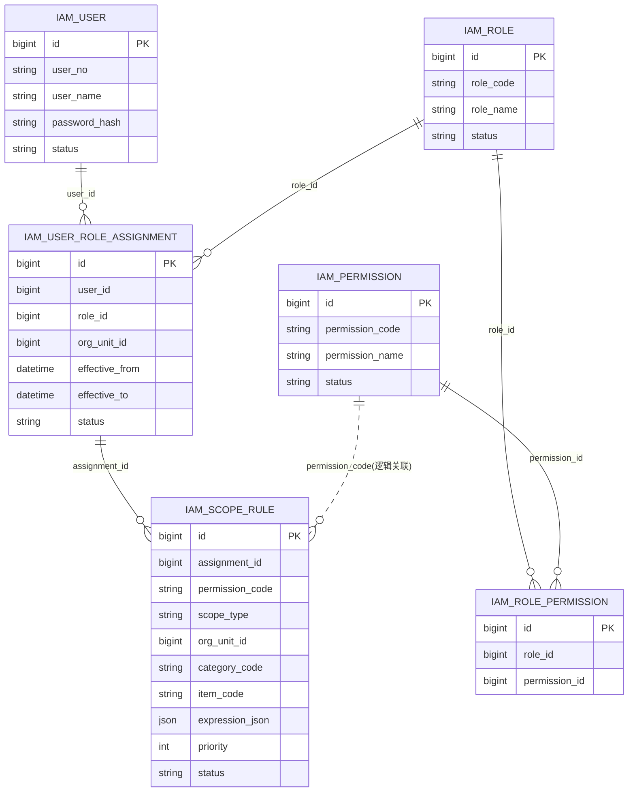

# Scope Rule 表关系与 SQL 翻译参考

## 1. 文档目的

本文档聚焦回答三个问题：

1. IAM / Scope 相关表之间是什么关系
2. 权限与范围规则在运行时是如何流转的
3. `scope_type` 最终如何翻译成查询 SQL 条件

配套阅读：

- [认证、权限与可见范围链路说明](./auth-login-permission-scope-flow.md)
- [认证、权限与可见范围时序图评审版](./auth-login-permission-scope-sequence-review.md)

## 2. 核心结论

- `permission` 解决“能不能做某个动作”。
- `scope_rule` 解决“这个动作能作用于哪些数据”。
- `scope_rule` 挂在 `iam_user_role_assignment` 上，而不是直接挂用户或角色。
- 运行时先查权限，再查范围；没有权限时，范围规则不会单独生效。
- SQL 拼接不是直接从表结构硬编码得到，而是经历：
  - `IamScopeRule`
  - `AuthorizationScopeSet`
  - `ApplicationScopePredicate` / `ScoreScopePredicate`
  - `SqlPredicateFragment`

## 3. 表关系图



## 4. 表职责说明

### 4.1 `iam_user`

- 保存用户基本身份与登录凭证。
- 登录时按 `user_no` 查用户，并校验 `password_hash` 与 `status`。

### 4.2 `iam_user_role_assignment`

- 保存“用户被赋予某个角色”的事实。
- 同时承载有效期、状态、组织上下文等信息。
- `scope_rule` 绑定到 assignment，而不是直接绑定 user / role，目的是让同一用户在不同角色分配下拥有不同数据范围。

### 4.3 `iam_role`

- 定义角色本身，例如学生、辅导员、管理员。
- 角色是否有效由 `status` 控制。

### 4.4 `iam_permission`

- 定义细粒度权限点，例如 `application.view.assigned`。
- 它表示“动作”本身，不表示数据范围。

### 4.5 `iam_role_permission`

- 建立角色与权限之间的多对多关系。
- 它解决“某角色具备哪些能力”。

### 4.6 `iam_scope_rule`

- 建立“某次角色分配下、某个权限点的可见范围规则”。
- 关键字段语义：
  - `assignment_id`：这条范围规则属于哪一次角色分配
  - `permission_code`：这条规则作用于哪个权限
  - `scope_type`：范围类型
  - `org_unit_id/category_code/item_code`：范围参数
  - `expression_json`：自定义规则 DSL
  - `priority`：排序优先级
  - `status`：规则状态

## 5. 为什么这样设计

### 5.1 为什么 `permission` 和 `scope` 分开

- 如果把范围直接编码进权限，会导致权限点爆炸。
- 例如把“查看本班申请”“查看学院申请”“查看某类项目申请”都设计成不同 permission，会很快失控。
- 当前设计把它拆成：
  - `permission` 表示动作
  - `scope_rule` 表示数据边界

### 5.2 为什么 `scope_rule` 绑定 `assignment`

- 一个用户可能有多个角色。
- 同一个角色在不同组织下也可能需要不同可见范围。
- 把规则挂在 assignment 上，可以准确表达“这条范围来自哪次角色分配”。

### 5.3 为什么 `scope_rule` 里还要保留 `permission_code`

- 因为同一个 assignment 下，不同权限对应的范围可能不同。
- 例如：
  - `application.view.assigned` 可以看学院全部申请
  - `application.approve` 可能只能审批自己班级的申请

### 5.4 为什么运行时还要校验权限

- 范围规则不能反向授予权限。
- 当前代码一定先检查用户是否拥有目标 permission，再使用这个 permission 对应的 scope rules。
- 这能避免“只有范围，没有权限”的脏数据绕过授权。

## 6. 权限与范围流转图

```mermaid
flowchart LR
    A[请求进入系统] --> B[JWT 解析出最小身份]
    B --> C[按 userId 查有效角色分配]
    C --> D[查有效权限<br/>iam_user_role_assignment -> iam_role -> iam_role_permission -> iam_permission]
    C --> E[查有效范围规则<br/>iam_user_role_assignment -> iam_scope_rule]
    D --> F[authorities]
    E --> G[scopeRules]

    F --> H[组装 UserAuthorizationContext]
    G --> H

    H --> I[AuthorizationScopeEvaluator]
    I --> J{是否拥有目标 permissionCode}
    J -- 否 --> K[AuthorizationScopeSet.denied]
    J -- 是 --> L[筛选该 permissionCode 对应 scopeRules]
    L --> M[过滤 ACTIVE / 排序 / 去重]
    M --> N[AuthorizationScopeSet.granted]

    N --> O1[ScopePredicateBuilder]
    N --> O2[ScoreScopePredicateBuilder]
    N --> O3[ResourceScopeAccessEvaluator]

    O1 --> P1[ApplicationScopePredicate]
    O2 --> P2[ScoreScopePredicate]

    P1 --> Q1[ApplicationScopeSqlTranslator]
    P2 --> Q2[ScoreScopeSqlTranslator]

    Q1 --> R[SqlPredicateFragment]
    Q2 --> R

    R --> S[Repository / Mapper 拼接查询 SQL]
    S --> T[数据库返回过滤后的列表数据]

    O3 --> U{逐条资源是否命中 scope}
    U --> V[SELF / ORG_UNIT / ORG_SUBTREE / CATEGORY / ITEM / ORG_UNIT_ITEM / ALL]
    U --> W[ScopeRuleExpressionInterpreter]
    W --> X[CUSTOM_EXPRESSION JSON DSL 匹配]
    V --> Y[ScopeAccessDecision]
    X --> Y
```



## 7. 运行时处理步骤

### 7.1 查权限

- 查询路径：
  - `iam_user_role_assignment`
  - `iam_role`
  - `iam_role_permission`
  - `iam_permission`
- 只取：
  - assignment `ACTIVE`
  - role `ACTIVE`
  - permission `ACTIVE`
  - assignment 在有效期内

### 7.2 查范围规则

- 查询路径：
  - `iam_scope_rule`
  - `iam_user_role_assignment`
  - `iam_role`
  - `iam_permission`
  - `iam_role_permission`
- 只取：
  - 当前用户有效 assignment 下的 rule
  - `iam_scope_rule.status = ACTIVE`
  - assignment / role / permission 仍然有效
  - assignment 对应角色确实拥有该 permission

### 7.3 规整为统一范围模型

- `IamScopeRule` 会被转换为 `AuthorizationScope`。
- 同一个 permission 下的规则会聚合为 `AuthorizationScopeSet`。
- 这个集合不是 SQL，而是授权层统一的范围抽象。

### 7.4 转换为查询谓词

- 申请场景使用 `ApplicationScopePredicate`
- 成绩场景使用 `ScoreScopePredicate`
- 这一步做的是“范围语义 -> 查询条件语义”的转换，不做 SQL 拼接

### 7.5 转换为 SQL 片段

- 最终由 SQL translator 生成 `SqlPredicateFragment`
- 该对象包含：
  - `expression`
  - `parameters`

## 8. SQL 翻译总规则

### 8.1 总体规则

- 如果 permission 不存在或结果为空，输出 `1 = 0`
- 如果命中 `ALL`，输出空表达式，表示不附加 where 限制
- 单个 clause 内部使用 `AND`
- 多个 clause 之间使用 `OR`
- 所有动态值使用参数占位，避免直接字符串拼接

### 8.2 为什么不是简单 `IN`

范围规则本质是“多个并列授权子句”，不是单一维度集合求交集。

例如两条规则：

- `ORG_UNIT(3001)`
- `ITEM(ACADEMIC, LECTURE)`

正确语义是：

```sql
(org_unit_id = ?)
OR
(category_code = ? AND item_code = ?)
```

而不是：

```sql
org_unit_id IN (?) AND item_code IN (?)
```

## 9. `scope_type` 到 SQL 条件翻译规则

### 9.1 申请场景字段映射

| DSL 字段 | 申请表列 |
|---|---|
| `applicationId` | `application_id` |
| `applicantUserId` | `applicant_user_id` |
| `ownerUserId` | `applicant_user_id` |
| `orgUnitId` | `org_unit_id` |
| `orgPath` | `org_path` |
| `categoryCode` | `category_code` |
| `itemCode` | `item_code` |

### 9.2 成绩场景字段映射

| DSL 字段 | 成绩表列 |
|---|---|
| `scoreId` | `score_id` |
| `studentUserId` | `student_user_id` |
| `ownerUserId` | `student_user_id` |
| `orgUnitId` | `org_unit_id` |
| `orgPath` | `org_path` |
| `categoryCode` | `category_code` |
| `itemCode` | `item_code` |
| `academicYear` | `academic_year` |

### 9.3 详细翻译表

| `scope_type` | 申请谓词字段 | 成绩谓词字段 | SQL 条件翻译规则 | 说明 |
|---|---|---|---|---|
| `ALL` | 无 | 无 | 不追加限制条件 | 表示此 permission 对全部数据放行 |
| `SELF` | `applicantUserId = currentUser.userId` | `studentUserId = currentUser.userId` | `applicant_user_id = ?` / `student_user_id = ?` | 当前用户仅能访问自己名下资源 |
| `ORG_UNIT` | `orgUnitId` + 可选 `categoryCode/itemCode` | `orgUnitId` + 可选 `categoryCode/itemCode` | `org_unit_id = ?`，若 category/item 非空则继续 `AND category_code = ?`、`AND item_code = ?` | 最常见的组织维度范围 |
| `ORG_SUBTREE` | `orgSubtreeRootId` + 可选 `categoryCode/itemCode` | `orgSubtreeRootId` + 可选 `categoryCode/itemCode` | `org_path LIKE ?`，参数格式为 `"%/{orgUnitId}/%"`，若 category/item 非空则继续追加 `AND` 条件 | 当前实现用 `org_path` 表示祖先链路 |
| `CATEGORY` | `categoryCode` | `categoryCode` | `category_code = ?` | 只按项目大类做范围限制 |
| `ITEM` | `categoryCode + itemCode` | `categoryCode + itemCode` | `category_code = ? AND item_code = ?`；如果 category 为空则只拼 `item_code = ?` | 细粒度到具体项目项 |
| `ORG_UNIT_ITEM` | `orgUnitId + categoryCode + itemCode` | `orgUnitId + categoryCode + itemCode` | `org_unit_id = ?` 并按非空字段追加 `category_code = ?`、`item_code = ?` | 表示组织和项目维度同时约束 |
| `CUSTOM_EXPRESSION` | `expressionJson`，同时保留常规字段 | `expressionJson`，同时保留常规字段 | 先解析 JSON DSL，再把每个条件翻译成参数化 SQL；根节点当前只支持 `allOf`，因此内部统一 `AND` 拼接 | 适合表达无法被固定枚举覆盖的规则 |

### 9.4 真实 SQL 生成示例表

说明：

- 以下 SQL 为 translator 产出的 `expression` 片段示意，不包含外围完整 `SELECT ... WHERE`。
- 参数名按当前实现风格使用 `#{parameters.pN}`，实际编号会随同一条查询内前序条件数量变化。
- 多条范围规则同时存在时，最终会按 `OR` 把多个 clause 连接起来；下表展示的是“单条规则生成的单个 clause”。

| `scope_type` | 输入样例 | 生成 SQL（申请场景） | 生成 SQL（成绩场景） | 参数示例 |
|---|---|---|---|---|
| `ALL` | `{ "scopeType": "ALL" }` | 空表达式 | 空表达式 | 无 |
| `SELF` | 当前用户 `userId=1001` | `(applicant_user_id = #{parameters.p1})` | `(student_user_id = #{parameters.p1})` | `p1=1001` |
| `ORG_UNIT` | `{ "scopeType": "ORG_UNIT", "orgUnitId": 3001 }` | `(org_unit_id = #{parameters.p1})` | `(org_unit_id = #{parameters.p1})` | `p1=3001` |
| `ORG_UNIT` | `{ "scopeType": "ORG_UNIT", "orgUnitId": 3001, "categoryCode": "ACADEMIC", "itemCode": "LECTURE" }` | `(org_unit_id = #{parameters.p1} AND category_code = #{parameters.p2} AND item_code = #{parameters.p3})` | `(org_unit_id = #{parameters.p1} AND category_code = #{parameters.p2} AND item_code = #{parameters.p3})` | `p1=3001, p2=ACADEMIC, p3=LECTURE` |
| `ORG_SUBTREE` | `{ "scopeType": "ORG_SUBTREE", "orgUnitId": 3001 }` | `(org_path LIKE #{parameters.p1})` | `(org_path LIKE #{parameters.p1})` | `p1=%/3001/%` |
| `ORG_SUBTREE` | `{ "scopeType": "ORG_SUBTREE", "orgUnitId": 3001, "categoryCode": "ACADEMIC" }` | `(org_path LIKE #{parameters.p1} AND category_code = #{parameters.p2})` | `(org_path LIKE #{parameters.p1} AND category_code = #{parameters.p2})` | `p1=%/3001/%, p2=ACADEMIC` |
| `CATEGORY` | `{ "scopeType": "CATEGORY", "categoryCode": "ACADEMIC" }` | `(category_code = #{parameters.p1})` | `(category_code = #{parameters.p1})` | `p1=ACADEMIC` |
| `ITEM` | `{ "scopeType": "ITEM", "categoryCode": "ACADEMIC", "itemCode": "LECTURE" }` | `(category_code = #{parameters.p1} AND item_code = #{parameters.p2})` | `(category_code = #{parameters.p1} AND item_code = #{parameters.p2})` | `p1=ACADEMIC, p2=LECTURE` |
| `ITEM` | `{ "scopeType": "ITEM", "itemCode": "LECTURE" }` | `(item_code = #{parameters.p1})` | `(item_code = #{parameters.p1})` | `p1=LECTURE` |
| `ORG_UNIT_ITEM` | `{ "scopeType": "ORG_UNIT_ITEM", "orgUnitId": 3001, "categoryCode": "ACADEMIC", "itemCode": "LECTURE" }` | `(org_unit_id = #{parameters.p1} AND category_code = #{parameters.p2} AND item_code = #{parameters.p3})` | `(org_unit_id = #{parameters.p1} AND category_code = #{parameters.p2} AND item_code = #{parameters.p3})` | `p1=3001, p2=ACADEMIC, p3=LECTURE` |
| `CUSTOM_EXPRESSION` | `{"scopeType":"CUSTOM_EXPRESSION","expressionJson":"{\"allOf\":[{\"field\":\"ownerUserId\",\"operator\":\"EQ\",\"valueFrom\":\"currentUser.userId\"}]}"}` | `(applicant_user_id = #{parameters.p1})` | `(student_user_id = #{parameters.p1})` | `p1=currentUser.userId` |
| `CUSTOM_EXPRESSION` | `{"scopeType":"CUSTOM_EXPRESSION","expressionJson":"{\"allOf\":[{\"field\":\"categoryCode\",\"operator\":\"IN\",\"values\":[\"ACADEMIC\",\"PRACTICE\"]}]}"}` | `(category_code IN (#{parameters.p1}, #{parameters.p2}))` | `(category_code IN (#{parameters.p1}, #{parameters.p2}))` | `p1=ACADEMIC, p2=PRACTICE` |
| `CUSTOM_EXPRESSION` | `{"scopeType":"CUSTOM_EXPRESSION","expressionJson":"{\"allOf\":[{\"field\":\"ownerUserId\",\"operator\":\"EQ\",\"valueFrom\":\"currentUser.userId\"},{\"field\":\"categoryCode\",\"operator\":\"EQ\",\"value\":\"ACADEMIC\"}]}"}` | `(applicant_user_id = #{parameters.p1} AND category_code = #{parameters.p2})` | `(student_user_id = #{parameters.p1} AND category_code = #{parameters.p2})` | `p1=currentUser.userId, p2=ACADEMIC` |

### 9.5 多条规则合并示例

假设某用户对同一个 permission 同时拥有两条申请范围规则：

1. `ORG_UNIT(3001)`
2. `ITEM(categoryCode=ACADEMIC, itemCode=LECTURE)`

最终 translator 产出的 SQL 片段会是：

```sql
(
  (org_unit_id = #{parameters.p1})
  OR
  (category_code = #{parameters.p2} AND item_code = #{parameters.p3})
)
```

对应参数：

```json
{
  "p1": 3001,
  "p2": "ACADEMIC",
  "p3": "LECTURE"
}
```

## 10. `CUSTOM_EXPRESSION` 翻译规则

### 10.1 当前 DSL 结构

当前第一版只支持受控 JSON DSL，例如：

```json
{
  "allOf": [
    {
      "field": "ownerUserId",
      "operator": "EQ",
      "valueFrom": "currentUser.userId"
    },
    {
      "field": "categoryCode",
      "operator": "IN",
      "values": ["ACADEMIC", "PRACTICE"]
    }
  ]
}
```

### 10.2 支持能力

| 字段 | 当前支持 |
|---|---|
| 根节点 | `allOf` |
| 操作符 | `EQ`、`IN` |
| 固定值 | `value`、`values` |
| 动态取值 | `currentUser.userId`、`currentUser.userNo`、`currentUser.identity` |

### 10.3 SQL 翻译语义

| DSL 条件 | SQL 结果 |
|---|---|
| `{"field":"ownerUserId","operator":"EQ","valueFrom":"currentUser.userId"}` | `applicant_user_id = ?` 或 `student_user_id = ?` |
| `{"field":"categoryCode","operator":"EQ","value":"ACADEMIC"}` | `category_code = ?` |
| `{"field":"categoryCode","operator":"IN","values":["A","B"]}` | `category_code IN (?, ?)` |

### 10.4 限制

- 不支持任意脚本
- 不支持直接写 SQL
- 不支持未登记到字段映射表中的字段
- 运行时解释器与 SQL translator 必须共享同一套 DSL 语义

## 11. 示例

### 11.1 输入规则

假设某用户对 `application.view.assigned` 有两条规则：

1. `ORG_UNIT`, `orgUnitId = 3001`
2. `ITEM`, `categoryCode = ACADEMIC`, `itemCode = LECTURE`

### 11.2 转换后的 SQL 片段

```sql
(
  (org_unit_id = #{parameters.p1})
  OR
  (category_code = #{parameters.p2} AND item_code = #{parameters.p3})
)
```

对应参数：

```json
{
  "p1": 3001,
  "p2": "ACADEMIC",
  "p3": "LECTURE"
}
```

## 12. 当前边界

- `ApplicationScopeSqlTranslator` 和 `ScoreScopeSqlTranslator` 已实现
- 真实申请/成绩查询仓储尚未正式消费这些 `SqlPredicateFragment`
- `ORG_SUBTREE` 目前依赖 `org_path` 约定
- `CUSTOM_EXPRESSION` 当前只支持第一版 DSL

## 13. 代码参考

- 申请范围规则查询：[IamScopeRuleQueryMapper](file:///Users/bytedance/whut/whutXX/rewrite/whut-comprehensive-evaluation/whut-eval-infra/src/main/java/edu/whut/eval/infra/persistence/mapper/IamScopeRuleQueryMapper.java)
- 权限查询：[IamPermissionQueryMapper](file:///Users/bytedance/whut/whutXX/rewrite/whut-comprehensive-evaluation/whut-eval-infra/src/main/java/edu/whut/eval/infra/persistence/mapper/IamPermissionQueryMapper.java)
- 范围评估：[DefaultAuthorizationScopeEvaluator](file:///Users/bytedance/whut/whutXX/rewrite/whut-comprehensive-evaluation/whut-eval-application/src/main/java/edu/whut/eval/application/auth/service/DefaultAuthorizationScopeEvaluator.java)
- 申请谓词构建：[DefaultScopePredicateBuilder](file:///Users/bytedance/whut/whutXX/rewrite/whut-comprehensive-evaluation/whut-eval-application/src/main/java/edu/whut/eval/application/auth/service/DefaultScopePredicateBuilder.java)
- 成绩谓词构建：[DefaultScoreScopePredicateBuilder](file:///Users/bytedance/whut/whutXX/rewrite/whut-comprehensive-evaluation/whut-eval-application/src/main/java/edu/whut/eval/application/auth/service/DefaultScoreScopePredicateBuilder.java)
- 申请 SQL 翻译：[ApplicationScopeSqlTranslator](file:///Users/bytedance/whut/whutXX/rewrite/whut-comprehensive-evaluation/whut-eval-infra/src/main/java/edu/whut/eval/infra/security/sql/ApplicationScopeSqlTranslator.java)
- 成绩 SQL 翻译：[ScoreScopeSqlTranslator](file:///Users/bytedance/whut/whutXX/rewrite/whut-comprehensive-evaluation/whut-eval-infra/src/main/java/edu/whut/eval/infra/security/sql/ScoreScopeSqlTranslator.java)
- 自定义表达式公共翻译基类：[AbstractScopeSqlTranslator](file:///Users/bytedance/whut/whutXX/rewrite/whut-comprehensive-evaluation/whut-eval-infra/src/main/java/edu/whut/eval/infra/security/sql/AbstractScopeSqlTranslator.java)
