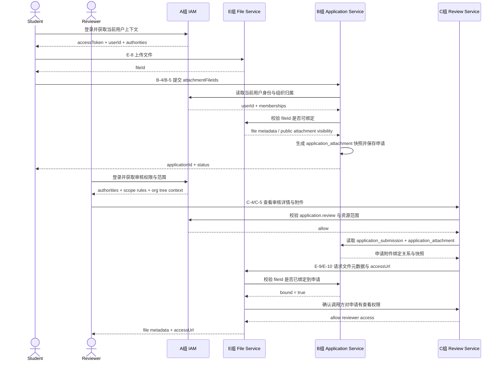

# 完整交付清单

## 1. 文档目的

本文档把以下两类信息合并成一份总控清单：

- 数据库表责任矩阵
- 组间接口依赖矩阵

目标是让项目负责人和 5 个组长可以用同一份文档回答 4 个问题：

1. 每张核心表由哪个组主责维护。
2. 每个组对每张表是主写、受限写、只读还是禁止直连。
3. 每个组在联调时依赖谁的接口。
4. 实际推进时应该按什么顺序交付，避免互相阻塞。

## 2. 使用方式

- 项目负责人用本清单做排期、拆任务、定联调顺序。
- 组长用本清单确认本组主责表、前置接口和最小交付范围。
- 联调前用本清单检查是否越界写表、是否遗漏前置接口。

## 3. 标记说明

### 3.1 数据库权限标记

| 标记 | 含义 |
|---|---|
| `OWN` | 主责组，负责表结构、索引、状态机、主写链路、核心仓储 |
| `RW` | 受限写，允许按冻结契约写入局部状态或记录，但不能扩表、扩状态 |
| `R` | 只读，允许查询、关联、汇总、鉴权，不允许写 |
| `-` | 不允许直连，必须通过主责组接口或统一应用服务间接访问 |

### 3.2 接口依赖标记

| 标记 | 含义 |
|---|---|
| `运行时` | 模块上线后会真实依赖该接口或接口口径 |
| `联调前置` | 不一定在代码里直接调用，但没有该接口就无法完成联调验收 |
| `高` | 阻塞主链路，必须优先交付 |
| `中` | 不阻塞主链路，但会阻塞后台页面、配置页或完整验收 |
| `低` | 可以后置，通常属于增强功能或运营能力 |

## 4. 数据库表责任矩阵

### 4.1 主责组总览

| 组别 | 主责领域 |
|---|---|
| A 组 | 身份、组织、角色、权限、范围规则、会话 |
| B 组 | 学生申请写链路、申请事实、申请附件绑定 |
| C 组 | 审核动作、审核轨迹、审核状态流转 |
| D 组 | 最终成绩汇总、最终成绩冻结、导入导出结果消费 |
| E 组 | 综测项目定义、文件主表、公共附件池 |

### 4.2 19 张冻结表矩阵

| 序号 | 表名 | 领域 | 主责组 | A 组 | B 组 | C 组 | D 组 | E 组 | 备注 |
|---:|---|---|---|---|---|---|---|---|---|
| 1 | `iam_user` | 身份与权限 | A | `OWN` | `R` | `R` | `R` | `R` | 全局身份主表 |
| 2 | `org_unit` | 身份与权限 | A | `OWN` | `R` | `R` | `R` | `R` | 组织树 |
| 3 | `org_membership` | 身份与权限 | A | `OWN` | `R` | `R` | `R` | `R` | 用户组织归属 |
| 4 | `iam_role` | 身份与权限 | A | `OWN` | `R` | `R` | `R` | `R` | 角色模板 |
| 5 | `iam_permission` | 身份与权限 | A | `OWN` | `R` | `R` | `R` | `R` | 权限字典 |
| 6 | `iam_role_permission` | 身份与权限 | A | `OWN` | `R` | `R` | `R` | `R` | 角色权限关系 |
| 7 | `iam_user_role_assignment` | 身份与权限 | A | `OWN` | `R` | `R` | `R` | `R` | 角色分配 |
| 8 | `iam_scope_rule` | 身份与权限 | A | `OWN` | `R` | `R` | `R` | `R` | 数据范围规则 |
| 9 | `iam_session` | 身份与权限 | A | `OWN` | `-` | `-` | `-` | `-` | 仅 A 组认证链路可直连 |
| 10 | `evaluation_category` | 综测定义 | E | `R` | `R` | `R` | `R` | `OWN` | 分类定义 |
| 11 | `evaluation_item` | 综测定义 | E | `R` | `R` | `R` | `R` | `OWN` | 项目定义 |
| 12 | `application_submission` | 申请域 | B | `R` | `OWN` | `RW` | `R` | `R` | C 组仅可写审核状态流转 |
| 13 | `application_fact` | 申请域 | B | `-` | `OWN` | `R` | `R` | `-` | 事实明细 |
| 14 | `application_review_log` | 申请域 | C | `R` | `R` | `OWN` | `R` | `-` | 审核轨迹 |
| 15 | `application_attachment` | 申请域 | B | `-` | `OWN` | `R` | `R` | `R` | 附件绑定快照 |
| 16 | `file_asset` | 文件与附件 | E | `-` | `R` | `R` | `R` | `OWN` | 文件主表 |
| 17 | `public_attachment_entry` | 文件与附件 | E | `-` | `R` | `R` | `-` | `OWN` | 公共附件池 |
| 18 | `final_record` | 最终成绩 | D | `-` | `R` | `-` | `OWN` | `-` | 最终成绩表头 |
| 19 | `final_component_score` | 最终成绩 | D | `-` | `R` | `-` | `OWN` | `-` | 最终成绩分项快照 |

### 4.3 受限写边界

| 表名 | 主责组 | 受限写组 | 允许写入范围 |
|---|---|---|---|
| `application_submission` | B | C | 仅审核动作导致的 `SUBMITTED -> APPROVED/RETURNED/REJECTED` 状态流转 |
| `application_review_log` | C | 无 | 仅 C 组统一写入审核轨迹 |
| `application_attachment` | B | 无 | 仅 B 组在申请创建/更新时写入附件快照 |

## 5. 接口依赖矩阵

### 5.0 核心时序图：文件绑定与权限判定



### 5.1 核心接口依赖总表

| 编号 | 消费组 | 提供组 | 依赖接口/契约 | 依赖类型 | 阻塞级别 | 用途 |
|---:|---|---|---|---|---|---|
| 1 | B | A | `A-1 /api/auth/login`、`A-2 /api/auth/refresh`、`A-3 /api/security/me` | 运行时 | 高 | 学生申请接口必须跑在统一登录态和当前用户上下文之上 |
| 2 | C | A | `A-1`、`A-2`、`A-3`、`A-20 /api/admin/permissions` | 运行时 | 高 | 审核工作台必须复用统一鉴权和权限字典 |
| 3 | D | A | `A-1`、`A-2`、`A-3`、`A-21 /api/admin/org-units/tree` | 运行时 | 高 | 学生最终成绩查询、教师确认与导出依赖统一登录态；教师侧按年级/班级筛选时依赖组织树与组织层级口径 |
| 4 | E | A | `A-1`、`A-2`、`A-3`、`A-20`、`A-21 /api/admin/org-units/tree`、`A-13/A-22/A-23` | 运行时 | 中 | 平台治理、项目定义、公共附件池后台页面依赖 IAM 元数据；若后台启用 `ORG_UNIT/ROLE` 范围发布，还依赖角色分配和组织归属口径 |
| 5 | B | E | `E-5 /api/platform/evaluation-items` | 运行时 | 高 | 创建/更新申请时需要项目定义和 `itemCode` 口径 |
| 6 | B | E | `E-1 /api/platform/menu/status`、`E-3 /api/platform/menu/deadline` | 运行时 | 高 | 学生申请窗口是否开放、截止时间是否合法 |
| 7 | B | E | `E-8 /api/files/upload`、`E-11 /api/files/public-attachments` | 运行时 | 高 | 申请附件来源依赖文件上传与公共附件池查询 |
| 8 | C | E | `E-9 /api/files/{fileId}`、`E-10 /api/files/{fileId}/access-url` | 运行时 | 高 | 审核侧查看申请附件元数据和访问地址 |
| 9 | D | E | `E-5`、`E-1`、`E-3` | 运行时 | 中 | 最终成绩提交与导入导出需要项目定义及平台规则口径 |
| 10 | C | B | `B-4/B-5/B-7` 所形成的申请状态契约 | 联调前置 | 高 | 没有学生提交的 `SUBMITTED` 申请，C 组无法产出待审任务 |
| 11 | D | C | `C-7/C-8/C-9` 所形成的审核结果契约 | 联调前置 | 高 | 没有 `APPROVED` 申请，D 组无法汇总最终成绩 |
| 12 | D | B | `B-2 /api/student/query/applications`、`B-3 /api/student/applications/{applicationId}`、`application_fact` 事实明细契约 | 联调前置 | 高 | 最终成绩页与申请详情页的字段口径需要统一，且最终成绩汇总依赖 B 组冻结事实明细的分值与展示语义 |
| 13 | B | A | `A-21 /api/admin/org-units/tree`、`A-22/A-23 memberships` | 联调前置 | 中 | 学生组织归属、归口组织筛选和数据归属口径 |
| 14 | C | A | `A-4 /api/iam/users/{userNo}/identity`、`A-21 /api/admin/org-units/tree` | 联调前置 | 高 | 审核角色、组织、范围规则联调需要身份摘要；审核工作台的组织筛选和默认组织口径依赖组织树 |
| 15 | E | B/C/D | `attachmentFileIds`、`fileId`、`itemCode` 契约 | 联调前置 | 中 | 确保文件服务、申请服务、审核服务、成绩服务字段口径一致 |
| 16 | E | B | `application_attachment` 附件绑定关系、申请附件快照口径 | 联调前置 | 高 | 文件读取授权若命中“已绑定到申请即可访问”分支，必须识别申请已绑定文件与快照归属 |
| 17 | E | C | 申请查看权限判定口径、审核人附件查看场景 | 联调前置 | 高 | E-9/E-10 需要与审核场景对齐，否则审核人无法读取学生私有附件 |
| 18 | B | D | `D-8/D-9` 对讲座与活动源数据的导入口径 | 联调前置 | 中 | B-9 查询讲座/活动候选项需要依赖 D 组导入后的讲座/活动源数据或至少共享字段契约 |

### 5.2 依赖解读

| 消费组 | 最强前置依赖 | 说明 |
|---|---|---|
| A 组 | 无 | A 组是全局底座起点，应优先交付认证与 IAM 元数据接口 |
| B 组 | A、D、E | 没有认证上下文和文件/项目定义能力，B 组主链路无法落地；若要完整交付 B-9，还依赖 D 组讲座/活动源数据口径 |
| C 组 | A、E、B | 没有登录态、文件读取、组织树和已提交申请，审核模块无法联调 |
| D 组 | A、B、C、E | 没有认证、A 组组织层级口径、B 组事实明细契约、审核通过结果和平台规则，最终成绩链路无法闭环 |
| E 组 | A、B、C | E 组后台治理接口要复用 A 组权限体系；文件读取授权要和 B 组附件绑定关系、C 组审核查看场景对齐 |

## 6. 推荐交付顺序

### 6.1 阶段划分

| 阶段 | 建议先交付的组 | 目标 |
|---|---|---|
| P1 | A、E | 先交付认证底座、项目定义、文件上传/读取、平台规则查询 |
| P2 | B | 在 A/E 底座上打通学生申请创建、更新、提交、撤回 |
| P3 | C | 基于 B 组已提交申请，完成审核工作台与审核动作 |
| P4 | D | 基于 C 组 `APPROVED` 结果，完成最终成绩汇总、确认、导入导出 |
| P5 | E 增强 | 公共附件池精化、AI 扩展、平台治理增强 |

### 6.2 最小阻塞链路

```text
A 组认证底座
  -> E 组项目定义/文件服务
    -> B 组学生申请
      -> C 组审核工作流
        -> D 组最终成绩

横向依赖补充：
- B 组的讲座/活动候选查询额外依赖 D 组导入源数据口径
- C 组额外依赖 A 组组织树与身份摘要接口
- D 组额外依赖 B 组 `application_fact` 明细契约
- D 组教师侧年级/班级筛选额外依赖 A 组组织层级口径
- E 组文件读取授权额外依赖 B 组附件绑定关系与 C 组审核查看口径
```

## 7. 各组最小交付清单

### 7.1 A 组

- 登录、刷新、登出、`/me`
- 用户/角色/权限/组织/角色分配/范围规则元数据接口
- IAM 相关 9 张表的仓储与查询
- `permissionCode`、`scopeType`、组织树口径冻结

### 7.2 B 组

- 申请草稿创建、更新、删除、提交、撤回
- 本人申请列表/详情/概览
- `application_submission`、`application_fact`、`application_attachment` 主写链路
- `attachmentFileIds` 契约冻结

### 7.3 C 组

- 待审列表、详情、附件查看、审核日志
- 审批通过、退回、拒绝、批量审批
- `application_review_log` 主写链路
- 审核状态机冻结：`SUBMITTED -> APPROVED/RETURNED/REJECTED`

### 7.4 D 组

- 学生已审核成绩查询
- 最终成绩表头/分项查询
- 学生提交最终成绩、教师确认最终成绩
- 导入导师成绩、讲座、文体活动，导出最终成绩，未提交名单

### 7.5 E 组

- 平台开关/截止时间查询与管理端修改
- 项目定义查询/新增/修改
- 文件上传、文件元数据读取、访问地址生成
- 公共附件池发布/查询/下架
- AI 生成与查询接口

## 8. 联调红线

- 不允许跳过 A 组认证底座，各组自行解析 token 或自建用户上下文。
- 不允许绕过 E 组文件服务，直接在 B/C/D 组请求体里传 `storageKey`。
- 不允许 C/D 组直接改 B 组申请事实或附件绑定。
- 不允许任意组私自修改别组主责表结构或状态机。
- 若需要新增跨组写权限，必须先更新这份文档，再改代码和组文档。

## 9. 合并前验收检查

任一组改动 `docs/team-delivery/*.sql`、`*.safe-init.sql`、跨组种子数据或 Maven 测试契约时，合并前必须确认 full seed smoke gate。

本地复现命令：

```bash
mvn -B -pl whut-eval-app -am -Dtest=TeamDeliverySqlConsistencyTest#shouldInitializeFullSeedChainOnAGroupSchemaAndKeepSafeInitRerunnable -Dsurefire.failIfNoSpecifiedTests=false test
scripts/full-seed-init-mysql-smoke.sh
```

PR 上必须关注 `Full Seed Init Smoke` workflow 的两个 job：

- `A + E/B/C/D seed chain`
- `Real MySQL seed chain`

若任一 job 失败，不允许通过“单组 SQL 可执行”或“本地 H2 通过”替代放行；必须先修复初始化顺序、幂等性、固定 ID 冲突或组织路径/权限范围口径问题。

任一组改动认证、附件绑定、学生申请、审核状态流转、最终成绩汇总/确认、IAM 范围规则或主链路接口契约时，还必须确认最小业务闭环 smoke gate。

本地复现命令：

```bash
mvn -B -pl whut-eval-app -am -Dtest=MinimumBusinessLoopSmokeIntegrationTest,MinimumBusinessLoopHttpSmokeIntegrationTest -Dsurefire.failIfNoSpecifiedTests=false test
```

该 gate 覆盖：

- `2022010101` 和 `T20260001` 种子账号登录；
- 学生创建并提交一条 `INTELLECTUAL/INTELLECTUAL_PAPER` 申请；
- 审核人审批通过并写入审核日志；
- 学生提交 `2025-2026` 学年最终成绩；
- 审核范围内教师确认最终成绩，最终状态为 `CONFIRMED`。
- HTTP controller、请求 DTO 绑定、JWT 过滤器、会话校验与真实仓储链路。

演示或人工验收前按 `minimum-business-loop-demo-runbook.md` 执行同一条主链路。PR 上必须关注 `Full Seed Init Smoke` workflow 的 `Minimum business loop` job。

## 10. 关联文档

- [database-schema-confirmation.md](file:///Users/bytedance/whut/whutXX/rewrite/whut-comprehensive-evaluation/docs/team-delivery/database-schema-confirmation.md)
- [database-frozen-tables.md](file:///Users/bytedance/whut/whutXX/rewrite/whut-comprehensive-evaluation/docs/team-delivery/database-frozen-tables.md)
- [database-table-ownership-matrix.md](file:///Users/bytedance/whut/whutXX/rewrite/whut-comprehensive-evaluation/docs/team-delivery/database-table-ownership-matrix.md)
- [foundation-capabilities-guide.md](file:///Users/bytedance/whut/whutXX/rewrite/whut-comprehensive-evaluation/docs/team-delivery/foundation-capabilities-guide.md)
- [full-seed-init-smoke-gate.md](file:///Users/bytedance/whut/whutXX/rewrite/whut-comprehensive-evaluation/docs/team-delivery/full-seed-init-smoke-gate.md)
- [minimum-business-loop-demo-runbook.md](file:///Users/bytedance/whut/whutXX/rewrite/whut-comprehensive-evaluation/docs/team-delivery/minimum-business-loop-demo-runbook.md)
