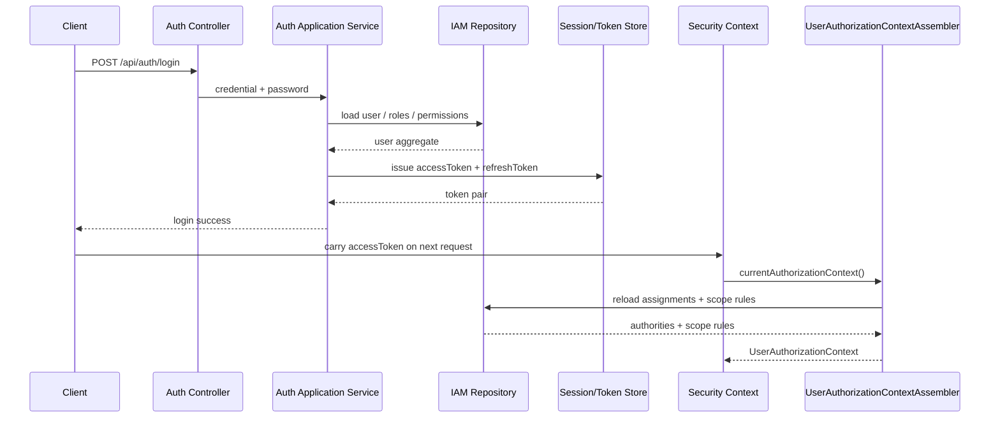
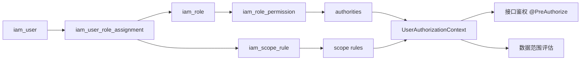

# A 组需求文档：身份认证与用户权限

## 1. 模块背景

A 组负责整个 rewrite 项目的身份底座，范围覆盖：登录、刷新 token、当前用户上下文、用户主数据、角色模板、角色分配、数据范围规则。

这个模块是其他 4 组的前置依赖，原因如下：

- B 组学生申请需要当前用户身份与附件归属校验。
- C 组审核工作流需要“动作权限 + 数据范围”做授权判断。
- D 组成绩查询与导出需要基于范围规则过滤可见数据。
- E 组的平台配置、附件池、AI 接口也必须复用统一安全链路。

一句话定位：A 组提供“谁在访问、能做什么、能看哪些数据”的统一能力。

### 1.1 核心时序图：登录与认证上下文装配



### 1.2 核心流程图：权限与范围规则装配



## 2. 模块边界

### 2.1 负责内容

- 登录、刷新、退出登录
- 当前用户认证上下文查询
- 用户主数据管理
- 组织树与组织归属关系
- 角色模板管理
- 权限字典与元数据查询
- 用户角色分配
- 范围规则管理
- IAM 身份查询接口

### 2.2 不负责内容

- 学生申请表单写入
- 教师审核业务动作本身
- 学生最终成绩汇总
- 文件上传存储实现
- 平台规则开关和 AI 报告生成

## 3. 数据依赖

A 组应优先依赖并落地以下表：

- `iam_user`
- `org_unit`
- `org_membership`
- `iam_role`
- `iam_permission`
- `iam_role_permission`
- `iam_user_role_assignment`
- `iam_scope_rule`
- `iam_session`
- `evaluation_category`
- `evaluation_item`

## 4. 统一响应约定

成功响应：

```json
{
  "success": true,
  "code": "OK",
  "message": "success",
  "data": {}
}
```

异常响应：

```json
{
  "success": false,
  "code": "VAL-4001",
  "message": "credential: 不能为空",
  "data": null
}
```

常见错误码：

| 错误码 | HTTP 状态码 | 场景 |
|---|---:|---|
| `VAL-4001` | `400` | 请求参数不合法 |
| `AUTH-4010` | `401` | 用户名密码错误或认证失败 |
| `AUTH-4011` | `401` | token 已过期 |
| `AUTH-4012` | `401` | token 非法 |
| `AUTH-4030` | `403` | 无权限访问 |
| `RES-4040` | `404` | 用户、角色、分配、组织不存在 |
| `BIZ-4090` | `409` | 重复用户、重复角色、重复分配、状态冲突 |
| `SYS-5000` | `500` | 未知系统错误 |

## 5. 接口清单总表

| 编号 | 方法 | 路由 | 用途 |
|---|---|---|---|
| A-1 | `POST` | `/api/auth/login` | 登录并签发 token |
| A-2 | `POST` | `/api/auth/refresh` | 刷新 token 对 |
| A-3 | `GET` | `/api/security/me` | 查询当前认证主体与权限摘要 |
| A-4 | `GET` | `/api/iam/users/{userNo}/identity` | 查询用户身份、组织、角色分配 |
| A-5 | `GET` | `/api/admin/users` | 分页查询用户 |
| A-6 | `POST` | `/api/admin/users` | 创建用户 |
| A-7 | `PATCH` | `/api/admin/users/{userId}/status` | 启用/禁用用户 |
| A-8 | `POST` | `/api/admin/users/import` | 批量导入用户 |
| A-9 | `GET` | `/api/admin/roles` | 分页查询角色模板 |
| A-10 | `POST` | `/api/admin/roles` | 创建角色模板 |
| A-11 | `PATCH` | `/api/admin/roles/{roleId}` | 修改角色模板 |
| A-12 | `POST` | `/api/admin/roles/{roleId}/permissions` | 绑定角色权限 |
| A-13 | `GET` | `/api/admin/role-assignments` | 分页查询角色分配 |
| A-14 | `POST` | `/api/admin/role-assignments` | 给用户分配角色 |
| A-15 | `PATCH` | `/api/admin/role-assignments/{assignmentId}` | 修改角色分配 |
| A-16 | `DELETE` | `/api/admin/role-assignments/{assignmentId}` | 撤销角色分配 |
| A-17 | `GET` | `/api/admin/role-assignments/{assignmentId}/scope-rules` | 查询范围规则 |
| A-18 | `POST` | `/api/admin/role-assignments/{assignmentId}/scope-rules` | 新增范围规则 |
| A-19 | `POST` | `/api/auth/logout` | 退出登录并使当前会话失效 |
| A-20 | `GET` | `/api/admin/permissions` | 查询权限字典 |
| A-21 | `GET` | `/api/admin/org-units/tree` | 查询组织树 |
| A-22 | `GET` | `/api/admin/users/{userId}/memberships` | 查询用户组织归属 |
| A-23 | `PUT` | `/api/admin/users/{userId}/memberships` | 整集合更新用户组织归属 |

## 6. 详细接口定义

### A-1 登录

- 路由：`POST /api/auth/login`
- 鉴权：匿名可访问
- 目的：按 `credential + password` 完成认证，加载角色、权限、范围后签发 Access Token / Refresh Token

请求体：

| 字段 | 类型 | 必填 | 说明 |
|---|---|---|---|
| `credential` | `string` | 是 | 学号/工号/统一登录账号 |
| `password` | `string` | 是 | 原始密码 |

成功返回 `data`：

| 字段 | 类型 | 说明 |
|---|---|---|
| `accessToken` | `string` | 访问 token |
| `accessTokenType` | `string` | 固定为 `Bearer` |
| `accessTokenExpiresAt` | `string` | 过期时间 |
| `refreshToken` | `string` | 刷新 token |
| `refreshTokenType` | `string` | 固定为 `Bearer` |
| `refreshTokenExpiresAt` | `string` | 过期时间 |

成功示例：

```json
{
  "success": true,
  "code": "OK",
  "message": "success",
  "data": {
    "accessToken": "eyJ...",
    "accessTokenType": "Bearer",
    "accessTokenExpiresAt": "2026-05-20T10:00:00Z",
    "refreshToken": "eyJ...",
    "refreshTokenType": "Bearer",
    "refreshTokenExpiresAt": "2026-05-27T10:00:00Z"
  }
}
```

异常返回：

| 场景 | HTTP | 错误码 | 说明 |
|---|---:|---|---|
| 凭证缺失 | `400` | `VAL-4001` | 必填字段为空 |
| 用户不存在或密码错误 | `401` | `AUTH-4010` | 认证失败 |
| 用户状态不可登录 | `401` | `AUTH-4010` | 账号状态为 `DISABLED` 或 `LOCKED`，统一视为非 `ACTIVE` |

### A-2 刷新 token

- 路由：`POST /api/auth/refresh`
- 鉴权：匿名可访问
- 目的：通过 Refresh Token 重载最新用户、角色、权限、范围，再次签发 token 对

请求体：

| 字段 | 类型 | 必填 | 说明 |
|---|---|---|---|
| `refreshToken` | `string` | 是 | 已签发 refresh token |

成功返回：与 A-1 相同。

异常返回：

| 场景 | HTTP | 错误码 | 说明 |
|---|---:|---|---|
| refresh token 缺失 | `400` | `VAL-4001` | 参数缺失 |
| refresh token 过期 | `401` | `AUTH-4011` | 无法刷新 |
| refresh token 非法 | `401` | `AUTH-4012` | 签名或类型错误 |
| 用户状态不可刷新 | `401` | `AUTH-4010` | 查库后账号状态为 `DISABLED` 或 `LOCKED`，统一视为非 `ACTIVE` |

### A-3 查询当前认证上下文

- 路由：`GET /api/security/me`
- 鉴权：需要 Bearer Token
- 目的：给前端或联调用于确认当前用户、角色、权限、范围规则是否正确装配

成功返回 `data`：

| 字段 | 类型 | 说明 |
|---|---|---|
| `userId` | `number` | 当前用户 ID |
| `userNo` | `string` | 学号/工号 |
| `userName` | `string` | 姓名 |
| `identity` | `string` | 当前主身份快照 |
| `roles` | `string[]` | 当前角色编码集合 |
| `authorities` | `string[]` | 当前权限码集合 |
| `scopeRules` | `object[]` | 当前范围规则集合 |

异常返回：`401` / `403` 为主。

### A-4 查询 IAM 身份

- 路由：`GET /api/iam/users/{userNo}/identity`
- 鉴权：`user.manage`
- 目的：按用户编号查询用户资料、角色分配、组织归属，供后台管理页和联调用

路径参数：

| 参数 | 类型 | 必填 | 说明 |
|---|---|---|---|
| `userNo` | `string` | 是 | 用户编号 |

成功返回 `data`：

| 字段 | 类型 | 说明 |
|---|---|---|
| `user` | `object` | 用户主数据 |
| `assignments` | `object[]` | 角色分配 |
| `memberships` | `object[]` | 组织归属 |

异常返回：

| 场景 | HTTP | 错误码 | 说明 |
|---|---:|---|---|
| 用户不存在 | `404` | `RES-4040` | `userNo` 无效 |
| 无权限访问 | `403` | `AUTH-4030` | 当前用户无查询身份权限 |

### A-5 分页查询用户

- 路由：`GET /api/admin/users`
- 鉴权：`user.manage`
- 目的：后台分页查询用户和状态

查询参数：

| 参数 | 类型 | 必填 | 默认值 | 说明 |
|---|---|---|---|---|
| `pageNo` | `long` | 否 | `1` | 页码 |
| `pageSize` | `long` | 否 | `20` | 页大小 |
| `keyword` | `string` | 否 | - | 姓名/学号/工号模糊搜索 |
| `status` | `string` | 否 | - | `ACTIVE`/`DISABLED`/`LOCKED` |
| `orgUnitId` | `long` | 否 | - | 组织过滤 |

成功返回：`ApiResponse<PageResult<UserView>>`

`UserView` 关键字段：`userId/userNo/userName/status/orgUnits/roleCodes/createdAt`

异常返回：

| 场景 | HTTP | 错误码 | 说明 |
|---|---:|---|---|
| 查询条件非法 | `400` | `VAL-4001` | 页码、页大小或状态枚举不合法 |
| 无权限访问 | `403` | `AUTH-4030` | 当前用户无用户管理权限 |
| 组织不存在 | `404` | `RES-4040` | 指定 `orgUnitId` 不存在 |

### A-6 创建用户

- 路由：`POST /api/admin/users`
- 鉴权：`user.manage`
- 目的：创建单个用户账号

请求体：

| 字段 | 类型 | 必填 | 说明 |
|---|---|---|---|
| `userNo` | `string` | 是 | 唯一编号 |
| `userName` | `string` | 是 | 用户姓名 |
| `password` | `string` | 是 | 初始密码 |
| `email` | `string` | 否 | 邮箱 |
| `phone` | `string` | 否 | 手机号 |
| `primaryOrgUnitId` | `long` | 否 | 主组织 |

成功返回 `data`：`userId/userNo/userName/status`

异常返回：

| 场景 | HTTP | 错误码 | 说明 |
|---|---:|---|---|
| 请求字段非法 | `400` | `VAL-4001` | 编号、姓名、密码等字段不合法 |
| 编号重复 | `409` | `BIZ-4090` | `userNo` 已存在 |
| 组织不存在 | `404` | `RES-4040` | `primaryOrgUnitId` 无效 |
| 无权限访问 | `403` | `AUTH-4030` | 当前用户无创建权限 |

### A-7 修改用户状态

- 路由：`PATCH /api/admin/users/{userId}/status`
- 鉴权：`user.manage`
- 目的：启用或禁用用户

请求体：

| 字段 | 类型 | 必填 | 说明 |
|---|---|---|---|
| `status` | `string` | 是 | `ACTIVE` / `DISABLED` / `LOCKED` |
| `reason` | `string` | 否 | 变更原因 |

成功返回：`data = null`

异常返回：

| 场景 | HTTP | 错误码 | 说明 |
|---|---:|---|---|
| 用户不存在 | `404` | `RES-4040` | `userId` 无效 |
| 状态非法 | `400` | `VAL-4001` | 仅允许 `ACTIVE/DISABLED/LOCKED` |
| 无权限访问 | `403` | `AUTH-4030` | 当前用户无状态修改权限 |
| 状态未变化或发生冲突 | `409` | `BIZ-4090` | 状态已是目标值或资源状态已变更 |

### A-8 批量导入用户

- 路由：`POST /api/admin/users/import`
- 鉴权：`user.import`
- Content-Type：`multipart/form-data`
- 目的：批量导入学生或教师账号

请求参数：

| 参数 | 类型 | 必填 | 说明 |
|---|---|---|---|
| `file` | `MultipartFile` | 是 | Excel 文件 |
| `importMode` | `string` | 否 | `UPSERT` / `INSERT_ONLY` |

成功返回 `data`：

| 字段 | 类型 | 说明 |
|---|---|---|
| `totalCount` | `number` | 总行数 |
| `successCount` | `number` | 成功数 |
| `failedCount` | `number` | 失败数 |
| `failedRows` | `object[]` | 错误行摘要 |

异常返回：

| 场景 | HTTP | 错误码 | 说明 |
|---|---:|---|---|
| 文件为空 | `400` | `VAL-4001` | 未上传文件或文件大小为 0 |
| `importMode` 非法 | `400` | `VAL-4001` | 仅允许 `UPSERT/INSERT_ONLY` |
| 模板错误 | `400` | `VAL-4001` | 缺少必填列或文件不可解析 |
| 无权限访问 | `403` | `AUTH-4030` | 当前用户无导入权限 |
| 严格插入遇到重复编号 | `409` | `BIZ-4090` | `INSERT_ONLY` 下不允许覆盖 |
| 文件解析失败 | `503` | `EXT-5033` | Excel 解析或外部依赖异常 |

### A-9 分页查询角色模板

- 路由：`GET /api/admin/roles`
- 鉴权：`role.manage`
- 返回字段：`roleId/roleCode/roleName/status/permissionCount/createdAt`

异常返回：

| 场景 | HTTP | 错误码 | 说明 |
|---|---:|---|---|
| 查询条件非法 | `400` | `VAL-4001` | 页码、状态或关键字条件不合法 |
| 无权限访问 | `403` | `AUTH-4030` | 当前用户无角色管理权限 |

### A-10 创建角色模板

- 路由：`POST /api/admin/roles`
- 鉴权：`role.manage`

请求体：

| 字段 | 类型 | 必填 | 说明 |
|---|---|---|---|
| `roleCode` | `string` | 是 | 角色编码 |
| `roleName` | `string` | 是 | 角色名称 |
| `roleType` | `string` | 是 | `SYSTEM` / `CUSTOM` |
| `description` | `string` | 否 | 说明 |

成功返回 `data`：`roleId/roleCode/roleName/status`

异常返回：

| 场景 | HTTP | 错误码 | 说明 |
|---|---:|---|---|
| 请求字段非法 | `400` | `VAL-4001` | 编码、名称或类型字段不合法 |
| 角色编码重复 | `409` | `BIZ-4090` | `roleCode` 已存在 |
| 无权限访问 | `403` | `AUTH-4030` | 当前用户无角色创建权限 |

### A-11 修改角色模板

- 路由：`PATCH /api/admin/roles/{roleId}`
- 鉴权：`role.manage`
- 允许修改：`roleName/description/status`

成功返回：`data = null`

异常返回：

| 场景 | HTTP | 错误码 | 说明 |
|---|---:|---|---|
| 角色不存在 | `404` | `RES-4040` | `roleId` 无效 |
| 请求字段非法 | `400` | `VAL-4001` | 状态或名称字段不合法 |
| 无权限访问 | `403` | `AUTH-4030` | 当前用户无角色修改权限 |
| 状态冲突 | `409` | `BIZ-4090` | 角色状态已变化或不允许修改 |

### A-12 绑定角色权限

- 路由：`POST /api/admin/roles/{roleId}/permissions`
- 鉴权：`permission.manage`

请求体：

| 字段 | 类型 | 必填 | 说明 |
|---|---|---|---|
| `permissionCodes` | `string[]` | 是 | 角色要绑定的权限码集合 |
| `replaceAll` | `boolean` | 否 | 是否整集合替换，默认 `true` |

成功返回：`data = null`

补充说明：

- 前端权限选择器的数据源统一来自 A-20，不允许各组私自硬编码权限码。
- 当前仅支持整集合替换，不提供增量绑定接口。

异常返回：

| 场景 | HTTP | 错误码 | 说明 |
|---|---:|---|---|
| 角色不存在 | `404` | `RES-4040` | `roleId` 无效 |
| 权限码不存在 | `404` | `RES-4040` | 任一 `permissionCode` 无效 |
| 请求字段非法 | `400` | `VAL-4001` | 权限集合为空或包含空值 |
| 无权限访问 | `403` | `AUTH-4030` | 当前用户无权限绑定权限 |

### A-13 分页查询角色分配

- 路由：`GET /api/admin/role-assignments`
- 鉴权：`assignment.manage`
- 状态冻结：角色分配状态统一使用 `ACTIVE/INACTIVE/EXPIRED`

状态说明：

- `ACTIVE`：当前有效且可参与授权计算。
- `INACTIVE`：被人工撤销或手工停用，不再参与授权计算。
- `EXPIRED`：超过 `effectiveTo` 后由系统自动判定失效，不能通过接口手工写入。

查询参数：`pageNo/pageSize/userId/roleCode/status/orgUnitId`

成功返回 `data`：`ApiResponse<PageResult<RoleAssignmentView>>`

`RoleAssignmentView` 字段冻结为：

| 字段 | 类型 | 说明 |
|---|---|---|
| `assignmentId` | `number` | 分配记录 ID |
| `userId` | `number` | 用户 ID |
| `userNo` | `string` | 用户编号 |
| `userName` | `string` | 用户名称 |
| `roleCode` | `string` | 角色编码 |
| `roleName` | `string` | 角色名称 |
| `orgUnitId` | `number` | 组织 ID |
| `orgUnitName` | `string` | 组织名称 |
| `status` | `string` | `ACTIVE/INACTIVE/EXPIRED` |
| `effectiveFrom` | `string` | 生效时间 |
| `effectiveTo` | `string` | 失效时间 |

异常返回：

| 场景 | HTTP | 错误码 | 说明 |
|---|---:|---|---|
| 查询条件非法 | `400` | `VAL-4001` | 页码、状态或条件值不合法 |
| 无权限访问 | `403` | `AUTH-4030` | 当前用户无角色分配查询权限 |
| 用户或组织不存在 | `404` | `RES-4040` | 指定过滤条件无效 |

### A-14 创建角色分配

- 路由：`POST /api/admin/role-assignments`
- 鉴权：`assignment.manage`
- 接口层 DTO：
  - 请求：`edu.whut.eval.interfaces.iam.request.CreateRoleAssignmentRequest`
  - 响应：`edu.whut.eval.interfaces.iam.response.RoleAssignmentResponse`

请求体：

| 字段 | 类型 | 必填 | 说明 |
|---|---|---|---|
| `userId` | `long` | 是 | 用户 ID |
| `roleCode` | `string` | 是 | 角色编码 |
| `orgUnitId` | `long` | 否 | 角色挂载组织 |
| `effectiveFrom` | `string` | 否 | 生效时间 |
| `effectiveTo` | `string` | 否 | 失效时间 |
| `sourceType` | `string` | 否 | `MANUAL` / `IMPORT` |

请求示例：

```json
{
  "userId": 1010,
  "roleCode": "COUNSELOR",
  "orgUnitId": 2002,
  "effectiveFrom": "2026-05-20T00:00:00",
  "effectiveTo": "2027-07-01T00:00:00",
  "sourceType": "MANUAL"
}
```

创建规则：

- 新建分配默认写入 `ACTIVE`。
- 当前版本不支持创建未来生效的 `PENDING` 状态；若 `effectiveFrom` 晚于当前时间，按请求非法处理。
- `EXPIRED` 只能由系统依据 `effectiveTo` 自动判定，不能通过创建接口直接指定。

成功返回 `data`：`assignmentId/userId/roleCode/status/effectiveFrom/effectiveTo`

成功响应示例：

```json
{
  "success": true,
  "code": "OK",
  "message": "success",
  "data": {
    "assignmentId": 70021,
    "userId": 1010,
    "roleCode": "COUNSELOR",
    "roleName": "辅导员",
    "orgUnitId": 2002,
    "orgUnitName": "计算机与人工智能学院",
    "status": "ACTIVE",
    "effectiveFrom": "2026-05-20T00:00:00",
    "effectiveTo": "2027-07-01T00:00:00",
    "sourceType": "MANUAL"
  }
}
```

异常返回：

| 场景 | HTTP | 错误码 | 说明 |
|---|---:|---|---|
| 请求字段非法 | `400` | `VAL-4001` | 时间区间或字段值不合法 |
| 用户、角色或组织不存在 | `404` | `RES-4040` | 关联资源无效 |
| 重复有效分配 | `409` | `BIZ-4090` | 同一维度已存在有效分配 |
| 无权限访问 | `403` | `AUTH-4030` | 当前用户无分配创建权限 |

### A-15 修改角色分配

- 路由：`PATCH /api/admin/role-assignments/{assignmentId}`
- 鉴权：`assignment.manage`
- 可修改字段：`status/effectiveFrom/effectiveTo/orgUnitId`
- 状态流转冻结：仅允许 `ACTIVE -> INACTIVE` 和 `INACTIVE -> ACTIVE`；`EXPIRED` 为终态，不允许通过接口回写
- 接口层 DTO：
  - 请求：`edu.whut.eval.interfaces.iam.request.UpdateRoleAssignmentRequest`
  - 响应：`edu.whut.eval.interfaces.iam.response.RoleAssignmentResponse`

请求体：

| 字段 | 类型 | 必填 | 说明 |
|---|---|---|---|
| `status` | `string` | 否 | `ACTIVE/INACTIVE` |
| `orgUnitId` | `long` | 否 | 新挂载组织 |
| `effectiveFrom` | `string` | 否 | 新的生效时间 |
| `effectiveTo` | `string` | 否 | 新的失效时间 |

请求示例：

```json
{
  "status": "ACTIVE",
  "orgUnitId": 2009,
  "effectiveFrom": "2026-05-20T00:00:00",
  "effectiveTo": "2027-07-01T00:00:00"
}
```

成功返回：更新后的角色分配快照

成功响应示例：

```json
{
  "success": true,
  "code": "OK",
  "message": "success",
  "data": {
    "assignmentId": 70021,
    "userId": 1010,
    "roleCode": "COUNSELOR",
    "roleName": "辅导员",
    "orgUnitId": 2009,
    "orgUnitName": "计算机学院研工办",
    "status": "ACTIVE",
    "effectiveFrom": "2026-05-20T00:00:00",
    "effectiveTo": "2027-07-01T00:00:00",
    "sourceType": "MANUAL",
    "updatedAt": "2026-05-20T10:20:30"
  }
}
```

异常返回：

| 场景 | HTTP | 错误码 | 说明 |
|---|---:|---|---|
| 分配不存在 | `404` | `RES-4040` | `assignmentId` 无效 |
| 组织不存在 | `404` | `RES-4040` | 新组织不存在 |
| 请求字段非法 | `400` | `VAL-4001` | 状态不是 `ACTIVE/INACTIVE`，或时间区间不合法 |
| 无权限访问 | `403` | `AUTH-4030` | 当前用户无分配修改权限 |
| 状态冲突 | `409` | `BIZ-4090` | 分配已过期、已失效或被并发更新 |

### A-16 撤销角色分配

- 路由：`DELETE /api/admin/role-assignments/{assignmentId}`
- 鉴权：`assignment.manage`
- 说明：撤销动作统一把 `ACTIVE` 分配置为 `INACTIVE`

成功返回：`data = null`

异常返回：

| 场景 | HTTP | 错误码 | 说明 |
|---|---:|---|---|
| 分配不存在 | `404` | `RES-4040` | `assignmentId` 无效 |
| 无权限访问 | `403` | `AUTH-4030` | 当前用户无分配撤销权限 |
| 已是失效状态 | `409` | `BIZ-4090` | 分配已是 `INACTIVE` 或 `EXPIRED` |

### A-17 查询范围规则

- 路由：`GET /api/admin/role-assignments/{assignmentId}/scope-rules`
- 鉴权：`assignment.manage`
- 返回字段：`scopeRuleId/permissionCode/scopeType/orgUnitId/categoryCode/itemCode/priority/status`
- 接口层 DTO：
  - 响应：`edu.whut.eval.interfaces.iam.response.ScopeRuleResponse`

成功响应示例：

```json
{
  "success": true,
  "code": "OK",
  "message": "success",
  "data": [
    {
      "scopeRuleId": 81001,
      "permissionCode": "manage.review.view",
      "scopeType": "ORG_SUBTREE",
      "orgUnitId": 2002,
      "orgUnitName": "计算机与人工智能学院",
      "categoryCode": null,
      "itemCode": null,
      "expressionJson": null,
      "priority": 100,
      "status": "ACTIVE"
    },
    {
      "scopeRuleId": 81002,
      "permissionCode": "manage.review.view",
      "scopeType": "CATEGORY",
      "orgUnitId": null,
      "orgUnitName": null,
      "categoryCode": "MORAL",
      "itemCode": null,
      "expressionJson": null,
      "priority": 90,
      "status": "ACTIVE"
    },
    {
      "scopeRuleId": 81003,
      "permissionCode": "manage.students.view",
      "scopeType": "ORG_SUBTREE",
      "orgUnitId": 2002,
      "orgUnitName": "计算机与人工智能学院",
      "categoryCode": null,
      "itemCode": null,
      "expressionJson": null,
      "priority": 100,
      "status": "ACTIVE"
    }
  ]
}
```

异常返回：

| 场景 | HTTP | 错误码 | 说明 |
|---|---:|---|---|
| assignment 不存在 | `404` | `RES-4040` | 目标分配不存在 |
| 无权限访问 | `403` | `AUTH-4030` | 当前用户无范围规则查询权限 |

### A-18 新增范围规则

- 路由：`POST /api/admin/role-assignments/{assignmentId}/scope-rules`
- 鉴权：`assignment.manage`
- 接口层 DTO：
  - 请求：`edu.whut.eval.interfaces.iam.request.CreateScopeRuleRequest`
  - 响应：`edu.whut.eval.interfaces.iam.response.ScopeRuleResponse`

请求体：

| 字段 | 类型 | 必填 | 说明 |
|---|---|---|---|
| `permissionCode` | `string` | 是 | 作用权限 |
| `scopeType` | `string` | 是 | `SELF` / `ALL` / `ORG_UNIT` / `ORG_SUBTREE` / `CATEGORY` / `ITEM` / `ORG_UNIT_ITEM` / `CUSTOM_EXPRESSION` |
| `orgUnitId` | `long` | 否 | 组织范围 |
| `categoryCode` | `string` | 否 | 大类编码 |
| `itemCode` | `string` | 否 | 子项编码 |
| `expressionJson` | `object` | 否 | 受控 JSON DSL |
| `priority` | `int` | 否 | 优先级，默认 `100` |

请求示例 1：本部门及下级

```json
{
  "permissionCode": "manage.review.view",
  "scopeType": "ORG_SUBTREE",
  "orgUnitId": 2002,
  "priority": 100
}
```

请求示例 2：指定类别

```json
{
  "permissionCode": "manage.review.view",
  "scopeType": "CATEGORY",
  "categoryCode": "MORAL",
  "priority": 90
}
```

成功返回：新增后的范围规则快照

成功响应示例：

```json
{
  "success": true,
  "code": "OK",
  "message": "success",
  "data": {
    "scopeRuleId": 81004,
    "assignmentId": 70021,
    "permissionCode": "manage.review.view",
    "scopeType": "CATEGORY",
    "orgUnitId": null,
    "categoryCode": "MORAL",
    "itemCode": null,
    "expressionJson": null,
    "priority": 90,
    "status": "ACTIVE",
    "createdAt": "2026-05-20T10:40:00"
  }
}
```

异常返回：

| 场景 | HTTP | 错误码 | 说明 |
|---|---:|---|---|
| assignment 不存在 | `404` | `RES-4040` | 目标分配不存在 |
| 范围规则字段冲突 | `400` | `VAL-4001` | `scopeType` 与字段不匹配 |
| 重复规则 | `409` | `BIZ-4090` | 相同语义已存在 |

### A-19 退出登录

- 路由：`POST /api/auth/logout`
- 鉴权：需要登录态
- 目的：使当前 Access Token 对应会话失效，同时撤销当前 Refresh Token

请求体：无

成功返回：`data = null`

异常返回：

| 场景 | HTTP | 错误码 | 说明 |
|---|---:|---|---|
| 未携带 token | `401` | `AUTH-4012` | 请求头缺失或 token 非法 |
| 会话不存在或已失效 | `401` | `AUTH-4012` | token 已撤销或会话已失效 |

### A-20 查询权限字典

- 路由：`GET /api/admin/permissions`
- 鉴权：`permission.manage`
- 目的：为角色配置、菜单按钮控制、范围规则编辑器提供统一权限码来源

查询参数：

| 参数 | 类型 | 必填 | 默认值 | 说明 |
|---|---|---|---|---|
| `keyword` | `string` | 否 | - | 权限码/权限名称模糊搜索 |
| `module` | `string` | 否 | - | 业务模块过滤 |
| `status` | `string` | 否 | `ACTIVE` | 状态过滤 |

成功返回 `data`：

| 字段 | 类型 | 说明 |
|---|---|---|
| `permissionCode` | `string` | 权限码 |
| `permissionName` | `string` | 权限名称 |
| `module` | `string` | 所属模块 |
| `description` | `string` | 说明 |
| `status` | `string` | 状态 |

异常返回：

| 场景 | HTTP | 错误码 | 说明 |
|---|---:|---|---|
| 无权限访问 | `403` | `AUTH-4030` | 无权限查看权限字典 |

### A-21 查询组织树

- 路由：`GET /api/admin/org-units/tree`
- 鉴权：`org.manage`
- 目的：为用户组织归属、角色分配挂载组织、范围规则编辑提供统一组织树

查询参数：

| 参数 | 类型 | 必填 | 默认值 | 说明 |
|---|---|---|---|---|
| `rootId` | `long` | 否 | - | 指定根组织 |
| `unitType` | `string` | 否 | - | 组织类型过滤 |
| `includeDisabled` | `boolean` | 否 | `false` | 是否返回禁用组织 |

成功返回 `data`：树形节点列表

| 字段 | 类型 | 说明 |
|---|---|---|
| `id` | `number` | 组织 ID |
| `unitCode` | `string` | 组织编码 |
| `unitName` | `string` | 组织名称 |
| `unitType` | `string` | 组织类型 |
| `status` | `string` | 状态 |
| `children` | `object[]` | 子节点 |

异常返回：

| 场景 | HTTP | 错误码 | 说明 |
|---|---:|---|---|
| 根组织不存在 | `404` | `RES-4040` | 指定 `rootId` 不存在 |
| 无权限访问 | `403` | `AUTH-4030` | 无权限查看组织树 |

### A-22 查询用户组织归属

- 路由：`GET /api/admin/users/{userId}/memberships`
- 鉴权：`org.manage`
- 目的：查询某个用户当前挂载的组织归属关系，供后台用户详情和角色分配页使用

路径参数：

| 参数 | 类型 | 必填 | 说明 |
|---|---|---|---|
| `userId` | `long` | 是 | 用户 ID |

成功返回 `data`：组织归属列表

| 字段 | 类型 | 说明 |
|---|---|---|
| `membershipId` | `number` | 归属记录 ID |
| `orgUnitId` | `number` | 组织 ID |
| `orgUnitName` | `string` | 组织名称 |
| `orgUnitType` | `string` | 组织类型 |
| `isPrimary` | `boolean` | 是否主组织 |
| `status` | `string` | 状态 |

异常返回：

| 场景 | HTTP | 错误码 | 说明 |
|---|---:|---|---|
| 用户不存在 | `404` | `RES-4040` | `userId` 无效 |
| 无权限访问 | `403` | `AUTH-4030` | 无权限查询他人组织归属 |

### A-23 整集合更新用户组织归属

- 路由：`PUT /api/admin/users/{userId}/memberships`
- 鉴权：`org.manage`
- 目的：按整集合方式更新用户组织归属，避免前端逐条增删导致状态不一致

请求体：

| 字段 | 类型 | 必填 | 说明 |
|---|---|---|---|
| `memberships` | `object[]` | 是 | 最新组织归属集合 |

`memberships` 元素字段：

| 字段 | 类型 | 必填 | 说明 |
|---|---|---|---|
| `orgUnitId` | `long` | 是 | 组织 ID |
| `isPrimary` | `boolean` | 否 | 是否主组织 |

成功返回：`data = null`

异常返回：

| 场景 | HTTP | 错误码 | 说明 |
|---|---:|---|---|
| 用户不存在 | `404` | `RES-4040` | 目标用户不存在 |
| 组织不存在 | `404` | `RES-4040` | 任一 `orgUnitId` 不存在 |
| 多个主组织 | `400` | `VAL-4001` | `isPrimary=true` 超过 1 个 |
| 重复组织 | `409` | `BIZ-4090` | 同一组织重复提交 |

## 7. 交付要求

- 必须提供 IAM DDL、初始化数据脚本和权限码清单。
- 必须提供登录、刷新、授权上下文加载的自动化测试。
- 必须给 B/C/D/E 组提供统一的 `CurrentUser` / `UserAuthorizationContext` 读取方式。
- 必须冻结 `role_code`、`permission_code`、`category_code`、`item_code` 词汇表。
