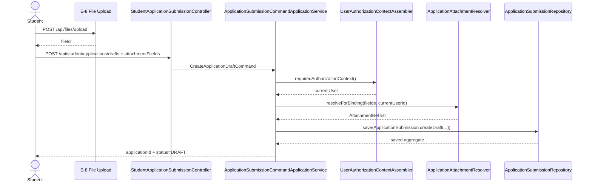
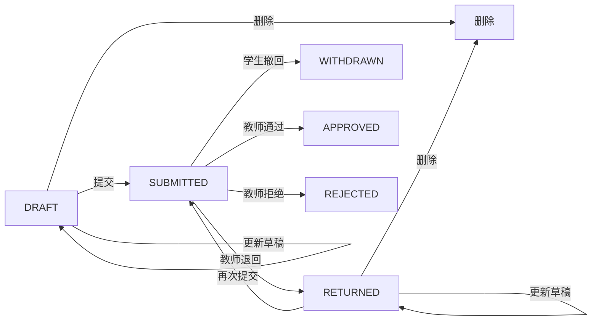

# B 组需求文档：学生申请模块

## 1. 模块背景

B 组负责“学生发起和维护综测申请”这条主链路，是全系统最核心的正式业务写入域。旧系统里这部分能力分散在 `DetermineController`、`ViewApplicationController` 中，且按智育/体育/劳育分裂成多套路由；rewrite 阶段需要统一为一套正式申请模型。

当前已经明确的设计结论：

- 学生申请统一建模为 `ApplicationSubmission` 聚合。
- 附件不再直接传 `storageKey` 等基础设施细节，请求体只传 `attachmentFileIds`。
- 草稿、更新、提交、撤回应采用乐观锁版本控制。
- 学生只能操作自己的申请。
- 申请写接口必须复用 A 组的认证与权限上下文。

### 1.1 核心时序图：创建申请草稿



### 1.2 核心流程图：申请状态机



## 2. 模块边界

### 2.1 负责内容

- 创建申请草稿
- 更新草稿
- 删除草稿/退回申请
- 提交申请
- 撤回申请
- 查询本人申请列表/详情
- 学生首页申请概览
- 讲座/可选项目等申请前置查询
- 附件绑定与状态约束校验

### 2.2 不负责内容

- 教师审核动作
- 最终成绩冻结与导出
- 公共附件池发布管理
- 平台开关配置本身

## 3. 核心业务规则

- 仅 `DRAFT` / `RETURNED` 状态允许编辑或删除。
- `SUBMITTED` 状态不能修改附件和正文。
- `WITHDRAWN` 只允许从 `SUBMITTED` 流转得到；`DRAFT` / `RETURNED` 不走撤回接口，而是走删除接口。
- 同一学生、同一 `itemCode`、同一学年学期，不允许存在多条活跃申请。
- 草稿更新、提交、撤回都必须带 `expectedVersion`。
- 附件解析采用 fail-closed：任一 `fileId` 不合法，整次写入失败。
- 附件当前仅允许两类来源：本人上传的 `ACTIVE` 文件、公共池中 `PUBLISHED + ALL` 的文件。
- 即使 E 组后续支持 `ORG_UNIT/ROLE` 范围公共附件，一期学生申请写链路仍只允许消费 `PUBLISHED + ALL` 记录。

## 4. 数据依赖

B 组主要依赖以下表：

- `application_submission`
- `application_fact`
- `application_review_log`
- `application_attachment`
- `file_asset`
- `public_attachment_entry`
- `evaluation_item`

## 5. 接口清单总表

| 编号 | 方法 | 路由 | 用途 |
|---|---|---|---|
| B-1 | `GET` | `/api/student/applications/overview` | 学生首页申请概览 |
| B-2 | `GET` | `/api/student/query/applications` | 分页查询本人申请列表 |
| B-3 | `GET` | `/api/student/applications/{applicationId}` | 查询申请详情 |
| B-4 | `POST` | `/api/student/applications/drafts` | 创建申请草稿 |
| B-5 | `PUT` | `/api/student/applications/{applicationId}/draft` | 更新申请草稿 |
| B-6 | `DELETE` | `/api/student/applications/{applicationId}` | 删除草稿/退回申请 |
| B-7 | `POST` | `/api/student/applications/{applicationId}/submit` | 提交申请 |
| B-8 | `POST` | `/api/student/applications/{applicationId}/withdraw` | 撤回申请 |
| B-9 | `GET` | `/api/student/lectures` | 查询可申报讲座或可选活动 |

## 6. 统一返回约定

成功响应统一为 `ApiResponse<T>`；异常由 `GlobalExceptionHandler` 映射。

重点错误码：

| 错误码 | HTTP | 典型场景 |
|---|---:|---|
| `VAL-4001` | `400` | 请求字段缺失、附件不存在、附件无权使用、窗口未开放 |
| `AUTH-4030` | `403` | 非本人操作、权限不足 |
| `RES-4040` | `404` | 申请不存在 |
| `BIZ-4090` | `409` | 活跃申请冲突、版本冲突、重复附件 |

## 7. 详细接口定义

### B-1 学生首页申请概览

- 路由：`GET /api/student/applications/overview`
- 鉴权：需要登录态
- 目的：替代旧系统首页统计能力，统一返回当前学生的申请概览信息

成功返回 `data`：

| 字段 | 类型 | 说明 |
|---|---|---|
| `draftCount` | `number` | 草稿数量 |
| `submittedCount` | `number` | 已提交待审数量 |
| `returnedCount` | `number` | 退回数量 |
| `approvedCount` | `number` | 已通过数量 |
| `rejectedCount` | `number` | 已拒绝数量 |
| `latestAcademicYear` | `string` | 最近学年 |

### B-2 分页查询本人申请列表

- 路由：`GET /api/student/query/applications`
- 鉴权：`application.view.self`

查询参数：

| 参数 | 类型 | 必填 | 默认值 | 说明 |
|---|---|---|---|---|
| `pageNo` | `long` | 否 | `1` | 页码 |
| `pageSize` | `long` | 否 | `20` | 每页数量 |
| `applicationId` | `long` | 否 | - | 申请 ID |
| `orgUnitId` | `long` | 否 | - | 组织过滤 |
| `categoryCode` | `string` | 否 | - | 类别编码 |
| `itemCode` | `string` | 否 | - | 项目编码 |
| `academicYear` | `string` | 否 | - | 学年 |
| `term` | `string` | 否 | - | 学期 |
| `status` | `string` | 否 | - | 申请状态 |

成功返回 `data`：`ApiResponse<PageResult<StudentApplicationListItem>>`

`StudentApplicationListItem` 字段冻结为：

| 字段 | 类型 | 说明 |
|---|---|---|
| `applicationId` | `number` | 申请 ID |
| `title` | `string` | 申请标题 |
| `categoryCode` | `string` | 大类编码 |
| `itemCode` | `string` | 子项编码 |
| `academicYear` | `string` | 学年 |
| `term` | `string` | 学期 |
| `status` | `string` | 申请状态 |
| `updatedAt` | `string` | 最近更新时间 |
| `version` | `number` | 当前版本 |

异常返回：

| 场景 | HTTP | 错误码 | 说明 |
|---|---:|---|---|
| 查询条件非法 | `400` | `VAL-4001` | 页码、状态或过滤条件不合法 |
| 无权限访问 | `403` | `AUTH-4030` | 当前用户无列表查询权限 |

### B-3 查询申请详情

- 路由：`GET /api/student/applications/{applicationId}`
- 鉴权：需要登录态且必须是本人申请

成功返回 `data`：

| 字段 | 类型 | 说明 |
|---|---|---|
| `applicationId` | `number` | 主键 |
| `status` | `string` | `DRAFT/SUBMITTED/RETURNED/APPROVED/REJECTED/WITHDRAWN` |
| `orgUnitId` | `number` | 归属组织 |
| `categoryCode` | `string` | 大类编码 |
| `itemCode` | `string` | 子项编码 |
| `academicYear` | `string` | 学年 |
| `term` | `string` | 学期 |
| `title` | `string` | 标题 |
| `description` | `string` | 说明 |
| `attachments` | `object[]` | 附件快照 |
| `reviewLogs` | `object[]` | 审核轨迹摘要 |
| `version` | `number` | 乐观锁版本 |

异常返回：

| 场景 | HTTP | 错误码 | 说明 |
|---|---:|---|---|
| 申请不存在 | `404` | `RES-4040` | `applicationId` 无效 |
| 非本人访问 | `403` | `AUTH-4030` | 只能查看自己的申请 |

### B-4 创建申请草稿

- 路由：`POST /api/student/applications/drafts`
- 鉴权：需要登录态
- 约束冻结：创建草稿必须同时通过申请窗口校验和项目定义校验；窗口关闭、项目停用、项目不支持学生申报都应直接拒绝创建

请求体：

| 字段 | 类型 | 必填 | 说明 |
|---|---|---|---|
| `orgUnitId` | `long` | 是 | 归属组织 |
| `categoryCode` | `string` | 是 | 大类编码 |
| `itemCode` | `string` | 是 | 子项编码 |
| `academicYear` | `string` | 是 | 学年 |
| `term` | `string` | 是 | 学期 |
| `title` | `string` | 是 | 标题 |
| `description` | `string` | 是 | 说明 |
| `attachmentFileIds` | `string[]` | 是 | 已上传附件 `fileId` 集合 |

成功返回 `data`：

| 字段 | 类型 | 说明 |
|---|---|---|
| `applicationId` | `number` | 新申请 ID |
| `status` | `string` | 初始值 `DRAFT` |
| `title` | `string` | 标题 |
| `description` | `string` | 说明 |
| `attachmentCount` | `number` | 附件数量 |
| `version` | `number` | 初始版本 |

成功示例：

```json
{
  "success": true,
  "code": "OK",
  "message": "success",
  "data": {
    "applicationId": 10001,
    "status": "DRAFT",
    "title": "2025 学年讲座加分申请",
    "description": "提交讲座签到与证明材料",
    "attachmentCount": 2,
    "version": 1
  }
}
```

异常返回：

| 场景 | HTTP | 错误码 | 说明 |
|---|---:|---|---|
| 字段缺失 | `400` | `VAL-4001` | 请求体非法 |
| 申请窗口未开放 | `400` | `VAL-4001` | 平台规则不允许当前时间创建申请 |
| 项目不存在 | `404` | `RES-4040` | `categoryCode/itemCode` 无效 |
| 项目已停用 | `400` | `VAL-4001` | 项目定义状态不是可申报状态 |
| 项目不支持学生申报 | `400` | `VAL-4001` | `applyMode` 为 `TEACHER_IMPORT` 等非学生申报模式 |
| 附件不存在或失效 | `400` | `VAL-4001` | `file_asset` 缺失或非 `ACTIVE` |
| 无权使用附件 | `400` | `VAL-4001` | 附件不是本人上传，也不是已发布公共附件 |
| 同学年同项目已有活跃申请 | `409` | `BIZ-4090` | 不能重复创建 |
| 同一请求重复附件 | `409` | `BIZ-4090` | 相同 `fileId` 重复出现 |

### B-5 更新申请草稿

- 路由：`PUT /api/student/applications/{applicationId}/draft`
- 鉴权：需要登录态且必须是本人申请
- 约束冻结：更新草稿同样受申请窗口和项目定义约束；若项目已停用或当前窗口关闭，应拒绝更新

请求体：

| 字段 | 类型 | 必填 | 说明 |
|---|---|---|---|
| `title` | `string` | 是 | 新标题 |
| `description` | `string` | 是 | 新说明 |
| `attachmentFileIds` | `string[]` | 是 | 最新附件集合，整集合替换 |
| `expectedVersion` | `long` | 是 | 乐观锁版本 |

成功返回 `data`：

| 字段 | 类型 | 说明 |
|---|---|---|
| `applicationId` | `number` | 申请 ID |
| `status` | `string` | 更新后的状态，保持 `DRAFT` 或 `RETURNED` |
| `title` | `string` | 最新标题 |
| `description` | `string` | 最新说明 |
| `attachmentCount` | `number` | 最新附件数量 |
| `version` | `number` | 最新版本 |

异常返回：

| 场景 | HTTP | 错误码 | 说明 |
|---|---:|---|---|
| 申请不存在 | `404` | `RES-4040` | `applicationId` 无效 |
| 非本人操作 | `403` | `AUTH-4030` | 只能更新自己的申请 |
| 申请窗口未开放 | `400` | `VAL-4001` | 平台规则不允许当前时间更新申请 |
| 项目已停用 | `400` | `VAL-4001` | 关联项目定义状态不允许编辑 |
| 项目不支持学生申报 | `400` | `VAL-4001` | 项目已切换为非学生申报模式 |
| 非 `DRAFT/RETURNED` 状态更新 | `409` | `BIZ-4090` | 当前状态不允许编辑 |
| 版本冲突 | `409` | `BIZ-4090` | `expectedVersion` 与当前版本不一致 |
| 附件异常 | `400` | `VAL-4001` | 附件不存在、失效、无权使用或重复 |

### B-6 删除申请

- 路由：`DELETE /api/student/applications/{applicationId}`
- 鉴权：需要登录态且必须是本人申请
- 目标：替代旧系统 `applicationClass + id` 的删除方式，统一按申请主键删除

请求体：无

成功返回：`data = null`

约束：

- 仅 `DRAFT` / `RETURNED` 可删除。
- 删除后只做逻辑删除，不直接删除 `file_asset`。
- 如果未来存在已引用附件，需要保留 `application_attachment` 历史审计或做软删除。

异常返回：

| 场景 | HTTP | 错误码 | 说明 |
|---|---:|---|---|
| 申请不存在 | `404` | `RES-4040` | `applicationId` 无效 |
| 非本人操作 | `403` | `AUTH-4030` | 只能删除自己的申请 |
| 非 `DRAFT/RETURNED` 状态删除 | `409` | `BIZ-4090` | `SUBMITTED/APPROVED/REJECTED/WITHDRAWN` 均不允许 |
| 版本或状态已变化 | `409` | `BIZ-4090` | 资源已被其他动作处理 |

### B-7 提交申请

- 路由：`POST /api/student/applications/{applicationId}/submit`
- 鉴权：需要登录态且必须是本人申请

请求体：

| 字段 | 类型 | 必填 | 说明 |
|---|---|---|---|
| `expectedVersion` | `long` | 是 | 乐观锁版本 |

成功返回 `data`：

| 字段 | 类型 | 说明 |
|---|---|---|
| `applicationId` | `number` | 申请 ID |
| `status` | `string` | 固定为 `SUBMITTED` |
| `submittedAt` | `string` | 提交时间 |
| `version` | `number` | 最新版本 |

异常返回：

| 场景 | HTTP | 错误码 | 说明 |
|---|---:|---|---|
| 申请窗口未开放 | `400` | `VAL-4001` | 平台规则不允许提交 |
| 申请不存在 | `404` | `RES-4040` | 无此申请 |
| 非法状态提交 | `409` | `BIZ-4090` | 非 `DRAFT/RETURNED` |
| 版本冲突 | `409` | `BIZ-4090` | 数据被他人或前一次请求更新 |

### B-8 撤回申请

- 路由：`POST /api/student/applications/{applicationId}/withdraw`
- 鉴权：需要登录态且必须是本人申请
- 语义冻结：该接口只处理“学生已提交但想主动撤回”的场景；草稿或退回态请使用 B-6 删除或 B-5 更新，不走撤回

请求体：

| 字段 | 类型 | 必填 | 说明 |
|---|---|---|---|
| `reason` | `string` | 是 | 撤回原因 |
| `expectedVersion` | `long` | 是 | 乐观锁版本 |

成功返回 `data`：

| 字段 | 类型 | 说明 |
|---|---|---|
| `applicationId` | `number` | 申请 ID |
| `status` | `string` | 固定为 `WITHDRAWN` |
| `version` | `number` | 最新版本 |
| `withdrawnAt` | `string` | 撤回时间 |

成功后状态变为 `WITHDRAWN`。

异常返回：

| 场景 | HTTP | 错误码 | 说明 |
|---|---:|---|---|
| 申请不存在 | `404` | `RES-4040` | 无此申请 |
| 非本人操作 | `403` | `AUTH-4030` | 只能撤回自己的申请 |
| 非 `SUBMITTED` 状态撤回 | `409` | `BIZ-4090` | `DRAFT/RETURNED/APPROVED/REJECTED/WITHDRAWN` 均不允许 |
| 审核已开始或状态已流转 | `409` | `BIZ-4090` | 已不处于可撤回窗口 |
| 版本冲突 | `409` | `BIZ-4090` | `expectedVersion` 与当前版本不一致 |
| 撤回原因为空 | `400` | `VAL-4001` | `reason` 不能为空 |

### B-9 查询讲座/活动候选项

- 路由：`GET /api/student/lectures`
- 鉴权：需要登录态
- 目的：替代旧系统讲座查询接口，提供学生申请前可选讲座列表
- 语义冻结：无匹配数据时返回空分页，不返回 `404`

查询参数：

| 参数 | 类型 | 必填 | 说明 |
|---|---|---|---|
| `academicYear` | `string` | 是 | 学年 |
| `keyword` | `string` | 否 | 标题搜索 |
| `pageNo` | `long` | 否 | 分页 |
| `pageSize` | `long` | 否 | 分页 |

成功返回 `data`：`ApiResponse<PageResult<LectureCandidateView>>`

`LectureCandidateView` 字段冻结为：

| 字段 | 类型 | 说明 |
|---|---|---|
| `lectureId` | `number` | 讲座 ID |
| `title` | `string` | 讲座标题 |
| `heldAt` | `string` | 举办时间 |
| `academicYear` | `string` | 学年 |
| `maxScore` | `number` | 该讲座可申报上限分值 |
| `attendanceStatus` | `string` | `ATTENDED/NOT_ATTENDED/CLAIMED` |

异常返回：

| 场景 | HTTP | 错误码 | 说明 |
|---|---:|---|---|
| 学年为空或格式非法 | `400` | `VAL-4001` | `academicYear` 不合法 |
| 查询条件非法 | `400` | `VAL-4001` | 页码、页大小或关键字参数不合法 |
| 无权限访问 | `403` | `AUTH-4030` | 当前用户无学生侧查询权限 |

## 8. 交付要求

- 必须产出学生申请状态机说明。
- 必须补齐创建、更新、提交、撤回、删除的单元测试和 WebMvc 测试。
- 必须与 E 组对齐 `attachmentFileIds` 契约，与 C 组对齐审核状态口径，与 D 组对齐通过后成绩汇入规则。
