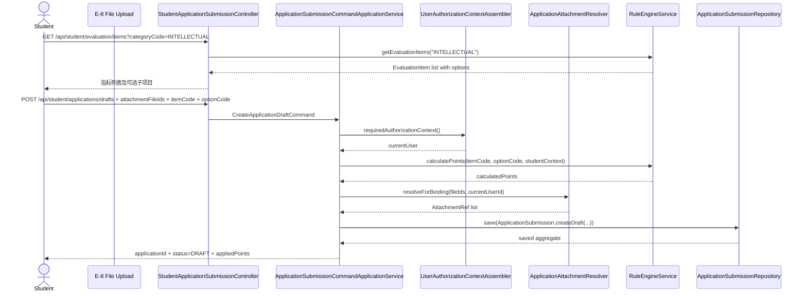
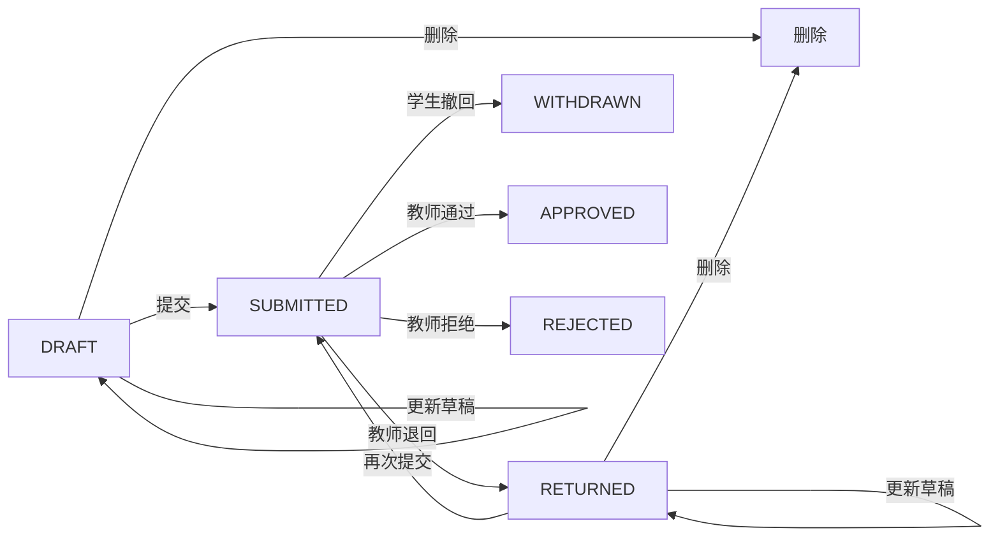
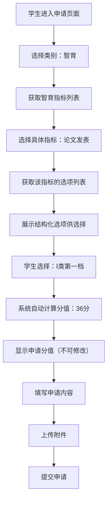
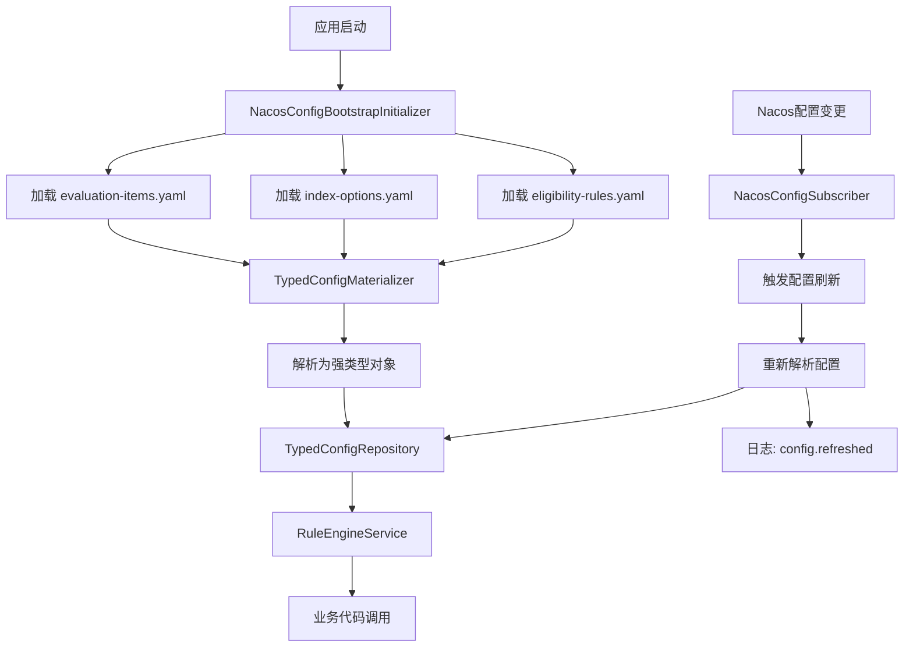

# B 组需求文档：学生申请模块

## 1. 模块背景

B 组负责“学生发起和维护综测申请”这条主链路，是全系统最核心的正式业务写入域。旧系统里这部分能力分散在 `DetermineController`、`ViewApplicationController` 中，且按智育/体育/劳育分裂成多套路由；rewrite 阶段需要统一为一套正式申请模型。

当前已经明确的设计结论：

- 学生申请统一建模为 `ApplicationSubmission` 聚合。
- 附件不再直接传 `storageKey` 等基础设施细节，请求体只传 `attachmentFileIds`。
- 草稿、更新、提交、撤回应采用乐观锁版本控制。
- 学生只能操作自己的申请。
- 申请写接口必须复用 A 组的认证与权限上下文。
- **指标配置通过 Nacos 动态加载，支持评分标准、分值计算、资格规则的灵活配置**。

### 1.1 核心时序图：创建申请草稿



### 1.2 核心流程图：申请状态机



---

## 15. 动态指标配置设计（新增）

### 15.1 设计目标

1. **配置化管理**：所有测评指标、评分标准、资格规则都通过 Nacos 配置管理，无需代码修改即可调整
2. **结构化评分标准**：评分标准不再是纯文本，而是由多个选项组成，每个选项对应固定分值
3. **规则引擎支持**：支持复杂的资格判定规则，如党员/非党员差异化要求
4. **最高分值动态计算**：支持 SpEL 表达式定义最高分值上限
5. **特殊类别支持**：支持"其他"等无固定评分标准的特殊类别
6. **热更新**：配置变更后自动生效，无需重启应用

### 15.2 配置结构总览

| 配置文件 | 用途 | 格式 |
|---------|------|------|
| `whut-eval-evaluation-items.yaml` | 测评指标定义（含最高分值表达式） | YAML |
| `whut-eval-index-options.yaml` | 指标选项与分值配置 | YAML |
| `whut-eval-eligibility-rules.yaml` | 奖学金资格规则 | YAML |

### 15.3 智育完整配置示例

#### 15.3.1 测评指标定义 (`whut-eval-evaluation-items.yaml`)

```yaml
evaluation-items:
  INTELLECTUAL:
    - itemCode: "INTELLECTUAL_GRADE"
      itemName: "学习成绩"
      categoryCode: "INTELLECTUAL"
      categoryName: "智育"
      description: "课程成绩加权平均分"
      maxPoints: null  # 无上限
      maxPointsExpression: null  # 无表达式
      applyMode: "SYSTEM_CALCULATED"  # 系统计算，不可学生申报
      enabled: true
      sortOrder: 1
      optionsKey: null  # 无选项，系统自动计算
    
    - itemCode: "INTELLECTUAL_PAPER"
      itemName: "论文发表"
      categoryCode: "INTELLECTUAL"
      categoryName: "智育"
      description: "学术论文发表加分"
      maxPoints: null  # 无固定上限，由选项决定
      maxPointsExpression: null
      applyMode: "STUDENT_APPLY"  # 学生可申报
      enabled: true
      sortOrder: 2
      optionsKey: "intellectual-paper"  # 关联选项配置
    
    - itemCode: "INTELLECTUAL_PATENT"
      itemName: "专利"
      categoryCode: "INTELLECTUAL"
      categoryName: "智育"
      description: "专利申请与授权加分"
      maxPoints: null
      maxPointsExpression: null
      applyMode: "STUDENT_APPLY"
      enabled: true
      sortOrder: 3
      optionsKey: "intellectual-patent"
    
    - itemCode: "INTELLECTUAL_COMPETITION"
      itemName: "学术科技竞赛"
      categoryCode: "INTELLECTUAL"
      categoryName: "智育"
      description: "各类学术科技竞赛获奖加分"
      maxPoints: null
      maxPointsExpression: null
      applyMode: "STUDENT_APPLY"
      enabled: true
      sortOrder: 4
      optionsKey: "intellectual-competition"
    
    - itemCode: "INTELLECTUAL_ACADEMIC_ACTIVITY"
      itemName: "学术活动"
      categoryCode: "INTELLECTUAL"
      categoryName: "智育"
      description: "参加学术会议、讲座等活动加分"
      maxPoints: 1  # 固定最高分值
      maxPointsExpression: null
      applyMode: "STUDENT_APPLY"
      enabled: true
      sortOrder: 5
      optionsKey: "intellectual-academic-activity"
    
    - itemCode: "INTELLECTUAL_LECTURE"
      itemName: "学术讲座"
      categoryCode: "INTELLECTUAL"
      categoryName: "智育"
      description: "参加学院组织的学术讲座"
      maxPoints: 2
      maxPointsExpression: null
      applyMode: "SYSTEM_CALCULATED"  # 系统根据签到记录计算
      enabled: true
      sortOrder: 6
      optionsKey: null
    
    - itemCode: "INTELLECTUAL_MENTOR_EVALUATION"
      itemName: "导师评价"
      categoryCode: "INTELLECTUAL"
      categoryName: "智育"
      description: "导师对研究生学年表现的评价"
      maxPoints: 10
      maxPointsExpression: null
      applyMode: "TEACHER_IMPORT"  # 教师导入
      enabled: true
      sortOrder: 7
      optionsKey: null

  SPORTS:
    - itemCode: "SPORTS_COMPETITION"
      itemName: "文体竞赛"
      categoryCode: "SPORTS"
      categoryName: "体育与美育"
      description: "各类文体竞赛获奖加分"
      maxPoints: null
      maxPointsExpression: null
      applyMode: "STUDENT_APPLY"
      enabled: true
      sortOrder: 1
      optionsKey: "sports-competition"
    
    - itemCode: "SPORTS_ART_CONTRIBUTION"
      itemName: "文艺征稿"
      categoryCode: "SPORTS"
      categoryName: "体育与美育"
      description: "文艺作品发表或获奖加分"
      maxPoints: null
      maxPointsExpression: null
      applyMode: "STUDENT_APPLY"
      enabled: true
      sortOrder: 2
      optionsKey: "sports-art-contribution"
    
    - itemCode: "SPORTS_OTHER"
      itemName: "其他"
      categoryCode: "SPORTS"
      categoryName: "体育与美育"
      description: "其他体育美育相关活动"
      maxPoints: 3  # 其他类有固定最高分值限制
      maxPointsExpression: null
      applyMode: "STUDENT_APPLY"
      enabled: true
      sortOrder: 3
      optionsKey: "sports-other"  # 有选项，但评分标准不固定，学生可自定义申请理由

  LABOR:
    - itemCode: "LABOR_SOCIAL_WORK"
      itemName: "社会工作"
      categoryCode: "LABOR"
      categoryName: "劳育"
      description: "学生干部工作加分"
      maxPoints: null
      maxPointsExpression: null
      applyMode: "STUDENT_APPLY"
      enabled: true
      sortOrder: 1
      optionsKey: "labor-social-work"
    
    - itemCode: "LABOR_SOCIAL_PRACTICE"
      itemName: "社会实践"
      categoryCode: "LABOR"
      categoryName: "劳育"
      description: "社会实践活动加分"
      maxPoints: null
      maxPointsExpression: null
      applyMode: "STUDENT_APPLY"
      enabled: true
      sortOrder: 2
      optionsKey: "labor-social-practice"
    
    - itemCode: "LABOR_CULTURE_CONSTRUCTION"
      itemName: "两室文化建设"
      categoryCode: "LABOR"
      categoryName: "劳育"
      description: "宿舍、教室文化建设加分"
      maxPoints: null
      maxPointsExpression: null
      applyMode: "STUDENT_APPLY"
      enabled: true
      sortOrder: 3
      optionsKey: "labor-culture-construction"

  MORAL:
    - itemCode: "MORAL_IDEOLOGY"
      itemName: "思想教育"
      categoryCode: "MORAL"
      categoryName: "德育"
      description: "思想政治理论学习和活动参与"
      maxPoints: 5
      maxPointsExpression: null
      applyMode: "SYSTEM_CALCULATED"
      enabled: true
      sortOrder: 1
      optionsKey: null
    
    - itemCode: "MORAL_DAILY_BEHAVIOR"
      itemName: "日常表现"
      categoryCode: "MORAL"
      categoryName: "德育"
      description: "纪律表现和任务完成情况"
      maxPoints: 5
      maxPointsExpression: null
      applyMode: "SYSTEM_CALCULATED"
      enabled: true
      sortOrder: 2
      optionsKey: null
    
    - itemCode: "MORAL_REWARD_PUNISHMENT"
      itemName: "奖惩"
      categoryCode: "MORAL"
      categoryName: "德育"
      description: "获得荣誉称号或受到处分"
      maxPoints: 6
      maxPointsExpression: "isPartyMember ? 8 : 6"  # SpEL表达式：党员最高8分，非党员最高6分
      applyMode: "STUDENT_APPLY"
      enabled: true
      sortOrder: 3
      optionsKey: "moral-reward-punishment"
```

#### 15.3.2 指标选项配置 (`whut-eval-index-options.yaml`)

```yaml
index-options:
  # ============ 智育选项 ============
  
  # 论文发表选项
  intellectual-paper:
    - optionCode: "PAPER_I_1"
      optionName: "Ⅰ类第一档（顶刊/顶会）"
      points: 36
      description: "发表在学科顶级期刊或会议"
      condition: "true"  # SpEL表达式，true表示始终适用
      sortOrder: 1
    
    - optionCode: "PAPER_I_2"
      optionName: "Ⅰ类第二档"
      points: 24
      description: "发表在学科重要期刊或会议"
      condition: "true"
      sortOrder: 2
    
    - optionCode: "PAPER_II_3"
      optionName: "Ⅱ类第三档"
      points: 12
      description: "发表在核心期刊"
      condition: "true"
      sortOrder: 3
    
    - optionCode: "PAPER_III_4"
      optionName: "Ⅲ类第四档"
      points: 6
      description: "发表在普通期刊"
      condition: "true"
      sortOrder: 4
    
    - optionCode: "PAPER_III_5"
      optionName: "Ⅲ类第五档"
      points: 5
      condition: "true"
      sortOrder: 5
    
    - optionCode: "PAPER_IV_6"
      optionName: "Ⅳ类第六档"
      points: 3
      condition: "true"
      sortOrder: 6
    
    - optionCode: "PAPER_IV_7"
      optionName: "Ⅳ类第七档"
      points: 2
      condition: "true"
      sortOrder: 7

  # 专利选项
  intellectual-patent:
    - optionCode: "PATENT_INVENTION_AUTH"
      optionName: "发明专利授权"
      points: 6
      description: "获得国家发明专利授权证书"
      condition: "true"
      sortOrder: 1
    
    - optionCode: "PATENT_INVENTION_ACCEPT"
      optionName: "发明专利受理"
      points: 2
      description: "获得国家发明专利受理通知书"
      condition: "true"
      sortOrder: 2
    
    - optionCode: "PATENT_UTILITY_AUTH"
      optionName: "实用新型专利授权"
      points: 2
      description: "获得实用新型专利授权证书"
      condition: "true"
      sortOrder: 3
    
    - optionCode: "PATENT_UTILITY_ACCEPT"
      optionName: "实用新型专利受理"
      points: 1
      description: "获得实用新型专利受理通知书"
      condition: "true"
      sortOrder: 4

  # 学术科技竞赛选项
  intellectual-competition:
    - optionCode: "COMPETITION_NATIONAL_GOLD"
      optionName: "国家级一等奖"
      points: 20
      description: "国家级竞赛一等奖"
      condition: "true"
      sortOrder: 1
    
    - optionCode: "COMPETITION_NATIONAL_SILVER"
      optionName: "国家级二等奖"
      points: 15
      description: "国家级竞赛二等奖"
      condition: "true"
      sortOrder: 2
    
    - optionCode: "COMPETITION_NATIONAL_BRONZE"
      optionName: "国家级三等奖"
      points: 10
      description: "国家级竞赛三等奖"
      condition: "true"
      sortOrder: 3
    
    - optionCode: "COMPETITION_CC_GOLD"
      optionName: "省部级一等奖"
      points: 7
      description: "省部级竞赛一等奖"
      condition: "true"
      sortOrder: 4
    
    - optionCode: "COMPETITION_CC_SILVER"
      optionName: "省部级二等奖"
      points: 5
      description: "省部级竞赛二等奖"
      condition: "true"
      sortOrder: 5
    
    - optionCode: "COMPETITION_CC_BRONZE"
      optionName: "省部级三等奖"
      points: 3
      description: "省部级竞赛三等奖"
      condition: "true"
      sortOrder: 6
    
    - optionCode: "COMPETITION_UNIVERSITY_GOLD"
      optionName: "校级一等奖"
      points: 3
      description: "校级竞赛一等奖"
      condition: "true"
      sortOrder: 7
    
    - optionCode: "COMPETITION_UNIVERSITY_SILVER"
      optionName: "校级二等奖"
      points: 2
      description: "校级竞赛二等奖"
      condition: "true"
      sortOrder: 8
    
    - optionCode: "COMPETITION_UNIVERSITY_BRONZE"
      optionName: "校级三等奖"
      points: 1
      description: "校级竞赛三等奖"
      condition: "true"
      sortOrder: 9

  # 学术活动选项
  intellectual-academic-activity:
    - optionCode: "ACTIVITY_INTERNATIONAL_PRESENT"
      optionName: "国际学术会议宣读论文"
      points: 0.5
      description: "在国际学术会议全英文宣读论文"
      condition: "true"
      sortOrder: 1
    
    - optionCode: "ACTIVITY_INTERNATIONAL_ATTEND"
      optionName: "参加国际学术活动"
      points: 0.2
      description: "参加国际性学术会议或活动"
      condition: "true"
      sortOrder: 2
    
    - optionCode: "ACTIVITY_NATIONAL_ATTEND"
      optionName: "参加全国性学术活动"
      points: 0.2
      description: "参加全国性学术会议或活动"
      condition: "true"
      sortOrder: 3

  # ============ 体育与美育选项 ============
  
  # 文体竞赛选项
  sports-competition:
    - optionCode: "SPORTS_COMP_NATIONAL_GOLD"
      optionName: "国家级一等奖"
      points: 7
      description: "国家级文体竞赛一等奖"
      condition: "true"
      sortOrder: 1
    
    - optionCode: "SPORTS_COMP_NATIONAL_SILVER"
      optionName: "国家级二等奖"
      points: 5
      description: "国家级文体竞赛二等奖"
      condition: "true"
      sortOrder: 2
    
    - optionCode: "SPORTS_COMP_NATIONAL_BRONZE"
      optionName: "国家级三等奖"
      points: 3
      description: "国家级文体竞赛三等奖"
      condition: "true"
      sortOrder: 3
    
    - optionCode: "SPORTS_COMP_CC_GOLD"
      optionName: "省部级一等奖"
      points: 3
      description: "省部级文体竞赛一等奖"
      condition: "true"
      sortOrder: 4
    
    - optionCode: "SPORTS_COMP_CC_SILVER"
      optionName: "省部级二等奖"
      points: 2
      description: "省部级文体竞赛二等奖"
      condition: "true"
      sortOrder: 5
    
    - optionCode: "SPORTS_COMP_UNIVERSITY_GOLD"
      optionName: "校级一等奖"
      points: 1
      description: "校级文体竞赛一等奖"
      condition: "true"
      sortOrder: 6
    
    - optionCode: "SPORTS_COMP_UNIVERSITY_SILVER"
      optionName: "校级二等奖"
      points: 0.5
      description: "校级文体竞赛二等奖"
      condition: "true"
      sortOrder: 7

  # 文艺征稿选项
  sports-art-contribution:
    - optionCode: "ART_NATIONAL_GOLD"
      optionName: "国家级一等奖"
      points: 6
      description: "国家级文艺征稿一等奖"
      condition: "true"
      sortOrder: 1
    
    - optionCode: "ART_NATIONAL_SILVER"
      optionName: "国家级二等奖"
      points: 4
      description: "国家级文艺征稿二等奖"
      condition: "true"
      sortOrder: 2
    
    - optionCode: "ART_CC_GOLD"
      optionName: "省部级一等奖"
      points: 3
      description: "省部级文艺征稿一等奖"
      condition: "true"
      sortOrder: 3
    
    - optionCode: "ART_CC_SILVER"
      optionName: "省部级二等奖"
      points: 2
      description: "省部级文艺征稿二等奖"
      condition: "true"
      sortOrder: 4
    
    - optionCode: "ART_UNIVERSITY_GOLD"
      optionName: "校级一等奖"
      points: 1
      description: "校级文艺征稿一等奖"
      condition: "true"
      sortOrder: 5

  # 其他选项（特殊：无固定评分标准，学生自定义申请理由）
  sports-other:
    - optionCode: "OTHER_CUSTOM"
      optionName: "其他活动"
      points: null  # 无固定分值，学生需填写申请理由，由审核老师评分
      description: "其他体育美育相关活动，需详细描述活动内容"
      condition: "true"
      sortOrder: 1
      allowCustomPoints: true  # 允许学生自定义分值

  # ============ 劳育选项 ============
  
  # 社会工作选项
  labor-social-work:
    - optionCode: "WORK_UNIVERSITY_CHAIRMAN"
      optionName: "校级研究生组织主席团、主任"
      points: 5
      description: "担任校级研究生组织主席团成员或主任"
      condition: "true"
      sortOrder: 1
    
    - optionCode: "WORK_CLASS_ADVISOR"
      optionName: "带班兼职辅导员"
      points: 5
      description: "担任带班兼职辅导员"
      condition: "true"
      sortOrder: 2
    
    - optionCode: "WORK_UNIVERSITY_DEPT_HEAD"
      optionName: "校级研究生组织部门负责人、院级研究生组织主席团"
      points: 4
      description: "担任校级研究生组织部门负责人或院级研究生组织主席团成员"
      condition: "true"
      sortOrder: 3
    
    - optionCode: "WORK_UNIVERSITY_STAFF"
      optionName: "校级研究生组织干事、班长、团支书"
      points: 3
      description: "担任校级研究生组织干事、班长或团支书"
      condition: "true"
      sortOrder: 4
    
    - optionCode: "WORK_COLLEGE_DEPT_HEAD"
      optionName: "院级研究生组织部门负责人"
      points: 2
      description: "担任院级研究生组织部门负责人"
      condition: "true"
      sortOrder: 5
    
    - optionCode: "WORK_COLLEGE_STAFF"
      optionName: "院级研究生组织干事及其他学生干部"
      points: 1.5
      description: "担任院级研究生组织干事或学院认定的其他学生干部"
      condition: "true"
      sortOrder: 6

  # 社会实践选项
  labor-social-practice:
    - optionCode: "PRACTICE_SUMMER"
      optionName: "暑期社会实践"
      points: 3
      description: "参加暑期社会实践活动"
      condition: "true"
      sortOrder: 1
    
    - optionCode: "PRACTICE_WORK_STUDY"
      optionName: "勤工助学"
      points: 2
      description: "参与勤工助学工作"
      condition: "true"
      sortOrder: 2
    
    - optionCode: "PRACTICE_PROFESSIONAL"
      optionName: "专业实习"
      points: 4
      description: "完成专业实习"
      condition: "true"
      sortOrder: 3
    
    - optionCode: "PRACTICE_VOLUNTEER"
      optionName: "志愿服务"
      points: 1
      description: "参与志愿服务活动（每次）"
      condition: "true"
      sortOrder: 4

  # 两室文化建设选项
  labor-culture-construction:
    - optionCode: "CULTURE_DORM"
      optionName: "宿舍文化建设"
      points: 2
      description: "参与宿舍文化建设活动"
      condition: "true"
      sortOrder: 1
    
    - optionCode: "CULTURE_CLASSROOM"
      optionName: "教室文化建设"
      points: 2
      description: "参与教室文化建设活动"
      condition: "true"
      sortOrder: 2
    
    - optionCode: "CULTURE_ACTIVITY"
      optionName: "文化活动组织"
      points: 1.5
      description: "组织文化活动"
      condition: "true"
      sortOrder: 3

  # ============ 德育选项 ============
  
  # 奖惩选项
  moral-reward-punishment:
    - optionCode: "REWARD_PROVINCIAL"
      optionName: "省级及以上荣誉称号"
      points: 3
      description: "获得省级及以上荣誉称号"
      condition: "true"
      sortOrder: 1
    
    - optionCode: "REWARD_UNIVERSITY"
      optionName: "校级荣誉称号"
      points: 1.5
      description: "获得校级荣誉称号"
      condition: "true"
      sortOrder: 2
    
    - optionCode: "REWARD_UNIVERSITY_PRAISE"
      optionName: "学校通报表扬"
      points: 1
      description: "获得学校通报表扬（一人次）"
      condition: "true"
      sortOrder: 3
    
    - optionCode: "REWARD_COLLEGE_PRAISE"
      optionName: "学院通报表扬"
      points: 0.5
      description: "获得学院通报表扬（一人次）"
      condition: "true"
      sortOrder: 4
    
    - optionCode: "PUNISH_COLLEGE"
      optionName: "学院通报批评"
      points: -0.5
      description: "受到学院通报批评（一人次）"
      condition: "true"
      sortOrder: 5
    
    - optionCode: "PUNISH_GRADE"
      optionName: "年级通报批评"
      points: -0.3
      description: "受到年级通报批评（一人次）"
      condition: "true"
      sortOrder: 6
```

#### 15.3.3 资格规则配置 (`whut-eval-eligibility-rules.yaml`)

```yaml
eligibility-rules:
  # ============ 智育资格规则 ============
  INTELLECTUAL:
    - ruleId: "INTELLECTUAL_RULE_1"
      ruleType: "CONDITION"
      description: "研究生第一、第二学年参评：论文或竞赛需达到0.4分及以上"
      expression: "(academicYear >= 2023 || academicYear >= 2024) && (paperScore + competitionScore >= 0.4)"
      params:
        minCombinedScore: 0.4
        targetAcademicYears: [2023, 2024]
      enabled: true
      sortOrder: 1
    
    - ruleId: "INTELLECTUAL_RULE_2"
      ruleType: "EXPRESSION"
      description: "参评学年无不及格课程"
      expression: "failedCourseCount == 0"
      params: {}
      enabled: true
      sortOrder: 2
    
    - ruleId: "INTELLECTUAL_RULE_3"
      ruleType: "SCORE_THRESHOLD"
      description: "课程成绩加权平均分需达到80分以上"
      expression: "gradeScore >= 80"
      params:
        minScore: 80
      enabled: true
      sortOrder: 3

  # ============ 体育与美育资格规则 ============
  SPORTS:
    - ruleId: "SPORTS_RULE_1"
      ruleType: "EXPRESSION"
      description: "体育美育总分需达到一定标准"
      expression: "sportsScore >= 2"
      params:
        minScore: 2
      enabled: true
      sortOrder: 1

  # ============ 劳育资格规则 ============
  LABOR:
    - ruleId: "LABOR_RULE_1"
      ruleType: "EXPRESSION"
      description: "研究生第一、第二学年参评：党员1.5分及以上，其他学生1分及以上"
      expression: "(academicYear >= 2023 || academicYear >= 2024) && (isPartyMember ? (laborScore >= 1.5) : (laborScore >= 1.0))"
      params:
        partyMemberMinScore: 1.5
        nonPartyMemberMinScore: 1.0
        targetAcademicYears: [2023, 2024]
      enabled: true
      sortOrder: 1

  # ============ 德育资格规则 ============
  MORAL:
    - ruleId: "MORAL_RULE_1"
      ruleType: "SCORE_THRESHOLD"
      description: "德育总分需达到9分及以上"
      expression: "moralScore >= 9"
      params:
        minScore: 9
      enabled: true
      sortOrder: 1
    
    - ruleId: "MORAL_RULE_2"
      ruleType: "EXPRESSION"
      description: "参评学年未受纪律处分、无违法违纪记录"
      expression: "disciplineRecordCount == 0"
      params: {}
      enabled: true
      sortOrder: 2
```

### 15.4 前端交互流程



### 15.5 后端核心接口

#### 15.5.1 获取指标列表

- **路由**: `GET /api/student/evaluation/items`
- **鉴权**: 需要登录态
- **查询参数**:

| 参数 | 类型 | 必填 | 说明 |
|------|------|------|------|
| `categoryCode` | String | 是 | 大类编码：MORAL/INTELLECTUAL/SPORTS/LABOR |

- **成功返回**:

```json
{
  "success": true,
  "code": "OK",
  "data": [
    {
      "itemCode": "INTELLECTUAL_PAPER",
      "itemName": "论文发表",
      "categoryCode": "INTELLECTUAL",
      "categoryName": "智育",
      "description": "学术论文发表加分",
      "maxPoints": null,
      "applyMode": "STUDENT_APPLY",
      "enabled": true,
      "options": [
        {
          "optionCode": "PAPER_I_1",
          "optionName": "Ⅰ类第一档（顶刊/顶会）",
          "points": 36,
          "description": "发表在学科顶级期刊或会议"
        },
        {
          "optionCode": "PAPER_I_2",
          "optionName": "Ⅰ类第二档",
          "points": 24,
          "description": "发表在学科重要期刊或会议"
        }
      ]
    }
  ]
}
```

#### 15.5.2 计算申请分值

- **路由**: `POST /api/student/evaluation/calculate-points`
- **鉴权**: 需要登录态
- **请求体**:

| 字段 | 类型 | 必填 | 说明 |
|------|------|------|------|
| `itemCode` | String | 是 | 指标编码 |
| `optionCode` | String | 是 | 选项编码 |

- **成功返回**:

```json
{
  "success": true,
  "code": "OK",
  "data": {
    "itemCode": "INTELLECTUAL_PAPER",
    "optionCode": "PAPER_I_1",
    "points": 36,
    "optionName": "Ⅰ类第一档（顶刊/顶会）"
  }
}
```

### 15.6 配置加载与刷新机制



### 15.7 规则引擎核心逻辑

```java
public class RuleEngineServiceImpl implements RuleEngineService {
    
    private final TypedConfigRepository configRepository;
    private final SpelExpressionParser spelParser;
    
    @Override
    public BigDecimal calculatePoints(String itemCode, String optionCode, StudentContext context) {
        // 1. 获取指标选项配置
        IndexOptionsConfig config = configRepository.find("index-options-config", IndexOptionsConfig.class)
                .orElseThrow(() -> new ConfigLoadException("index-options config not found"));
        
        // 2. 优先使用指标配置中的 optionsKey，避免前后端硬编码推导
        String optionsKey = resolveOptionsKey(itemCode);
        
        // 3. 查找选项列表
        List<OptionItem> options = config.getIndexOptions().getOrDefault(optionsKey, Collections.emptyList());
        
        // 4. 查找匹配的选项
        OptionItem matchedOption = options.stream()
                .filter(item -> item.getOptionCode().equals(optionCode))
                .filter(item -> evaluateCondition(item.getCondition(), context))
                .findFirst()
                .orElse(null);

        if (matchedOption == null) {
            return BigDecimal.ZERO;
        }
        if (matchedOption.isAllowCustomPoints() && matchedOption.getPoints() == null) {
            return null;
        }
        return matchedOption.getPoints() != null ? matchedOption.getPoints() : BigDecimal.ZERO;
    }
    
    @Override
    public boolean evaluateEligibility(String categoryCode, StudentEvaluationSummary summary) {
        // 1. 获取资格规则配置
        EligibilityRulesConfig config = configRepository.find("eligibility-rules-config", EligibilityRulesConfig.class)
                .orElseThrow(() -> new ConfigLoadException("eligibility-rules config not found"));
        
        // 2. 获取该类别的所有规则
        List<EligibilityRuleItem> rules = config.getEligibilityRules().getOrDefault(categoryCode, Collections.emptyList());
        
        // 3. 评估所有规则（全部通过才算合格）
        return rules.stream()
                .filter(EligibilityRuleItem::isEnabled)
                .allMatch(rule -> evaluateSpelExpression(rule.getExpression(), summary));
    }
    
    /**
     * 计算指标的最高分值上限（支持SpEL表达式）
     */
    @Override
    public BigDecimal calculateMaxPoints(String itemCode, StudentContext context) {
        // 1. 获取测评指标配置
        EvaluationItemsConfig config = configRepository.find("evaluation-items-config", EvaluationItemsConfig.class)
                .orElseThrow(() -> new ConfigLoadException("evaluation-items config not found"));
        
        // 2. 查找指标定义
        EvaluationItem item = findItemByCode(config, itemCode);
        
        // 3. 如果配置了SpEL表达式，动态计算最高分值
        if (item.getMaxPointsExpression() != null && !item.getMaxPointsExpression().isEmpty()) {
            return evaluateMaxPointsExpression(item.getMaxPointsExpression(), context);
        }
        
        // 4. 返回固定最高分值（可能为null表示无上限）
        return item.getMaxPoints();
    }
    
    /**
     * 检查选项是否允许自定义分值（如"其他"类别）
     */
    @Override
    public boolean allowsCustomPoints(String itemCode, String optionCode) {
        IndexOptionsConfig config = configRepository.find("index-options-config", IndexOptionsConfig.class)
                .orElseThrow(() -> new ConfigLoadException("index-options config not found"));
        
        String optionsKey = resolveOptionsKey(itemCode);
        List<OptionItem> options = config.getIndexOptions().getOrDefault(optionsKey, Collections.emptyList());
        
        return options.stream()
                .filter(item -> item.getOptionCode().equals(optionCode))
                .anyMatch(OptionItem::isAllowCustomPoints);
    }
    
    /**
     * 评估SpEL表达式计算最高分值
     */
    private BigDecimal evaluateMaxPointsExpression(String expression, StudentContext context) {
        try {
            Expression exp = spelParser.parseExpression(expression);
            EvaluationContext evalContext = createEvaluationContext(context);
            Object result = exp.getValue(evalContext);
            if (result instanceof Number) {
                return BigDecimal.valueOf(((Number) result).doubleValue());
            }
            return null;
        } catch (Exception e) {
            log.warn("Failed to evaluate maxPoints expression: {}", expression, e);
            return null;
        }
    }
}
```

---

### 15.7.1 特殊情况处理说明

#### 15.7.1.1 "其他"类别处理

**配置方式**：在 `index-options` 中设置 `points: null` 和 `allowCustomPoints: true`

```yaml
sports-other:
  - optionCode: "OTHER_CUSTOM"
    optionName: "其他活动"
    points: null                    # 无固定分值
    description: "其他体育美育相关活动"
    condition: "true"
    sortOrder: 1
    allowCustomPoints: true         # 允许学生自定义分值
```

**代码处理逻辑**：

```java
// 计算分值时的特殊处理
public BigDecimal calculatePoints(String itemCode, String optionCode, StudentContext context) {
    // ... 查找选项 ...
    
    OptionItem matchedOption = options.stream()
            .filter(item -> item.getOptionCode().equals(optionCode))
            .filter(item -> evaluateCondition(item.getCondition(), context))
            .findFirst()
            .orElse(null);
    
    if (matchedOption == null) {
        return BigDecimal.ZERO;
    }
    
    // 如果选项允许自定义分值且points为null，返回null表示需要学生填写
    if (matchedOption.isAllowCustomPoints() && matchedOption.getPoints() == null) {
        return null;  // 由学生自定义
    }
    
    return matchedOption.getPoints() != null ? matchedOption.getPoints() : BigDecimal.ZERO;
}
```

**前端交互**：
- 当 `allowsCustomPoints` 为 `true` 且 `points` 为 `null` 时，显示输入框让学生填写申请分值
- 系统仍会检查是否超过该指标的 `maxPoints` 上限
- 普通评分档位不显示手动分值输入框，学生选择 `optionCode` 后，后端按配置自动解析对应 `points`
- 超过最高分值时不禁止提交，提交成功后通过 `warningMessage` 提示学生，审核/最终计分阶段按上限处理

#### 15.7.1.2 最高分值SpEL表达式

**配置方式**：在 `evaluation-items` 中设置 `maxPointsExpression`

```yaml
MORAL_REWARD_PUNISHMENT:
  itemCode: "MORAL_REWARD_PUNISHMENT"
  itemName: "奖惩"
  maxPoints: 6                              # 默认值
  maxPointsExpression: "isPartyMember ? 8 : 6"  # SpEL表达式
```

**支持的上下文变量**：

| 变量名 | 类型 | 说明 |
|--------|------|------|
| `isPartyMember` | boolean | 是否党员 |
| `academicYear` | int | 入学年份 |
| `grade` | string | 年级 |
| `className` | string | 班级 |
| `major` | string | 专业 |
| `customAttributes` | Map | 自定义属性 |

**表达式示例**：

| 表达式 | 说明 |
|--------|------|
| `"isPartyMember ? 8 : 6"` | 党员最高8分，非党员最高6分 |
| `"academicYear >= 2023 ? 10 : 8"` | 2023级及以后最高10分，否则最高8分 |
| `"grade == '硕士' ? 5 : 3"` | 硕士生最高5分，其他最高3分 |

#### 15.7.1.3 无评分标准和资格要求的处理

**场景**：某些"其他"类别可能既没有固定评分标准，也没有参评学业奖学金基本要求

**配置示例**：

```yaml
SPORTS_OTHER:
  itemCode: "SPORTS_OTHER"
  itemName: "其他"
  description: "其他体育美育相关活动"
  maxPoints: 3              # 有上限
  maxPointsExpression: null
  applyMode: "STUDENT_APPLY"
  enabled: true
  optionsKey: "sports-other"  # 关联选项

# 选项配置
sports-other:
  - optionCode: "OTHER_CUSTOM"
    optionName: "其他活动"
    points: null
    description: "其他体育美育相关活动"
    condition: "true"
    allowCustomPoints: true

# 资格规则（该类别无特殊要求）
SPORTS:
  - ruleId: "SPORTS_RULE_1"
    ruleType: "EXPRESSION"
    description: "体育美育总分需达到一定标准"
    expression: "sportsScore >= 2"
    enabled: true
```

**处理逻辑**：
- 无评分标准：通过 `allowCustomPoints: true` 和 `points: null` 实现，由学生填写申请理由和分值
- 无资格要求：不在 `eligibility-rules` 中配置该指标的规则，或规则描述为空

#### 15.7.1.4 超过最高分值后的提交策略

**业务结论**：申请分值超过 `maxPoints` 或 `maxPointsExpression` 计算结果时，允许提交，不阻断申请流程。

**返回字段**：

```json
{
  "appliedPoints": 8,
  "maxPoints": 5,
  "exceedsMaxPoints": true,
  "warningMessage": "您申请的分值(8.00分)超过该指标的最高分值上限(5.00分)，申请已提交，但审核时将按最高分值计算"
}
```

**处理规则**：
- 学生端：申请成功后弹出警告提示，明确“已提交但审核按上限处理”
- 后端提交：只做提示信息生成，不抛出 `ValidationException`
- 审核端/最终计分：实际认定分值不得超过动态上限
- 审计日志：记录 `userId`、`itemCode`、`appliedPoints`、`maxPoints`

---

### 15.8 配置新增流程

1. **在 application.yml 注册配置定义**:
```yaml
infra:
  nacos:
    definitions:
      - name: evaluation-items-config
        data-id: whut-eval-evaluation-items.yaml
        group: WHUT_EVAL
        format: YAML
        required: true
        auto-refresh: true
      - name: index-options-config
        data-id: whut-eval-index-options.yaml
        group: WHUT_EVAL
        format: YAML
        required: true
        auto-refresh: true
      - name: eligibility-rules-config
        data-id: whut-eval-eligibility-rules.yaml
        group: WHUT_EVAL
        format: YAML
        required: true
        auto-refresh: true
```

2. **在 Nacos 创建对应配置文件**

3. **创建强类型配置类**:
```java
public class EvaluationItemsConfig {
    private Map<String, List<EvaluationItem>> items;
    // getters and setters
}

public class IndexOptionsConfig {
    private Map<String, List<OptionItem>> options;
    // getters and setters
}

public class EligibilityRulesConfig {
    private Map<String, List<EligibilityRuleItem>> rules;
    // getters and setters
}
```

4. **在 NacosTypedConfigConfiguration 注册 binding**

---

## 2. 模块边界

### 2.1 负责内容

- 创建申请草稿
- 更新草稿
- 删除草稿/退回申请
- 提交申请
- 撤回申请
- 查询本人申请列表/详情
- 学生首页申请概览
- **动态指标配置查询**
- **选项分值计算**
- 讲座/可选项目等申请前置查询
- 附件绑定与状态约束校验

### 2.2 不负责内容

- 教师审核动作
- 最终成绩冻结与导出
- 公共附件池发布管理
- 平台开关配置本身
- **规则引擎核心实现**（由 infra 层提供）

## 3. 核心业务规则

- 仅 `DRAFT` / `RETURNED` 状态允许编辑或删除。
- `SUBMITTED` 状态不能修改附件和正文。
- `WITHDRAWN` 只允许从 `SUBMITTED` 流转得到；`DRAFT` / `RETURNED` 不走撤回接口，而是走删除接口。
- 同一学生、同一 `itemCode`、同一学年学期，不允许存在多条活跃申请。
- 草稿更新、提交、撤回都必须带 `expectedVersion`。
- 附件解析采用 fail-closed：任一 `fileId` 不合法，整次写入失败。
- 附件当前仅允许两类来源：本人上传的 `ACTIVE` 文件、公共池中 `PUBLISHED + ALL` 的文件。
- 即使 E 组后续支持 `ORG_UNIT/ROLE` 范围公共附件，一期学生申请写链路仍只允许消费 `PUBLISHED + ALL` 记录。
- **申请分值由系统根据选项自动计算，不允许学生手动填写**。
- **指标配置从 Nacos 动态加载，支持热更新**。

## 4. 数据依赖

B 组主要依赖以下表：

- `application_submission`
- `application_fact`
- `application_review_log`
- `application_attachment`
- `file_asset`
- `public_attachment_entry`
- `evaluation_item`
- `evaluation_item_option`（新增：存储指标选项）
- `eligibility_rule`（新增：存储资格规则）

## 5. 接口清单总表

| 编号 | 方法 | 路由 | 用途 |
|---|---|---|---|
| B-1 | `GET` | `/api/student/applications/overview` | 学生首页申请概览 |
| B-2 | `GET` | `/api/student/query/applications` | 分页查询本人申请列表 |
| B-3 | `GET` | `/api/student/applications/{applicationId}` | 查询申请详情 |
| B-4 | `POST` | `/api/student/applications/drafts` | 创建申请草稿 |
| B-5 | `PUT` | `/api/student/applications/{applicationId}/draft` | 更新申请草稿 |
| B-6 | `DELETE` | `/api/student/applications/{applicationId}` | 删除草稿/退回申请 |
| B-7 | `POST` | `/api/student/applications/{applicationId}/submit` | 提交申请 |
| B-8 | `POST` | `/api/student/applications/{applicationId}/withdraw` | 撤回申请 |
| B-9 | `GET` | `/api/student/lectures` | 查询可申报讲座或可选活动 |
| **B-10** | `GET` | `/api/student/evaluation/items` | **查询测评指标及选项** |
| **B-11** | `POST` | `/api/student/evaluation/calculate-points` | **计算申请分值** |

## 6. 统一返回约定

成功响应统一为 `ApiResponse<T>`；异常由 `GlobalExceptionHandler` 映射。

重点错误码：

| 错误码 | HTTP | 典型场景 |
|---|---:|---|
| `VAL-4001` | `400` | 请求字段缺失、附件不存在、附件无权使用、窗口未开放 |
| `AUTH-4030` | `403` | 非本人操作、权限不足 |
| `RES-4040` | `404` | 申请不存在、指标不存在 |
| `BIZ-4090` | `409` | 活跃申请冲突、版本冲突、重复附件 |
| `CFG-5031` | `503` | 配置缺失、规则引擎初始化失败 |

## 7. 详细接口定义

### B-1 学生首页申请概览

- 路由：`GET /api/student/applications/overview`
- 鉴权：需要登录态
- 目的：替代旧系统首页统计能力，统一返回当前学生的申请概览信息

成功返回 `data`：

| 字段 | 类型 | 说明 |
|---|---|---|
| `draftCount` | `number` | 草稿数量 |
| `submittedCount` | `number` | 已提交待审数量 |
| `returnedCount` | `number` | 退回数量 |
| `approvedCount` | `number` | 已通过数量 |
| `rejectedCount` | `number` | 已拒绝数量 |
| `latestAcademicYear` | `string` | 最近学年 |

### B-2 分页查询本人申请列表

- 路由：`GET /api/student/query/applications`
- 鉴权：`application.view.self`

查询参数：

| 参数 | 类型 | 必填 | 默认值 | 说明 |
|---|---|---|---|---|
| `pageNo` | `long` | 否 | `1` | 页码 |
| `pageSize` | `long` | 否 | `20` | 每页数量 |
| `applicationId` | `long` | 否 | - | 申请 ID |
| `orgUnitId` | `long` | 否 | - | 组织过滤 |
| `categoryCode` | `string` | 否 | - | 类别编码 |
| `itemCode` | `string` | 否 | - | 项目编码 |
| `academicYear` | `string` | 否 | - | 学年 |
| `term` | `string` | 否 | - | 学期 |
| `status` | `string` | 否 | - | 申请状态 |

成功返回 `data`：`ApiResponse<PageResult<StudentApplicationListItem>>`

`StudentApplicationListItem` 字段冻结为：

| 字段 | 类型 | 说明 |
|---|---|---|
| `applicationId` | `number` | 申请 ID |
| `title` | `string` | 申请标题 |
| `categoryCode` | `string` | 大类编码 |
| `itemCode` | `string` | 子项编码 |
| `academicYear` | `string` | 学年 |
| `term` | `string` | 学期 |
| `status` | `string` | 申请状态 |
| `updatedAt` | `string` | 最近更新时间 |
| `version` | `number` | 当前版本 |

异常返回：

| 场景 | HTTP | 错误码 | 说明 |
|---|---:|---|---|
| 查询条件非法 | `400` | `VAL-4001` | 页码、状态或过滤条件不合法 |
| 无权限访问 | `403` | `AUTH-4030` | 当前用户无列表查询权限 |

### B-3 查询申请详情

- 路由：`GET /api/student/applications/{applicationId}`
- 鉴权：需要登录态且必须是本人申请

成功返回 `data`：

| 字段 | 类型 | 说明 |
|---|---|---|
| `applicationId` | `number` | 主键 |
| `status` | `string` | `DRAFT/SUBMITTED/RETURNED/APPROVED/REJECTED/WITHDRAWN` |
| `orgUnitId` | `number` | 归属组织 |
| `categoryCode` | `string` | 大类编码 |
| `itemCode` | `string` | 子项编码 |
| `academicYear` | `string` | 学年 |
| `term` | `string` | 学期 |
| `title` | `string` | 标题 |
| `description` | `string` | 说明 |
| `attachments` | `object[]` | 附件快照 |
| `reviewLogs` | `object[]` | 审核轨迹摘要 |
| `version` | `number` | 乐观锁版本 |
| `appliedPoints` | `number` | 申请分值（系统计算） |

异常返回：

| 场景 | HTTP | 错误码 | 说明 |
|---|---:|---|---|
| 申请不存在 | `404` | `RES-4040` | `applicationId` 无效 |
| 非本人访问 | `403` | `AUTH-4030` | 只能查看自己的申请 |

### B-4 创建申请草稿

- 路由：`POST /api/student/applications/drafts`
- 鉴权：需要登录态
- 约束冻结：创建草稿必须同时通过申请窗口校验和项目定义校验；窗口关闭、项目停用、项目不支持学生申报都应直接拒绝创建

请求体：

| 字段 | 类型 | 必填 | 说明 |
|---|---|---|---|
| `orgUnitId` | `long` | 是 | 归属组织 |
| `categoryCode` | `string` | 是 | 大类编码 |
| `itemCode` | `string` | 是 | 子项编码 |
| `optionCode` | `string` | 否 | 选项编码（当 applyMode=STUDENT_APPLY 时必填） |
| `academicYear` | `string` | 是 | 学年 |
| `term` | `string` | 是 | 学期 |
| `title` | `string` | 是 | 标题 |
| `description` | `string` | 是 | 说明 |
| `attachmentFileIds` | `string[]` | 是 | 已上传附件 `fileId` 集合 |

成功返回 `data`：

| 字段 | 类型 | 说明 |
|---|---|---|
| `applicationId` | `number` | 新申请 ID |
| `status` | `string` | 初始值 `DRAFT` |
| `title` | `string` | 标题 |
| `description` | `string` | 说明 |
| `attachmentCount` | `number` | 附件数量 |
| `version` | `number` | 初始版本 |
| `appliedPoints` | `number` | 系统计算的申请分值 |

成功示例：

```json
{
  "success": true,
  "code": "OK",
  "message": "success",
  "data": {
    "applicationId": 10001,
    "status": "DRAFT",
    "title": "论文发表加分申请",
    "description": "发表Ⅰ类第一档论文一篇",
    "attachmentCount": 2,
    "version": 1,
    "appliedPoints": 36
  }
}
```

异常返回：

| 场景 | HTTP | 错误码 | 说明 |
|---|---:|---|---|
| 字段缺失 | `400` | `VAL-4001` | 请求体非法 |
| 申请窗口未开放 | `400` | `VAL-4001` | 平台规则不允许当前时间创建申请 |
| 项目不存在 | `404` | `RES-4040` | `categoryCode/itemCode` 无效 |
| 项目已停用 | `400` | `VAL-4001` | 项目定义状态不是可申报状态 |
| 项目不支持学生申报 | `400` | `VAL-4001` | `applyMode` 为 `TEACHER_IMPORT` 等非学生申报模式 |
| 附件不存在或失效 | `400` | `VAL-4001` | `file_asset` 缺失或非 `ACTIVE` |
| 无权使用附件 | `400` | `VAL-4001` | 附件不是本人上传，也不是已发布公共附件 |
| 同学年同项目已有活跃申请 | `409` | `BIZ-4090` | 不能重复创建 |
| 同一请求重复附件 | `409` | `BIZ-4090` | 相同 `fileId` 重复出现 |
| 选项编码无效 | `400` | `VAL-4001` | `optionCode` 在当前指标下不存在 |

### B-5 更新申请草稿

- 路由：`PUT /api/student/applications/{applicationId}/draft`
- 鉴权：需要登录态且必须是本人申请
- 约束冻结：更新草稿同样受申请窗口和项目定义约束；若项目已停用或当前窗口关闭，应拒绝更新

请求体：

| 字段 | 类型 | 必填 | 说明 |
|---|---|---|---|
| `title` | `string` | 是 | 新标题 |
| `description` | `string` | 是 | 新说明 |
| `optionCode` | `string` | 否 | 新选项编码 |
| `attachmentFileIds` | `string[]` | 是 | 最新附件集合，整集合替换 |
| `expectedVersion` | `long` | 是 | 乐观锁版本 |

成功返回 `data`：

| 字段 | 类型 | 说明 |
|---|---|---|
| `applicationId` | `number` | 申请 ID |
| `status` | `string` | 更新后的状态，保持 `DRAFT` 或 `RETURNED` |
| `title` | `string` | 最新标题 |
| `description` | `string` | 最新说明 |
| `attachmentCount` | `number` | 最新附件数量 |
| `version` | `number` | 最新版本 |
| `appliedPoints` | `number` | 更新后的申请分值 |

异常返回：

| 场景 | HTTP | 错误码 | 说明 |
|---|---:|---|---|
| 申请不存在 | `404` | `RES-4040` | `applicationId` 无效 |
| 非本人操作 | `403` | `AUTH-4030` | 只能更新自己的申请 |
| 申请窗口未开放 | `400` | `VAL-4001` | 平台规则不允许当前时间更新申请 |
| 项目已停用 | `400` | `VAL-4001` | 关联项目定义状态不允许编辑 |
| 项目不支持学生申报 | `400` | `VAL-4001` | 项目已切换为非学生申报模式 |
| 非 `DRAFT/RETURNED` 状态更新 | `409` | `BIZ-4090` | 当前状态不允许编辑 |
| 版本冲突 | `409` | `BIZ-4090` | `expectedVersion` 与当前版本不一致 |
| 附件异常 | `400` | `VAL-4001` | 附件不存在、失效、无权使用或重复 |
| 选项编码无效 | `400` | `VAL-4001` | `optionCode` 在当前指标下不存在 |

### B-6 删除申请

- 路由：`DELETE /api/student/applications/{applicationId}`
- 鉴权：需要登录态且必须是本人申请
- 目标：替代旧系统 `applicationClass + id` 的删除方式，统一按申请主键删除

请求体：无

成功返回：`data = null`

约束：

- 仅 `DRAFT` / `RETURNED` 可删除。
- 删除后只做逻辑删除，不直接删除 `file_asset`。
- 如果未来存在已引用附件，需要保留 `application_attachment` 历史审计或做软删除。

异常返回：

| 场景 | HTTP | 错误码 | 说明 |
|---|---:|---|---|
| 申请不存在 | `404` | `RES-4040` | `applicationId` 无效 |
| 非本人操作 | `403` | `AUTH-4030` | 只能删除自己的申请 |
| 非 `DRAFT/RETURNED` 状态删除 | `409` | `BIZ-4090` | `SUBMITTED/APPROVED/REJECTED/WITHDRAWN` 均不允许 |
| 版本或状态已变化 | `409` | `BIZ-4090` | 资源已被其他动作处理 |

### B-7 提交申请

- 路由：`POST /api/student/applications/{applicationId}/submit`
- 鉴权：需要登录态且必须是本人申请

请求体：

| 字段 | 类型 | 必填 | 说明 |
|---|---|---|---|
| `expectedVersion` | `long` | 是 | 乐观锁版本 |

成功返回 `data`：

| 字段 | 类型 | 说明 |
|---|---|---|
| `applicationId` | `number` | 申请 ID |
| `status` | `string` | 固定为 `SUBMITTED` |
| `submittedAt` | `string` | 提交时间 |
| `version` | `number` | 最新版本 |
| `appliedPoints` | `number` | 申请分值 |

异常返回：

| 场景 | HTTP | 错误码 | 说明 |
|---|---:|---|---|
| 申请窗口未开放 | `400` | `VAL-4001` | 平台规则不允许提交 |
| 申请不存在 | `404` | `RES-4040` | 无此申请 |
| 非法状态提交 | `409` | `BIZ-4090` | 非 `DRAFT/RETURNED` |
| 版本冲突 | `409` | `BIZ-4090` | 数据被他人或前一次请求更新 |

### B-8 撤回申请

- 路由：`POST /api/student/applications/{applicationId}/withdraw`
- 鉴权：需要登录态且必须是本人申请
- 语义冻结：该接口只处理“学生已提交但想主动撤回”的场景；草稿或退回态请使用 B-6 删除或 B-5 更新，不走撤回

请求体：

| 字段 | 类型 | 必填 | 说明 |
|---|---|---|---|
| `reason` | `string` | 是 | 撤回原因 |
| `expectedVersion` | `long` | 是 | 乐观锁版本 |

成功返回 `data`：

| 字段 | 类型 | 说明 |
|---|---|---|
| `applicationId` | `number` | 申请 ID |
| `status` | `string` | 固定为 `WITHDRAWN` |
| `version` | `number` | 最新版本 |
| `withdrawnAt` | `string` | 撤回时间 |

成功后状态变为 `WITHDRAWN`。

异常返回：

| 场景 | HTTP | 错误码 | 说明 |
|---|---:|---|---|
| 申请不存在 | `404` | `RES-4040` | 无此申请 |
| 非本人操作 | `403` | `AUTH-4030` | 只能撤回自己的申请 |
| 非 `SUBMITTED` 状态撤回 | `409` | `BIZ-4090` | `DRAFT/RETURNED/APPROVED/REJECTED/WITHDRAWN` 均不允许 |
| 审核已开始或状态已流转 | `409` | `BIZ-4090` | 已不处于可撤回窗口 |
| 版本冲突 | `409` | `BIZ-4090` | `expectedVersion` 与当前版本不一致 |
| 撤回原因为空 | `400` | `VAL-4001` | `reason` 不能为空 |

### B-9 查询讲座/活动候选项

- 路由：`GET /api/student/lectures`
- 鉴权：需要登录态
- 目的：替代旧系统讲座查询接口，提供学生申请前可选讲座列表
- 语义冻结：无匹配数据时返回空分页，不返回 `404`

查询参数：

| 参数 | 类型 | 必填 | 说明 |
|---|---|---|---|
| `academicYear` | `string` | 是 | 学年 |
| `keyword` | `string` | 否 | 标题搜索 |
| `pageNo` | `long` | 否 | 分页 |
| `pageSize` | `long` | 否 | 分页 |

成功返回 `data`：`ApiResponse<PageResult<LectureCandidateView>>`

`LectureCandidateView` 字段冻结为：

| 字段 | 类型 | 说明 |
|---|---|---|
| `lectureId` | `number` | 讲座 ID |
| `title` | `string` | 讲座标题 |
| `heldAt` | `string` | 举办时间 |
| `academicYear` | `string` | 学年 |
| `maxScore` | `number` | 该讲座可申报上限分值 |
| `attendanceStatus` | `string` | `ATTENDED/NOT_ATTENDED/CLAIMED` |

异常返回：

| 场景 | HTTP | 错误码 | 说明 |
|---|---:|---|---|
| 学年为空或格式非法 | `400` | `VAL-4001` | `academicYear` 不合法 |
| 查询条件非法 | `400` | `VAL-4001` | 页码、页大小或关键字参数不合法 |
| 无权限访问 | `403` | `AUTH-4030` | 当前用户无学生侧查询权限 |

### B-10 查询测评指标及选项（新增）

- 路由：`GET /api/student/evaluation/items`
- 鉴权：需要登录态
- 目的：获取指定大类下的测评指标及其可选子项目

查询参数：

| 参数 | 类型 | 必填 | 说明 |
|---|---|---|---|
| `categoryCode` | `string` | 是 | 大类编码：MORAL/INTELLECTUAL/SPORTS/LABOR |

成功返回 `data`：`ApiResponse<List<EvaluationItemView>>`

`EvaluationItemView` 字段：

| 字段 | 类型 | 说明 |
|---|---|---|
| `itemCode` | `string` | 指标编码 |
| `itemName` | `string` | 指标名称 |
| `categoryCode` | `string` | 大类编码 |
| `categoryName` | `string` | 大类名称 |
| `description` | `string` | 指标描述 |
| `maxPoints` | `number` | 最高分值 |
| `applyMode` | `string` | 申报模式：STUDENT_APPLY/SYSTEM_CALCULATED/TEACHER_IMPORT |
| `enabled` | `boolean` | 是否启用 |
| `options` | `object[]` | 可选子项目列表 |

`OptionView` 字段（options 数组元素）：

| 字段 | 类型 | 说明 |
|---|---|---|
| `optionCode` | `string` | 选项编码 |
| `optionName` | `string` | 选项名称 |
| `points` | `number` | 对应分值 |
| `description` | `string` | 选项描述 |

成功示例：

```json
{
  "success": true,
  "code": "OK",
  "data": [
    {
      "itemCode": "INTELLECTUAL_PAPER",
      "itemName": "论文发表",
      "categoryCode": "INTELLECTUAL",
      "categoryName": "智育",
      "description": "学术论文发表加分",
      "maxPoints": null,
      "applyMode": "STUDENT_APPLY",
      "enabled": true,
      "options": [
        {
          "optionCode": "PAPER_I_1",
          "optionName": "Ⅰ类第一档（顶刊/顶会）",
          "points": 36,
          "description": "发表在学科顶级期刊或会议"
        },
        {
          "optionCode": "PAPER_I_2",
          "optionName": "Ⅰ类第二档",
          "points": 24,
          "description": "发表在学科重要期刊或会议"
        }
      ]
    }
  ]
}
```

异常返回：

| 场景 | HTTP | 错误码 | 说明 |
|---|---:|---|---|
| 大类编码无效 | `400` | `VAL-4001` | `categoryCode` 必须是 MORAL/INTELLECTUAL/SPORTS/LABOR |
| 配置未加载 | `503` | `CFG-5031` | 测评指标配置未加载 |

### B-11 计算申请分值（新增）

- 路由：`POST /api/student/evaluation/calculate-points`
- 鉴权：需要登录态
- 目的：根据指标和选项编码计算申请分值

请求体：

| 字段 | 类型 | 必填 | 说明 |
|---|---|---|---|
| `itemCode` | `string` | 是 | 指标编码 |
| `optionCode` | `string` | 是 | 选项编码 |

成功返回 `data`：

| 字段 | 类型 | 说明 |
|---|---|---|
| `itemCode` | `string` | 指标编码 |
| `optionCode` | `string` | 选项编码 |
| `points` | `number` | 计算的分值 |
| `optionName` | `string` | 选项名称 |

成功示例：

```json
{
  "success": true,
  "code": "OK",
  "data": {
    "itemCode": "INTELLECTUAL_PAPER",
    "optionCode": "PAPER_I_1",
    "points": 36,
    "optionName": "Ⅰ类第一档（顶刊/顶会）"
  }
}
```

异常返回：

| 场景 | HTTP | 错误码 | 说明 |
|---|---:|---|---|
| 参数缺失 | `400` | `VAL-4001` | `itemCode` 或 `optionCode` 不能为空 |
| 指标不存在 | `404` | `RES-4040` | `itemCode` 无效 |
| 选项不存在 | `404` | `RES-4040` | `optionCode` 在当前指标下不存在 |
| 配置未加载 | `503` | `CFG-5031` | 指标选项配置未加载 |

## 8. 交付要求

- 必须产出学生申请状态机说明。
- 必须补齐创建、更新、提交、撤回、删除的单元测试和 WebMvc 测试。
- 必须与 E 组对齐 `attachmentFileIds` 契约，与 C 组对齐审核状态口径，与 D 组对齐通过后成绩汇入规则。
- **必须实现动态指标配置加载机制**。
- **必须实现规则引擎支持结构化评分标准**。
- **必须新增指标查询和分值计算接口**。
