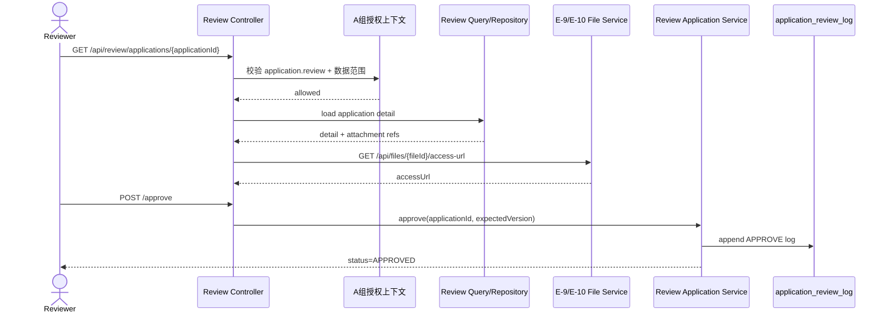
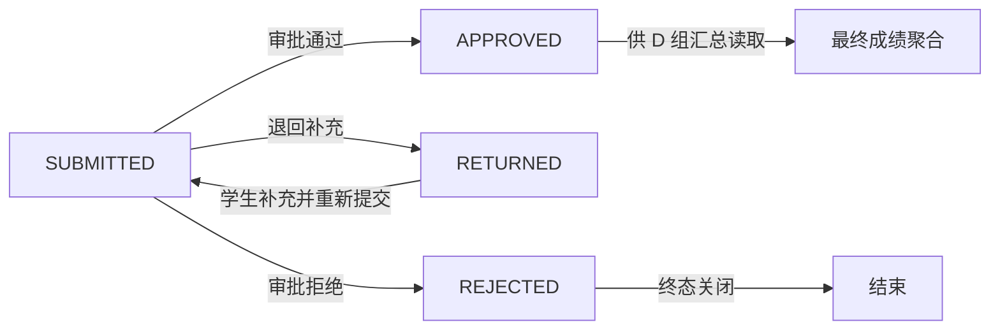

# C 组需求文档：审核工作流模块

> 当前状态：`PARTIAL_IMPLEMENTED`
>
> 当前 Java Controller 已提供 `ReviewApplicationController`，覆盖 C-3/C-4/C-5/C-6/C-7/C-8/C-9：审核列表、审核详情、附件摘要、审核轨迹、审批通过、退回补充、审批拒绝。C-1/C-2/C-10 仍为目标态设计；C-5 当前返回附件元数据摘要，访问 URL 生成仍待 E-9/E-10 集成。

## 1. 模块背景

C 组负责“申请送审之后”的整条审核链路，覆盖班长、辅导员、管理员等审核角色的列表、详情、附件查看、单条审批、批量审批、审核日志。旧系统里这部分能力主要散落在 `ExaminationController` 和 `AdminApplicationServiceImpl` 中，存在路由混乱、状态语义不统一、附件查看口径不稳定等问题。

rewrite 阶段的目标是把审核域重构为“统一状态机 + 统一动作命令 + 统一审计轨迹”。

### 1.1 核心时序图：审核通过

### 1.2 核心流程图：审核决策状态机

## 2. 模块边界

### 2.1 负责内容

- 待审申请查询
- 审核详情查询
- 附件查看与下载信息查询
- 单条审批通过/退回/拒绝
- 批量审批
- 审核轨迹查询
- 审核工作台统计
- 按角色和数据范围做授权过滤

### 2.2 不负责内容

- 学生创建和修改申请
- 文件上传本身
- 学年最终成绩冻结与导出
- 用户和角色管理

## 3. 核心业务规则

- 审核动作必须复用 A 组提供的 `application.review` 与范围规则。
- 只有 `SUBMITTED` 状态允许审核动作。
- 审核通过后申请进入 `APPROVED`；退回进入 `RETURNED`；拒绝进入 `REJECTED`。
- `RETURNED` 表示允许学生回到 B 组链路继续修改或删除；`REJECTED` 表示本次申请终态关闭，不允许学生继续编辑、删除或撤回。
- 每次审核动作都必须写入 `application_review_log`。
- 附件查看必须基于申请已绑定附件快照，而不是重新信任前端传参。
- 附件访问地址必须通过 E 组统一文件读取接口生成，不允许审核侧直接拼接 OSS 地址。
- 批量审批必须保证“部分失败可追踪”，不能只返回一句成功/失败。
- 批量审批接口统一返回 `200` + 结果明细；单条失败通过 `failedItems` 表达，请求级非法参数或无权限仍按标准异常码返回。

## 4. 数据依赖

- `application_submission`
- `application_review_log`
- `application_attachment`
- `file_asset`
- `final_record`（审核通过后供 D 组汇总读取）

## 5. 接口清单总表

| 编号 | 方法 | 路由 | 用途 | 当前状态 |
|---|---|---|---|---|
| C-1 | `GET` | `/api/review/tasks/summary` | 审核工作台摘要 | `TARGET_BLUEPRINT` |
| C-2 | `GET` | `/api/review/meta/grades` | 获取可选年级/组织过滤条件 | `TARGET_BLUEPRINT` |
| C-3 | `GET` | `/api/review/applications` | 分页查询待审/已审申请 | `CURRENT_IMPLEMENTED` |
| C-4 | `GET` | `/api/review/applications/{applicationId}` | 查询审核详情 | `CURRENT_IMPLEMENTED` |
| C-5 | `GET` | `/api/review/applications/{applicationId}/attachments` | 查看附件列表 | `CURRENT_IMPLEMENTED` |
| C-6 | `GET` | `/api/review/applications/{applicationId}/logs` | 查询审核轨迹 | `CURRENT_IMPLEMENTED` |
| C-7 | `POST` | `/api/review/applications/{applicationId}/approve` | 审批通过 | `CURRENT_IMPLEMENTED` |
| C-8 | `POST` | `/api/review/applications/{applicationId}/return` | 退回补充 | `CURRENT_IMPLEMENTED` |
| C-9 | `POST` | `/api/review/applications/{applicationId}/reject` | 审批拒绝 | `CURRENT_IMPLEMENTED` |
| C-10 | `POST` | `/api/review/applications/batch-approve` | 批量审批通过 | `TARGET_BLUEPRINT` |

## 6. 统一返回约定

- 成功：`ApiResponse<T>`
- 常见错误码：`VAL-4001`、`AUTH-4030`、`RES-4040`、`BIZ-4090`

审核模块批量动作统一返回对象：

| 字段 | 类型 | 说明 |
|---|---|---|
| `totalCount` | `number` | 总条数 |
| `successCount` | `number` | 成功条数 |
| `failedCount` | `number` | 失败条数 |
| `failedItems` | `object[]` | 失败明细 |

## 7. 详细接口定义

### C-1 审核工作台摘要

- 路由：`GET /api/review/tasks/summary`
- 鉴权：`review.task.view`
- 目的：展示当前审核人待处理数量、已处理数量、退回数量等

成功返回 `data`：

| 字段 | 类型 | 说明 |
|---|---|---|
| `pendingCount` | `number` | 待审核 |
| `approvedToday` | `number` | 今日已通过 |
| `returnedToday` | `number` | 今日已退回 |
| `rejectedToday` | `number` | 今日已拒绝 |
| `processedToday` | `number` | 今日总处理数量 |

异常返回：

| 场景 | HTTP | 错误码 | 说明 |
|---|---:|---|---|
| 无权限访问 | `403` | `AUTH-4030` | 当前用户无工作台查看权限 |

### C-2 获取可选年级/组织过滤条件

- 路由：`GET /api/review/meta/grades`
- 鉴权：`review.task.view`
- 目的：给审核列表页提供年级/组织过滤元数据

成功返回 `data`：

| 字段 | 类型 | 说明 |
|---|---|---|
| `gradeList` | `string[]` | 可选年级列表 |
| `orgUnitList` | `object[]` | 可选组织列表 |
| `defaultOrgUnitId` | `number` | 默认组织 ID |

`orgUnitList` 元素字段冻结为：`orgUnitId/orgUnitName/orgUnitType`

异常返回：

| 场景 | HTTP | 错误码 | 说明 |
|---|---:|---|---|
| 无权限访问 | `403` | `AUTH-4030` | 当前用户无元数据查询权限 |

### C-3 分页查询待审/已审申请

- 路由：`GET /api/review/applications`
- 鉴权：`application.review`
- 核心要求：查询必须吃 A 组的范围规则，不能手写“班长看自己班级”这种分支

查询参数：

| 参数 | 类型 | 必填 | 默认值 | 说明 |
|---|---|---|---|---|
| `pageNo` | `long` | 否 | `1` | 页码 |
| `pageSize` | `long` | 否 | `20` | 页大小 |
| `academicYear` | `string` | 否 | - | 学年 |
| `categoryCode` | `string` | 否 | - | 大类 |
| `itemCode` | `string` | 否 | - | 子项 |
| `status` | `string` | 否 | - | `SUBMITTED/APPROVED/RETURNED/REJECTED` |
| `keyword` | `string` | 否 | - | 学生姓名/编号模糊搜索 |
| `orgUnitId` | `long` | 否 | - | 前端筛选组织 |

成功返回 `data`：`ApiResponse<PageResult<ReviewApplicationListItem>>`

`ReviewApplicationListItem` 字段冻结为：

| 字段 | 类型 | 说明 |
|---|---|---|
| `applicationId` | `number` | 申请 ID |
| `applicantUserId` | `number` | 申请人用户 ID |
| `applicantUserName` | `string` | 申请人姓名 |
| `applicantUserNo` | `string` | 申请人编号 |
| `orgUnitName` | `string` | 归属组织名称 |
| `categoryCode` | `string` | 大类编码 |
| `itemCode` | `string` | 子项编码 |
| `title` | `string` | 申请标题 |
| `status` | `string` | 当前状态 |
| `submittedAt` | `string` | 提交时间 |
| `currentReviewNode` | `string` | 当前审核节点 |

异常返回：

| 场景 | HTTP | 错误码 | 说明 |
|---|---:|---|---|
| 查询条件非法 | `400` | `VAL-4001` | 页码、状态或过滤条件不合法 |
| 无权限访问 | `403` | `AUTH-4030` | 当前审核人无查询权限 |
| 组织不存在 | `404` | `RES-4040` | 指定 `orgUnitId` 无效 |

### C-4 查询审核详情

- 路由：`GET /api/review/applications/{applicationId}`
- 鉴权：`application.review`
- 要求：详情页必须在服务层做单条资源范围校验

成功返回 `data`：

| 字段 | 类型 | 说明 |
|---|---|---|
| `application` | `object` | 申请主信息 |
| `applicant` | `object` | 申请人摘要 |
| `attachments` | `object[]` | 附件列表 |
| `reviewLogs` | `object[]` | 审核轨迹 |
| `allowedActions` | `string[]` | 当前审核人可执行动作 |

`application` 子对象字段冻结为：`applicationId/status/title/description/categoryCode/itemCode/academicYear/term/submittedAt/version`

`applicant` 子对象字段冻结为：`userId/userNo/userName/orgUnitId/orgUnitName`

异常返回：

| 场景 | HTTP | 错误码 | 说明 |
|---|---:|---|---|
| 申请不存在 | `404` | `RES-4040` | `applicationId` 无效 |
| 无权限访问 | `403` | `AUTH-4030` | 当前审核人无该资源查看权限 |

### C-5 查看附件列表

- 路由：`GET /api/review/applications/{applicationId}/attachments`
- 鉴权：`application.review`
- 当前实现：返回申请已绑定附件的元数据摘要，不暴露 `storageKey`
- 后续目标：接入 E-9 查询文件元数据、E-10 生成访问地址；若文件本身已有 `publicUrl`，也应通过统一返回模型暴露，不允许控制器侧直接拼接 `storageKey`

成功返回 `data`：附件列表

| 字段 | 类型 | 说明 |
|---|---|---|
| `fileId` | `string` | 文件 ID |
| `originalFilename` | `string` | 原文件名 |
| `contentType` | `string` | 文件类型 |
| `size` | `number` | 文件大小 |
| `sortNo` | `number` | 附件排序号 |

E-9/E-10 集成后的目标扩展字段：

| 字段 | 类型 | 说明 |
|---|---|---|
| `sourceType` | `string` | 附件来源类型 |
| `accessUrl` | `string` | 统一访问地址 |
| `accessMode` | `string` | `PUBLIC_URL/SIGNED_URL` |
| `expiresAt` | `string` | 访问地址过期时间 |

异常返回：

| 场景 | HTTP | 错误码 | 说明 |
|---|---:|---|---|
| 申请不存在 | `404` | `RES-4040` | `applicationId` 无效 |
| 无权查看该申请 | `403` | `AUTH-4030` | 当前审核人无资源查看权限 |
| 附件访问地址生成失败 | `503` | `EXT-5033` | E 组文件服务生成地址失败 |

### C-6 查询审核轨迹

- 路由：`GET /api/review/applications/{applicationId}/logs`
- 鉴权：`application.review`
- 成功返回 `data`：审核轨迹列表

| 字段 | 类型 | 说明 |
|---|---|---|
| `reviewLogId` | `number` | 审核日志 ID |
| `action` | `string` | `APPROVED/RETURNED/REJECTED` |
| `reviewerId` | `number` | 审核人 ID |
| `reviewerName` | `string` | 审核人姓名 |
| `reviewRole` | `string` | 审核角色 |
| `reason` | `string` | 审核意见或原因 |
| `reviewedAt` | `string` | 审核时间 |

异常返回：

| 场景 | HTTP | 错误码 | 说明 |
|---|---:|---|---|
| 申请不存在 | `404` | `RES-4040` | `applicationId` 无效 |
| 无权限访问 | `403` | `AUTH-4030` | 当前审核人无轨迹查看权限 |

### C-7 审批通过

- 路由：`POST /api/review/applications/{applicationId}/approve`
- 鉴权：`application.review`

请求体：

| 字段 | 类型 | 必填 | 说明 |
|---|---|---|---|
| `comment` | `string` | 否 | 审核意见 |
| `expectedVersion` | `long` | 是 | 乐观锁版本 |

成功返回 `data`：

| 字段 | 类型 | 说明 |
|---|---|---|
| `applicationId` | `number` | 申请 ID |
| `status` | `string` | 固定为 `APPROVED` |
| `version` | `number` | 最新版本 |
| `reviewLogId` | `number` | 本次审核日志 ID |
| `reviewedAt` | `string` | 审核时间 |

成功语义：

- 申请状态改为 `APPROVED`
- 写入 `application_review_log`
- 触发 D 组可消费的后续汇总事件或状态变更

异常返回：

| 场景 | HTTP | 错误码 | 说明 |
|---|---:|---|---|
| 申请不存在 | `404` | `RES-4040` | `applicationId` 无效 |
| 非 `SUBMITTED` | `409` | `BIZ-4090` | 仅允许审核已提交申请 |
| 版本冲突 | `409` | `BIZ-4090` | `expectedVersion` 与当前版本不一致 |
| 无权限 | `403` | `AUTH-4030` | 当前审核人无审批权限 |

### C-8 退回补充

- 路由：`POST /api/review/applications/{applicationId}/return`
- 鉴权：`application.review`
- 语义冻结：只允许把 `SUBMITTED` 申请退回到 `RETURNED`，退回后学生可重新编辑、补附件、再次提交

请求体：

| 字段 | 类型 | 必填 | 说明 |
|---|---|---|---|
| `reason` | `string` | 是 | 退回原因 |
| `expectedVersion` | `long` | 是 | 乐观锁版本 |

成功返回 `data`：

| 字段 | 类型 | 说明 |
|---|---|---|
| `applicationId` | `number` | 申请 ID |
| `status` | `string` | 固定为 `RETURNED` |
| `version` | `number` | 最新版本 |
| `reviewLogId` | `number` | 本次审核日志 ID |
| `reviewedAt` | `string` | 审核时间 |

成功后状态改为 `RETURNED`。

异常返回：

| 场景 | HTTP | 错误码 | 说明 |
|---|---:|---|---|
| 申请不存在 | `404` | `RES-4040` | `applicationId` 无效 |
| 无权限访问 | `403` | `AUTH-4030` | 当前审核人无审核权限或无数据范围访问权 |
| 非 `SUBMITTED` 状态退回 | `409` | `BIZ-4090` | `DRAFT/RETURNED/APPROVED/REJECTED/WITHDRAWN` 均不允许 |
| 版本冲突 | `409` | `BIZ-4090` | `expectedVersion` 与当前版本不一致 |
| 退回原因为空 | `400` | `VAL-4001` | `reason` 不能为空 |
| 已被其他审核动作处理 | `409` | `BIZ-4090` | 状态已变化，当前动作失效 |

### C-9 审批拒绝

- 路由：`POST /api/review/applications/{applicationId}/reject`
- 鉴权：`application.review`
- 语义冻结：只允许把 `SUBMITTED` 申请拒绝到 `REJECTED`；拒绝后学生不能继续编辑、删除或撤回，只能重新发起新的申请

请求体：

| 字段 | 类型 | 必填 | 说明 |
|---|---|---|---|
| `reason` | `string` | 是 | 拒绝原因 |
| `expectedVersion` | `long` | 是 | 乐观锁版本 |

成功返回 `data`：

| 字段 | 类型 | 说明 |
|---|---|---|
| `applicationId` | `number` | 申请 ID |
| `status` | `string` | 固定为 `REJECTED` |
| `version` | `number` | 最新版本 |
| `reviewLogId` | `number` | 本次审核日志 ID |
| `reviewedAt` | `string` | 审核时间 |

成功后状态改为 `REJECTED`。

异常返回：

| 场景 | HTTP | 错误码 | 说明 |
|---|---:|---|---|
| 申请不存在 | `404` | `RES-4040` | `applicationId` 无效 |
| 无权限访问 | `403` | `AUTH-4030` | 当前审核人无审核权限或无数据范围访问权 |
| 非 `SUBMITTED` 状态拒绝 | `409` | `BIZ-4090` | `DRAFT/RETURNED/APPROVED/REJECTED/WITHDRAWN` 均不允许 |
| 版本冲突 | `409` | `BIZ-4090` | `expectedVersion` 与当前版本不一致 |
| 拒绝原因为空 | `400` | `VAL-4001` | `reason` 不能为空 |
| 已被其他审核动作处理 | `409` | `BIZ-4090` | 状态已变化，当前动作失效 |

### C-10 批量审批通过

- 路由：`POST /api/review/applications/batch-approve`
- 鉴权：`application.review`
- 说明：当前范围仅支持批量通过，不提供批量退回或批量拒绝接口
- 语义冻结：批量审批只处理“批量通过”；接口整体固定返回 `200`，单条失败不抛整批 `409`

请求体：

| 字段 | 类型 | 必填 | 说明 |
|---|---|---|---|
| `applicationIds` | `number[]` | 是 | 目标申请 ID 集合 |
| `comment` | `string` | 否 | 批量意见 |

成功返回 `data`：

| 字段 | 类型 | 说明 |
|---|---|---|
| `totalCount` | `number` | 总请求条数 |
| `successCount` | `number` | 审批成功条数 |
| `failedCount` | `number` | 审批失败条数 |
| `failedItems` | `object[]` | 失败明细 |
| `processedAt` | `string` | 批量处理时间 |

`failedItems` 字段冻结为：`applicationId/code/message`

单条 `failedItems.code` 允许值：

- `RES-4040`：申请不存在
- `AUTH-4030`：无权限审批该申请
- `BIZ-4090`：非 `SUBMITTED`、版本或状态冲突

请求级异常返回：

| 场景 | HTTP | 错误码 | 说明 |
|---|---:|---|---|
| `applicationIds` 为空 | `400` | `VAL-4001` | 至少传入一条申请 ID |
| `applicationIds` 存在重复值 | `400` | `VAL-4001` | 批量请求内不允许重复 ID |
| 无权限调用批量审批 | `403` | `AUTH-4030` | 当前审核人无批量审批权限 |

## 8. 交付要求

- 必须输出审核状态机图。
- 必须补齐单条审批和批量审批测试。
- 必须把附件查看、详情查看、单条审批全部接入 A 组范围校验。
- 必须与 B 组统一 `RETURNED/REJECTED/WITHDRAWN` 语义，与 D 组统一 `APPROVED` 后的汇总触发口径。
