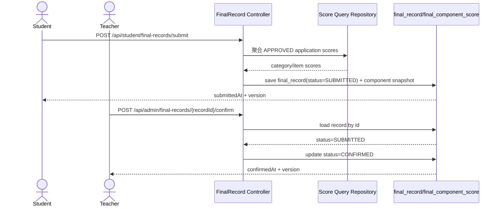
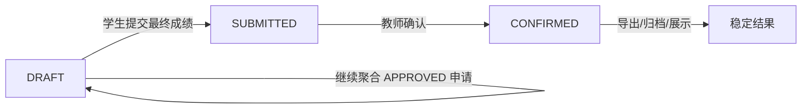

# D 组需求文档：成绩汇总、最终提交与导入导出

> 当前状态：`PARTIAL_IMPLEMENTED`
>
> 当前代码已提供学生/管理端成绩查询入口；最终成绩提交、确认、导入、导出、未提交名单仍属于目标态设计。

## 1. 模块背景

D 组负责“学生已审核成绩读取、学年最终成绩冻结、导入导出、未提交名单”这条链路。这个模块对业务最敏感，因为它直接决定教师端成绩管理和学生端最终成绩展示口径。

旧系统里，这部分能力散落在 `EvaluateApplicationController`、`ComprehensiveDataController`、`FinalMapper`、各类导入服务里，存在如下问题：

- 学生端“已审核成绩”“最终成绩”与教师端查询口径耦合在同一套宽表上。
- 导入、导出、冻结、查询混在一起，职责不清晰。
- 新增子项时往往需要改 SQL、改表、改导出。

rewrite 阶段这一组统一拆成两个子域，由 D 组负责：

- `score-finalization`：成绩汇总、最终提交、冻结快照、明细查看
- `score-import-export`：教师导入、导出、未提交名单

### 1.1 核心时序图：学生提交并教师确认最终成绩

### 1.2 核心流程图：最终成绩状态机

## 2. 模块边界

### 2.1 负责内容

- 学生侧成绩列表与最终成绩查询
- 学生侧最终提交
- 教师侧最终成绩列表、详情、确认
- 导入导师/固定成绩
- 导入讲座
- 导入文体活动
- 导出最终成绩
- 查看未提交最终成绩名单

### 2.2 不负责内容

- 学生申请写入
- 审核动作
- 平台菜单开关
- 文件上传底座

## 3. 数据依赖

- `application_submission`
- `application_review_log`
- `final_record`
- `final_component_score`
- `evaluation_item`
- 一期不建设导入导出批次表，导入失败通过 `failedRows` 即时返回

## 4. 核心业务规则

- 只有 `APPROVED` 的申请才能进入可计分范围。
- `final_record` 代表“学生 + 学年”的冻结总表头。
- `final_component_score` 代表冻结后的分项明细快照。
- `final_record.status` 统一冻结为三态：`DRAFT -> SUBMITTED -> CONFIRMED`。
- 学生最终提交必须在平台规则允许的窗口内进行。
- 学生侧只负责把 `final_record` 从 `DRAFT` 提交到 `SUBMITTED`；教师侧通过专门确认动作把 `SUBMITTED` 推进到 `CONFIRMED`。
- 若某学生在某学年尚未形成 `final_record`，查询学生最终成绩表头和分项明细统一返回 `404 / RES-4040`，不再采用“空对象”口径。
- 教师端列表查询优先读取 `final_record`，不要直接每次聚合所有申请明细。
- 导入接口必须可审计，至少返回导入成功/失败统计。
- 一期导入接口统一采用“同步处理 + 即时回执”模型：整批请求成功受理后返回 `200`，行级失败通过 `failedRows` 表达，不单独拆异步任务查询接口。
- 未提交名单查询在无数据时统一返回空分页，不返回 `404`。

## 5. 接口清单总表

| 编号 | 方法 | 路由 | 用途 |
|---|---|---|---|
| D-1 | `GET` | `/api/student/query/scores` | 查询学生已审核成绩列表 |
| D-2 | `GET` | `/api/student/final-records/{academicYear}` | 查询学生最终成绩表头 |
| D-3 | `GET` | `/api/student/final-records/{academicYear}/components` | 查询学生最终成绩分项明细 |
| D-4 | `POST` | `/api/student/final-records/submit` | 学生提交最终成绩 |
| D-5 | `GET` | `/api/admin/final-records` | 教师端分页查询最终成绩 |
| D-6 | `GET` | `/api/admin/final-records/{recordId}` | 教师端查询最终成绩详情 |
| D-12 | `POST` | `/api/admin/final-records/{recordId}/confirm` | 教师确认最终成绩 |
| D-7 | `POST` | `/api/admin/imports/mentor-scores` | 导入导师/固定成绩 |
| D-8 | `POST` | `/api/admin/imports/lectures` | 导入讲座 |
| D-9 | `POST` | `/api/admin/imports/cas-activities` | 导入文体活动 |
| D-10 | `GET` | `/api/admin/exports/final-scores` | 导出成绩 |
| D-11 | `GET` | `/api/admin/final-records/unsubmitted` | 查询未提交学生名单 |

## 6. 详细接口定义

### D-1 查询学生已审核成绩列表

- 路由：`GET /api/student/query/scores`
- 鉴权：`score.view.self`

查询参数：

| 参数 | 类型 | 必填 | 默认值 | 说明 |
|---|---|---|---|---|
| `pageNo` | `long` | 否 | `1` | 页码 |
| `pageSize` | `long` | 否 | `20` | 页大小 |
| `categoryCode` | `string` | 否 | - | 大类 |
| `itemCode` | `string` | 否 | - | 子项 |
| `academicYear` | `string` | 否 | - | 学年 |

成功返回 `data`：`ApiResponse<PageResult<StudentApprovedScoreItem>>`

`StudentApprovedScoreItem` 字段冻结为：

| 字段 | 类型 | 说明 |
|---|---|---|
| `scoreId` | `number` | 成绩记录 ID |
| `categoryCode` | `string` | 大类编码 |
| `itemCode` | `string` | 子项编码 |
| `itemName` | `string` | 子项名称 |
| `scoreValue` | `number` | 分值 |
| `displayText` | `string` | 展示文案 |
| `sourceType` | `string` | `APPLICATION/IMPORT` |
| `reviewedAt` | `string` | 审核通过时间 |

异常返回：

| 场景 | HTTP | 错误码 | 说明 |
|---|---:|---|---|
| 查询条件非法 | `400` | `VAL-4001` | 页码或过滤条件不合法 |
| 非本人访问 | `403` | `AUTH-4030` | 只能查看自己的成绩 |

### D-2 查询学生最终成绩表头

- 路由：`GET /api/student/final-records/{academicYear}`
- 鉴权：`final.view.self`

成功返回 `data`：

| 字段 | 类型 | 说明 |
|---|---|---|
| `finalRecordId` | `number` | 记录主键 |
| `academicYear` | `string` | 学年 |
| `status` | `string` | `DRAFT/SUBMITTED/CONFIRMED` |
| `moralTotal` | `number` | 德育总分 |
| `intellectualTotal` | `number` | 智育总分 |
| `physicalTotal` | `number` | 体育总分 |
| `laborTotal` | `number` | 劳育总分 |
| `grandTotal` | `number` | 总分 |
| `submittedAt` | `string` | 提交时间 |
| `version` | `number` | 乐观锁版本 |

异常返回：

| 场景 | HTTP | 错误码 | 说明 |
|---|---:|---|---|
| 当前学年无最终成绩记录 | `404` | `RES-4040` | 统一按未生成记录处理，不返回空对象 |
| 非本人访问 | `403` | `AUTH-4030` | 只能查询自己的最终成绩 |

### D-3 查询学生最终成绩分项明细

- 路由：`GET /api/student/final-records/{academicYear}/components`
- 鉴权：`final.view.self`

成功返回 `data`：分项成绩列表

| 字段 | 类型 | 说明 |
|---|---|---|
| `categoryCode` | `string` | 大类编码 |
| `itemCode` | `string` | 子项编码 |
| `itemName` | `string` | 子项名称 |
| `scoreValue` | `number` | 分值 |
| `displayText` | `string` | 文字说明 |
| `sourceType` | `string` | 来源：申请/导入 |
| `sourceRefId` | `string` | 源记录 ID |

异常返回：

| 场景 | HTTP | 错误码 | 说明 |
|---|---:|---|---|
| 当前学年无最终成绩记录 | `404` | `RES-4040` | 表头不存在时明细查询也直接失败 |
| 非本人访问 | `403` | `AUTH-4030` | 只能查询自己的最终成绩明细 |

### D-4 学生提交最终成绩

- 路由：`POST /api/student/final-records/submit`
- 鉴权：`final.submit.self`

请求体：

| 字段 | 类型 | 必填 | 说明 |
|---|---|---|---|
| `academicYear` | `string` | 是 | 学年 |
| `expectedVersion` | `long` | 是 | 乐观锁版本 |

成功返回 `data`：

| 字段 | 类型 | 说明 |
|---|---|---|
| `finalRecordId` | `number` | 最终成绩记录 ID |
| `academicYear` | `string` | 学年 |
| `status` | `string` | 固定为 `SUBMITTED` |
| `submittedAt` | `string` | 提交时间 |
| `version` | `number` | 最新版本 |

成功语义：

- `final_record.status` 变为 `SUBMITTED`
- 记录提交时间
- 该学年冻结后的快照被后续教师端读取

异常返回：

| 场景 | HTTP | 错误码 | 说明 |
|---|---:|---|---|
| 平台未开放最终提交 | `400` | `VAL-4001` | 平台规则不允许提交 |
| 当前学年无最终成绩记录 | `404` | `RES-4040` | 还未形成 `final_record` |
| 该学年无可提交成绩 | `409` | `BIZ-4090` | 无已审核成绩可冻结 |
| 非 `DRAFT` 状态重复提交 | `409` | `BIZ-4090` | `SUBMITTED/CONFIRMED` 不允许再次提交 |
| 版本冲突 | `409` | `BIZ-4090` | `expectedVersion` 与当前版本不一致 |

### D-5 教师端分页查询最终成绩

- 路由：`GET /api/admin/final-records`
- 鉴权：`score.view.assigned`
- 目标：替代旧系统直接扫宽表的列表查询

查询参数：

| 参数 | 类型 | 必填 | 默认值 | 说明 |
|---|---|---|---|---|
| `pageNo` | `long` | 否 | `1` | 页码 |
| `pageSize` | `long` | 否 | `20` | 页大小 |
| `academicYear` | `string` | 是 | - | 学年 |
| `status` | `string` | 否 | - | 提交状态 |
| `grade` | `string` | 否 | - | 年级 |
| `classes` | `string[]` | 否 | - | 班级集合 |
| `keyword` | `string` | 否 | - | 学生编号/姓名 |

成功返回 `data`：`ApiResponse<PageResult<AdminFinalRecordListItem>>`

`AdminFinalRecordListItem` 字段冻结为：

| 字段 | 类型 | 说明 |
|---|---|---|
| `finalRecordId` | `number` | 最终成绩记录 ID |
| `studentUserId` | `number` | 学生用户 ID |
| `studentUserNo` | `string` | 学号 |
| `studentUserName` | `string` | 姓名 |
| `academicYear` | `string` | 学年 |
| `status` | `string` | `DRAFT/SUBMITTED/CONFIRMED` |
| `moralTotal` | `number` | 德育总分 |
| `intellectualTotal` | `number` | 智育总分 |
| `physicalTotal` | `number` | 体育总分 |
| `laborTotal` | `number` | 劳育总分 |
| `grandTotal` | `number` | 总分 |
| `submittedAt` | `string` | 提交时间 |

异常返回：

| 场景 | HTTP | 错误码 | 说明 |
|---|---:|---|---|
| 查询条件非法 | `400` | `VAL-4001` | 学年缺失、状态非法或分页条件不合法 |
| 无权限访问 | `403` | `AUTH-4030` | 当前用户无查询权限 |

### D-6 教师端查询最终成绩详情

- 路由：`GET /api/admin/final-records/{recordId}`
- 鉴权：`score.view.assigned`
- 返回：表头 + `final_component_score` 明细

成功返回 `data`：

| 字段 | 类型 | 说明 |
|---|---|---|
| `record` | `object` | 最终成绩表头 |
| `student` | `object` | 学生摘要 |
| `components` | `object[]` | 分项明细 |

`record` 子对象字段冻结为：`finalRecordId/academicYear/status/moralTotal/intellectualTotal/physicalTotal/laborTotal/grandTotal/submittedAt/version`

`student` 子对象字段冻结为：`studentUserId/studentUserNo/studentUserName/grade/className`

`components` 元素字段冻结为：`categoryCode/itemCode/itemName/scoreValue/displayText/sourceType/sourceRefId`

异常返回：

| 场景 | HTTP | 错误码 | 说明 |
|---|---:|---|---|
| 记录不存在 | `404` | `RES-4040` | `recordId` 无效 |
| 无权限访问 | `403` | `AUTH-4030` | 当前用户无该记录查看权限 |

### D-12 教师确认最终成绩

- 路由：`POST /api/admin/final-records/{recordId}/confirm`
- 鉴权：`score.confirm.assigned`
- 语义冻结：该接口是 `CONFIRMED` 的唯一写入口，只允许把 `SUBMITTED` 状态推进到 `CONFIRMED`

请求体：

| 字段 | 类型 | 必填 | 说明 |
|---|---|---|---|
| `comment` | `string` | 否 | 确认备注 |
| `expectedVersion` | `long` | 是 | 乐观锁版本 |

成功返回 `data`：

| 字段 | 类型 | 说明 |
|---|---|---|
| `finalRecordId` | `number` | 最终成绩记录 ID |
| `status` | `string` | 固定为 `CONFIRMED` |
| `confirmedAt` | `string` | 确认时间 |
| `version` | `number` | 最新版本 |

成功语义：

- `final_record.status` 变为 `CONFIRMED`
- 确认后的记录进入教师侧最终确认态，可被导出和后续归档流程消费

异常返回：

| 场景 | HTTP | 错误码 | 说明 |
|---|---:|---|---|
| 记录不存在 | `404` | `RES-4040` | `recordId` 无效 |
| 无权限访问 | `403` | `AUTH-4030` | 当前用户无确认权限 |
| 非 `SUBMITTED` 状态确认 | `409` | `BIZ-4090` | `DRAFT/CONFIRMED` 均不允许执行确认 |
| 版本冲突 | `409` | `BIZ-4090` | `expectedVersion` 与当前版本不一致 |

### D-7 导入导师/固定成绩

- 路由：`POST /api/admin/imports/mentor-scores`
- 鉴权：`score.import`
- Content-Type：`multipart/form-data`
- 语义冻结：同步解析 Excel 并即时入库；合法行导入成功，非法行写入 `failedRows`

请求参数：

| 参数 | 类型 | 必填 | 说明 |
|---|---|---|---|
| `file` | `MultipartFile` | 是 | Excel 文件 |
| `academicYear` | `string` | 是 | 学年 |
| `importMode` | `string` | 否 | `UPSERT` / `STRICT_INSERT` |

成功返回 `data`：

| 字段 | 类型 | 说明 |
|---|---|---|
| `importBatchId` | `string` | 本次导入批次号 |
| `totalCount` | `number` | Excel 数据总行数 |
| `successCount` | `number` | 成功导入行数 |
| `failedCount` | `number` | 失败行数 |
| `failedRows` | `object[]` | 失败行回执 |
| `processedAt` | `string` | 导入完成时间 |

`failedRows` 字段冻结为：`rowNo/code/message/rawValue`

异常返回：

| 场景 | HTTP | 错误码 | 说明 |
|---|---:|---|---|
| 文件为空 | `400` | `VAL-4001` | 未上传文件或大小为 0 |
| 学年为空或格式非法 | `400` | `VAL-4001` | `academicYear` 不合法 |
| `importMode` 非法 | `400` | `VAL-4001` | 仅允许 `UPSERT/STRICT_INSERT` |
| 文件模板错误 | `400` | `VAL-4001` | 缺少必填列、列名不匹配或文件不可解析 |
| 无导入权限 | `403` | `AUTH-4030` | 当前用户无导入权限 |
| 严格插入下出现重复记录 | `409` | `BIZ-4090` | `STRICT_INSERT` 模式不允许覆盖 |
| 文件解析或存储失败 | `503` | `EXT-5033` | 外部文件处理组件异常 |

### D-8 导入讲座

- 路由：`POST /api/admin/imports/lectures`
- 鉴权：`score.import`
- Content-Type：`multipart/form-data`
- 语义冻结：同步导入讲座签到/成绩数据；合法行即刻写入，失败行通过回执返回

请求参数：

| 参数 | 类型 | 必填 | 说明 |
|---|---|---|---|
| `file` | `MultipartFile` | 是 | Excel 文件 |
| `title` | `string` | 是 | 讲座标题 |
| `heldAt` | `string` | 是 | 举办时间 |
| `academicYear` | `string` | 是 | 学年 |

成功返回 `data`：

| 字段 | 类型 | 说明 |
|---|---|---|
| `lectureBatchId` | `string` | 讲座导入批次号 |
| `title` | `string` | 讲座标题 |
| `heldAt` | `string` | 举办时间 |
| `academicYear` | `string` | 学年 |
| `totalCount` | `number` | 总行数 |
| `successCount` | `number` | 成功数 |
| `failedCount` | `number` | 失败数 |
| `failedRows` | `object[]` | 失败行回执 |

异常返回：

| 场景 | HTTP | 错误码 | 说明 |
|---|---:|---|---|
| 文件为空 | `400` | `VAL-4001` | 未上传文件或大小为 0 |
| 标题/时间/学年缺失 | `400` | `VAL-4001` | 必填参数缺失 |
| `heldAt` 格式非法 | `400` | `VAL-4001` | 讲座时间格式错误 |
| 模板错误或列缺失 | `400` | `VAL-4001` | Excel 模板不匹配 |
| 无导入权限 | `403` | `AUTH-4030` | 当前用户无导入权限 |
| 同一讲座批次重复导入冲突 | `409` | `BIZ-4090` | 幂等键冲突且不允许覆盖 |
| 文件解析或存储失败 | `503` | `EXT-5033` | 外部文件处理组件异常 |

### D-9 导入文体活动

- 路由：`POST /api/admin/imports/cas-activities`
- 鉴权：`score.import`
- Content-Type：`multipart/form-data`
- 语义冻结：同步导入活动成绩；活动元数据校验失败时整批请求直接失败，行级数据错误通过 `failedRows` 返回

请求参数：

| 参数 | 类型 | 必填 | 说明 |
|---|---|---|---|
| `file` | `MultipartFile` | 是 | Excel 文件 |
| `title` | `string` | 是 | 活动标题 |
| `itemCode` | `string` | 是 | 对应项目编码 |
| `scoreValue` | `number` | 是 | 分值 |
| `heldAt` | `string` | 是 | 举办时间 |
| `academicYear` | `string` | 是 | 学年 |

成功返回 `data`：

| 字段 | 类型 | 说明 |
|---|---|---|
| `activityBatchId` | `string` | 活动导入批次号 |
| `title` | `string` | 活动标题 |
| `itemCode` | `string` | 绑定的项目编码 |
| `scoreValue` | `number` | 活动分值 |
| `totalCount` | `number` | 总行数 |
| `successCount` | `number` | 成功数 |
| `failedCount` | `number` | 失败数 |
| `failedRows` | `object[]` | 失败行回执 |

异常返回：

| 场景 | HTTP | 错误码 | 说明 |
|---|---:|---|---|
| 文件为空 | `400` | `VAL-4001` | 未上传文件或大小为 0 |
| 标题/项目/分值/时间/学年缺失 | `400` | `VAL-4001` | 必填参数缺失 |
| `scoreValue` 非法 | `400` | `VAL-4001` | 分值为负数或超过项目允许范围 |
| `heldAt` 格式非法 | `400` | `VAL-4001` | 活动时间格式错误 |
| `itemCode` 无效 | `404` | `RES-4040` | 对应项目定义不存在 |
| 无导入权限 | `403` | `AUTH-4030` | 当前用户无导入权限 |
| 活动批次重复导入冲突 | `409` | `BIZ-4090` | 相同活动维度已存在且不允许覆盖 |
| 文件解析或存储失败 | `503` | `EXT-5033` | 外部文件处理组件异常 |

### D-10 导出成绩

- 路由：`GET /api/admin/exports/final-scores`
- 鉴权：`score.export.assigned`
- 返回：文件流 `application/vnd.openxmlformats-officedocument.spreadsheetml.sheet`
- 语义冻结：满足查询条件时直接同步导出 Excel 文件；无匹配数据时返回 `404`，不返回空文件

查询参数：

| 参数 | 类型 | 必填 | 说明 |
|---|---|---|---|
| `academicYear` | `string` | 是 | 学年 |
| `grade` | `string` | 否 | 年级 |
| `classes` | `string[]` | 否 | 班级集合 |
| `status` | `string` | 否 | `SUBMITTED/CONFIRMED` |

成功返回：

- `Content-Type`: `application/vnd.openxmlformats-officedocument.spreadsheetml.sheet`
- `Content-Disposition`: `attachment; filename="final-scores-{academicYear}.xlsx"`

异常返回：

| 场景 | HTTP | 错误码 | 说明 |
|---|---:|---|---|
| 查询条件非法 | `400` | `VAL-4001` | 学年缺失、状态非法或分页参数错误 |
| 无导出权限 | `403` | `AUTH-4030` | 当前用户无导出权限 |
| 无匹配导出数据 | `404` | `RES-4040` | 查询条件下无最终成绩记录 |
| 文件生成失败 | `503` | `EXT-5033` | Excel 生成或外部组件异常 |

### D-11 查询未提交最终成绩名单

- 路由：`GET /api/admin/final-records/unsubmitted`
- 鉴权：`score.view.assigned`
- 语义冻结：该接口用于查询“应提交但尚未提交最终成绩”的学生名单；无匹配数据时返回空分页

查询参数：

| 参数 | 类型 | 必填 | 默认值 | 说明 |
|---|---|---|---|---|
| `academicYear` | `string` | 是 | - | 学年 |
| `grade` | `string` | 否 | - | 年级 |
| `classes` | `string[]` | 否 | - | 班级集合 |
| `pageNo` | `long` | 否 | `1` | 页码 |
| `pageSize` | `long` | 否 | `20` | 页大小 |

成功返回 `data`：`ApiResponse<PageResult<UnsubmittedStudentView>>`

`UnsubmittedStudentView` 字段冻结为：

| 字段 | 类型 | 说明 |
|---|---|---|
| `studentUserId` | `number` | 学生用户 ID |
| `userNo` | `string` | 学号 |
| `userName` | `string` | 姓名 |
| `grade` | `string` | 年级 |
| `className` | `string` | 班级 |
| `status` | `string` | 固定为 `UNSUBMITTED` |
| `lastUpdatedAt` | `string` | 最近成绩变更时间 |

异常返回：

| 场景 | HTTP | 错误码 | 说明 |
|---|---:|---|---|
| 学年为空或格式非法 | `400` | `VAL-4001` | `academicYear` 不合法 |
| 无权限访问 | `403` | `AUTH-4030` | 当前用户无查询权限 |

## 7. 交付要求

- 必须冻结 `final_record` 与 `final_component_score` 的主键、唯一键和状态语义。
- 必须提供新旧结果对账方案。
- 必须把导入失败样例、失败行回执、幂等策略写成附录。
- 必须与 B/C 组明确“什么状态的申请进入最终汇总”。
