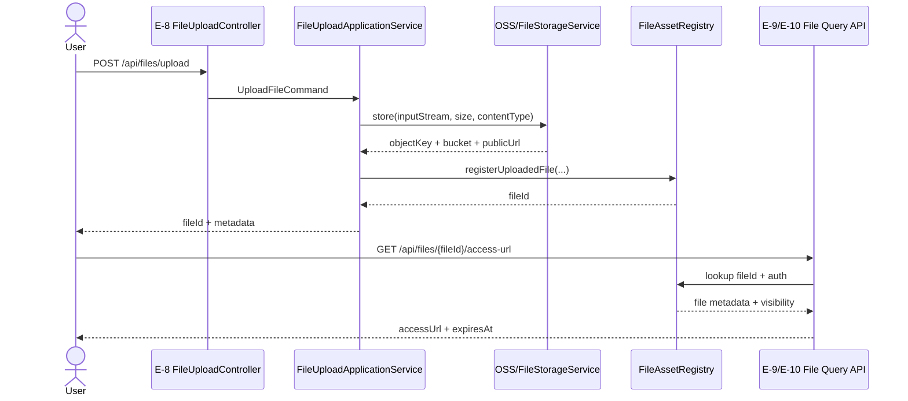
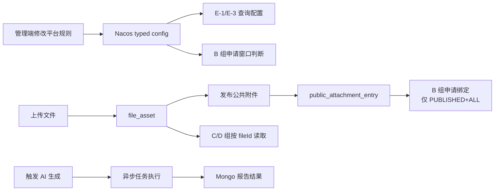

# E 组需求文档：平台治理、附件服务与 AI 扩展

> 当前状态：`PARTIAL_IMPLEMENTED`
>
> 当前代码已实现 `POST /api/files/upload` 和 Nacos typed config 查询/计算相关能力；文件读取、公共附件池管理、平台治理 CRUD 与 AI 报告接口仍属于目标态设计。

## 1. 模块背景

E 组负责所有横切能力和平台治理能力，覆盖：申请通道开关、截止时间、项目定义、文件上传、公共附件池、AI 报告生成与查询。这个组的特点不是“单一业务链路长”，而是“被所有业务复用”。

旧系统里这些能力分散在 `ComprehensiveDataController`、`CommonController`、`DeepSeekController` 中，存在如下问题：

- 通道开关和截止时间靠菜单或定时逻辑零散维护。
- 上传接口只返回 `storageKey`，缺少稳定业务 `fileId`。
- 公共附件池尚未正式产品化。
- AI 分析接口与 Mongo 入库逻辑耦合在控制器里。

rewrite 阶段，E 组需要把这些能力做成“可复用平台服务”。

### 1.1 核心时序图：上传并生成文件访问地址

### 1.2 核心流程图：平台治理与附件池主链路

## 2. 模块边界

### 2.1 负责内容

- 平台开关状态查询与变更
- 申请截止时间维护
- 项目定义/规则配置接口
- 文件上传与文件元数据登记
- 公共附件池发布与下架
- AI 报告生成与查询
- 与 Nacos 配置和日志体系的衔接

### 2.2 不负责内容

- 学生申请正文写入
- 审核动作
- 最终成绩聚合
- 角色与权限模型本身

## 3. 数据依赖

- `evaluation_category`
- `evaluation_item`
- `file_asset`
- `public_attachment_entry`
- 平台开关与截止时间接口在一期实现中统一走 Nacos typed config，不以数据库表作为运行时真源
- AI 报告当前优先落 Mongo，不纳入本次关系型库冻结范围

## 4. 核心业务规则

- 上传接口必须先完成对象存储，再登记 `file_asset` 并返回稳定 `fileId`。
- 文件读取必须统一按 `fileId` 发起，不允许 B/C/D 组直接依赖 `storageKey` 或私自拼接 OSS 地址。
- 文件读取授权统一采用“文件所有权 + 公共附件池可见性 + 业务资源关联授权”三段式校验；若文件已绑定到申请且调用方对该申请拥有查看权限，则允许读取该文件。
- 申请接口只允许消费 `attachmentFileIds`，不能反向要求前端回传 `storageKey`。
- 公共附件池是 `file_asset` 的发布属性，不是第二套文件主表。
- 公共附件池发布范围模型保留 `ALL/ORG_UNIT/ROLE`，但当前一期只有 `PUBLISHED + ALL` 能被 B 组学生申请绑定；`ORG_UNIT/ROLE` 仅供后续扩展，不进入本期学生申请写链路。
- 平台开关、截止时间等核心规则统一复用 Nacos typed config，接口层只暴露这一套实现口径，不再保留 `DB` 备选方案。
- AI 分析失败必须可观测，不能只抛控制器异常。
- AI 报告生成接口统一采用“同步受理、异步执行”模型；成功受理仅表示任务已创建，不代表报告已生成完成。

## 5. 接口清单总表

| 编号 | 方法 | 路由 | 用途 |
|---|---|---|---|
| E-1 | `GET` | `/api/platform/menu/status` | 查询申请通道状态 |
| E-2 | `PATCH` | `/api/platform/menu/status` | 开启/关闭申请通道 |
| E-3 | `GET` | `/api/platform/menu/deadline` | 查询截止时间 |
| E-4 | `PUT` | `/api/platform/menu/deadline` | 设置截止时间 |
| E-5 | `GET` | `/api/platform/evaluation-items` | 查询项目定义 |
| E-6 | `POST` | `/api/platform/evaluation-items` | 新增项目定义 |
| E-7 | `PATCH` | `/api/platform/evaluation-items/{itemCode}` | 修改项目定义 |
| E-8 | `POST` | `/api/files/upload` | 上传单个文件 |
| E-9 | `GET` | `/api/files/{fileId}` | 查询文件元数据 |
| E-10 | `GET` | `/api/files/{fileId}/access-url` | 生成文件访问地址 |
| E-11 | `GET` | `/api/files/public-attachments` | 查询公共附件池 |
| E-12 | `POST` | `/api/files/public-attachments` | 发布公共附件 |
| E-13 | `PATCH` | `/api/files/public-attachments/{entryId}/offline` | 下架公共附件 |
| E-14 | `POST` | `/api/ai/reports/{category}/generate` | 触发 AI 报告生成 |
| E-15 | `GET` | `/api/ai/reports/me` | 查询当前用户 AI 报告 |

## 6. 详细接口定义

### E-1 查询申请通道状态

- 路由：`GET /api/platform/menu/status`
- 鉴权：`platform.switch.manage`
- 目的：查询当前学生申请通道、最终提交通道等开关状态
- 实现冻结：该接口统一读取 Nacos typed config，不再支持数据库真源

成功返回 `data`：

| 字段 | 类型 | 说明 |
|---|---|---|
| `studentApplyEnabled` | `boolean` | 学生申请是否开启 |
| `finalSubmitEnabled` | `boolean` | 最终提交是否开启 |
| `effectiveAt` | `string` | 最近生效时间 |
| `source` | `string` | 固定为 `NACOS` |
| `updatedBy` | `string` | 最近变更人标识 |
| `reason` | `string` | 最近一次变更原因 |

异常返回：

| 场景 | HTTP | 错误码 | 说明 |
|---|---:|---|---|
| 无权限访问 | `403` | `AUTH-4030` | 当前用户无平台治理权限 |
| 配置不存在或未成功 materialize | `503` | `CFG-5031` | typed config 未加载成功 |

### E-2 开启/关闭申请通道

- 路由：`PATCH /api/platform/menu/status`
- 鉴权：`platform.switch.manage`
- 实现冻结：该接口只负责发布 typed config 补丁，不直接写数据库

请求体：

| 字段 | 类型 | 必填 | 说明 |
|---|---|---|---|
| `studentApplyEnabled` | `boolean` | 否 | 学生申请开关 |
| `finalSubmitEnabled` | `boolean` | 否 | 最终提交开关 |
| `reason` | `string` | 是 | 变更原因 |

补充语义：

- 至少必须传一个开关字段。
- 未传的开关字段保持当前配置值不变。
- 成功返回的是发布后的完整配置快照，而不是仅回显补丁字段。

成功返回 `data`：

| 字段 | 类型 | 说明 |
|---|---|---|
| `studentApplyEnabled` | `boolean` | 最新学生申请开关 |
| `finalSubmitEnabled` | `boolean` | 最新最终提交开关 |
| `effectiveAt` | `string` | 生效时间 |
| `source` | `string` | 固定为 `NACOS` |

异常返回：

| 场景 | HTTP | 错误码 | 说明 |
|---|---:|---|---|
| 开关字段全部缺失 | `400` | `VAL-4001` | 至少提供一个开关字段 |
| 变更原因为空 | `400` | `VAL-4001` | `reason` 不能为空 |
| 无权限访问 | `403` | `AUTH-4030` | 当前用户无变更权限 |
| 配置不存在或读取失败 | `503` | `CFG-5031` | 当前配置不可读取 |
| 配置发布失败 | `503` | `EXT-5033` | Nacos 发布或外部依赖异常 |

### E-3 查询截止时间

- 路由：`GET /api/platform/menu/deadline`
- 鉴权：`platform.switch.manage`
- 实现冻结：该接口统一读取 Nacos typed config 中的时间窗口配置

成功返回 `data`：

| 字段 | 类型 | 说明 |
|---|---|---|
| `studentApplyDeadline` | `string` | 学生申请截止时间，ISO-8601 |
| `finalSubmitDeadline` | `string` | 最终提交截止时间，ISO-8601 |
| `timezone` | `string` | 固定为 `Asia/Shanghai` |
| `source` | `string` | 固定为 `NACOS` |
| `updatedBy` | `string` | 最近变更人标识 |
| `reason` | `string` | 最近一次变更原因 |

异常返回：

| 场景 | HTTP | 错误码 | 说明 |
|---|---:|---|---|
| 无权限访问 | `403` | `AUTH-4030` | 当前用户无平台治理权限 |
| 配置不存在或未成功 materialize | `503` | `CFG-5031` | typed config 未加载成功 |

### E-4 设置截止时间

- 路由：`PUT /api/platform/menu/deadline`
- 鉴权：`platform.switch.manage`
- 实现冻结：该接口发布 deadline 配置的最新快照，底层仍通过 typed config 持久化
- 语义冻结：允许更新其中一个截止时间，但至少提供一个时间字段；未提供的字段保持当前值不变

请求体：

| 字段 | 类型 | 必填 | 说明 |
|---|---|---|---|
| `studentApplyDeadline` | `string` | 否 | ISO 时间 |
| `finalSubmitDeadline` | `string` | 否 | ISO 时间 |
| `reason` | `string` | 是 | 调整原因 |

成功返回 `data`：

| 字段 | 类型 | 说明 |
|---|---|---|
| `studentApplyDeadline` | `string` | 最新学生申请截止时间 |
| `finalSubmitDeadline` | `string` | 最新最终提交截止时间 |
| `timezone` | `string` | 固定为 `Asia/Shanghai` |
| `effectiveAt` | `string` | 配置生效时间 |
| `source` | `string` | 固定为 `NACOS` |

异常返回：

| 场景 | HTTP | 错误码 | 说明 |
|---|---:|---|---|
| 截止时间字段全部缺失 | `400` | `VAL-4001` | 至少提供一个截止时间字段 |
| 时间格式非法 | `400` | `VAL-4001` | 非 ISO-8601 时间 |
| 两个截止时间先后关系非法 | `400` | `VAL-4001` | 例如最终提交早于学生申请截止时间 |
| 变更原因为空 | `400` | `VAL-4001` | `reason` 不能为空 |
| 无权限访问 | `403` | `AUTH-4030` | 当前用户无变更权限 |
| 配置不存在或读取失败 | `503` | `CFG-5031` | 当前配置不可读取 |
| 配置发布失败 | `503` | `EXT-5033` | Nacos 发布或外部依赖异常 |

### E-5 查询项目定义

- 路由：`GET /api/platform/evaluation-items`
- 鉴权：`evaluation.item.manage`

查询参数：`categoryCode/status/applyMode/pageNo/pageSize`

成功返回 `data`：`ApiResponse<PageResult<EvaluationItemView>>`

`EvaluationItemView` 字段冻结为：

| 字段 | 类型 | 说明 |
|---|---|---|
| `itemCode` | `string` | 子项编码 |
| `itemName` | `string` | 子项名称 |
| `categoryCode` | `string` | 大类编码 |
| `applyMode` | `string` | 申报模式 |
| `reviewMode` | `string` | 审核模式 |
| `scoreMode` | `string` | 计分模式 |
| `status` | `string` | 项目状态 |
| `sortNo` | `number` | 排序号 |

异常返回：

| 场景 | HTTP | 错误码 | 说明 |
|---|---:|---|---|
| 查询条件非法 | `400` | `VAL-4001` | 分页、状态或模式过滤不合法 |
| 无权限访问 | `403` | `AUTH-4030` | 当前用户无项目定义查询权限 |

### E-6 新增项目定义

- 路由：`POST /api/platform/evaluation-items`
- 鉴权：`evaluation.item.manage`

请求体：

| 字段 | 类型 | 必填 | 说明 |
|---|---|---|---|
| `categoryCode` | `string` | 是 | 大类编码 |
| `itemCode` | `string` | 是 | 子项编码 |
| `itemName` | `string` | 是 | 子项名称 |
| `applyMode` | `string` | 是 | `STUDENT_APPLY/TEACHER_IMPORT/MIXED` |
| `reviewMode` | `string` | 是 | 审核模式 |
| `scoreMode` | `string` | 是 | 计分模式 |
| `capRuleJson` | `object` | 否 | 封顶规则 |
| `status` | `string` | 否 | 初始状态 |

成功返回 `data`：

| 字段 | 类型 | 说明 |
|---|---|---|
| `itemCode` | `string` | 子项编码 |
| `itemName` | `string` | 子项名称 |
| `categoryCode` | `string` | 大类编码 |
| `applyMode` | `string` | 申报模式 |
| `reviewMode` | `string` | 审核模式 |
| `scoreMode` | `string` | 计分模式 |
| `status` | `string` | 项目状态 |

异常返回：

| 场景 | HTTP | 错误码 | 说明 |
|---|---:|---|---|
| 请求字段非法 | `400` | `VAL-4001` | 编码、模式或规则字段不合法 |
| 大类不存在 | `404` | `RES-4040` | `categoryCode` 无效 |
| 编码重复 | `409` | `BIZ-4090` | `itemCode` 已存在 |
| 无权限访问 | `403` | `AUTH-4030` | 当前用户无项目定义新增权限 |

### E-7 修改项目定义

- 路由：`PATCH /api/platform/evaluation-items/{itemCode}`
- 鉴权：`evaluation.item.manage`
- 允许修改：`itemName/applyMode/reviewMode/scoreMode/capRuleJson/status`

成功返回：`data = null`

异常返回：

| 场景 | HTTP | 错误码 | 说明 |
|---|---:|---|---|
| 项目定义不存在 | `404` | `RES-4040` | `itemCode` 无效 |
| 请求字段非法 | `400` | `VAL-4001` | 模式、状态或规则字段不合法 |
| 无权限访问 | `403` | `AUTH-4030` | 当前用户无项目定义修改权限 |
| 状态冲突 | `409` | `BIZ-4090` | 项目状态已变化或不允许修改 |

### E-8 上传单个文件

- 路由：`POST /api/files/upload`
- 鉴权：需要登录态
- Content-Type：`multipart/form-data`

请求参数：

| 参数 | 类型 | 必填 | 说明 |
|---|---|---|---|
| `file` | `MultipartFile` | 是 | 文件本体 |
| `bizType` | `string` | 否 | 业务目录，例如 `profile`、`application` |

成功返回 `data`：

| 字段 | 类型 | 说明 |
|---|---|---|
| `fileId` | `string` | 稳定业务文件 ID |
| `bucket` | `string` | 存储桶 |
| `objectKey` | `string` | OSS key |
| `publicUrl` | `string` | 外链，可为空 |
| `originalFilename` | `string` | 原文件名 |
| `contentType` | `string` | MIME |
| `size` | `number` | 大小 |

异常返回：

| 场景 | HTTP | 错误码 | 说明 |
|---|---:|---|---|
| 空文件 | `400` | `VAL-4001` | 未上传文件或文件大小为 0 |
| `bizType` 非法 | `400` | `VAL-4001` | 业务目录不在允许范围内 |
| 无权限访问 | `403` | `AUTH-4030` | 当前用户无文件上传权限 |
| OSS 配置缺失 | `503` | `CFG-5031` | 上传配置未成功加载 |
| OSS 上传失败 | `503` | `EXT-5033` | 外部对象存储上传失败 |

### E-9 查询文件元数据

- 路由：`GET /api/files/{fileId}`
- 鉴权：需要登录态
- 目的：返回统一文件元数据，供学生详情、审核详情、导出页面做文件摘要展示
- 授权冻结：满足以下任一条件即可读取文件元数据：

  1. 当前用户是文件上传者
  2. 文件已进入公共附件池且当前用户位于可见范围内
  3. 文件已绑定到业务资源，且当前用户对该业务资源具备查看权限；一期先冻结为“已绑定申请且调用方可查看该申请”

路径参数：

| 参数 | 类型 | 必填 | 说明 |
|---|---|---|---|
| `fileId` | `string` | 是 | 业务文件 ID |

成功返回 `data`：

| 字段 | 类型 | 说明 |
|---|---|---|
| `fileId` | `string` | 业务文件 ID |
| `originalFilename` | `string` | 原文件名 |
| `contentType` | `string` | MIME |
| `size` | `number` | 文件大小 |
| `status` | `string` | 文件状态 |
| `sourceType` | `string` | `SELF_UPLOAD/PUBLIC_POOL/SYSTEM_IMPORT` |
| `publicUrl` | `string` | 公共地址，可为空 |
| `canPreview` | `boolean` | 当前用户是否可预览 |
| `canDownload` | `boolean` | 当前用户是否可下载 |

异常返回：

| 场景 | HTTP | 错误码 | 说明 |
|---|---:|---|---|
| 文件不存在或已失效 | `404` | `RES-4040` | `fileId` 不存在或文件状态不可用 |
| 当前用户无权访问 | `403` | `AUTH-4030` | 既不是所有者，也不在公共池可见范围内，且不存在已授权的业务资源关联 |

### E-10 生成文件访问地址

- 路由：`GET /api/files/{fileId}/access-url`
- 鉴权：需要登录态
- 目的：当 `publicUrl` 为空或对象私有化存储时，按需签发短时访问地址，供 B/C/D 组统一读取附件
- 授权冻结：与 E-9 完全一致；只要 E-9 可读，E-10 即可按同一授权上下文生成访问地址

路径参数：

| 参数 | 类型 | 必填 | 说明 |
|---|---|---|---|
| `fileId` | `string` | 是 | 业务文件 ID |

查询参数：

| 参数 | 类型 | 必填 | 默认值 | 说明 |
|---|---|---|---|---|
| `disposition` | `string` | 否 | `inline` | `inline` 预览，`attachment` 下载 |
| `expireSeconds` | `int` | 否 | `300` | 签名地址有效期，最大值 `1800` |

成功返回 `data`：

| 字段 | 类型 | 说明 |
|---|---|---|
| `fileId` | `string` | 业务文件 ID |
| `accessUrl` | `string` | 访问地址，可能是 `publicUrl` 或签名 URL |
| `accessMode` | `string` | `PUBLIC_URL/SIGNED_URL` |
| `expiresAt` | `string` | 过期时间；若为公共地址可为空 |

异常返回：

| 场景 | HTTP | 错误码 | 说明 |
|---|---:|---|---|
| 文件不存在或已失效 | `404` | `RES-4040` | `fileId` 无效 |
| 当前用户无权访问 | `403` | `AUTH-4030` | 无访问权限或无已授权业务资源关联 |
| 访问地址生成失败 | `503` | `EXT-5033` | OSS SDK 或外部依赖异常 |

### E-11 查询公共附件池

- 路由：`GET /api/files/public-attachments`
- 鉴权：`attachment.pool.read`
- 范围冻结：公共附件池底层支持 `ALL/ORG_UNIT/ROLE` 三种发布范围；但当前一期学生申请绑定链路只消费 `PUBLISHED + ALL` 记录，`ORG_UNIT/ROLE` 仅供后台浏览和后续扩展

查询参数：`categoryCode/keyword/pageNo/pageSize`

成功返回 `data`：`ApiResponse<PageResult<PublicAttachmentEntryView>>`

`PublicAttachmentEntryView` 字段冻结为：

| 字段 | 类型 | 说明 |
|---|---|---|
| `entryId` | `number` | 公共附件记录 ID |
| `fileId` | `string` | 文件 ID |
| `displayName` | `string` | 展示名称 |
| `categoryCode` | `string` | 分类编码 |
| `scopeType` | `string` | 发布范围 |
| `status` | `string` | 发布状态 |
| `publishedAt` | `string` | 发布时间 |
| `publicUrl` | `string` | 公共地址，可为空 |

异常返回：

| 场景 | HTTP | 错误码 | 说明 |
|---|---:|---|---|
| 查询条件非法 | `400` | `VAL-4001` | 分页或过滤条件不合法 |
| 无权限访问 | `403` | `AUTH-4030` | 当前用户无公共附件池查询权限 |

### E-12 发布公共附件

- 路由：`POST /api/files/public-attachments`
- 鉴权：`attachment.pool.publish`
- 范围冻结：接口允许写入 `ALL/ORG_UNIT/ROLE`；但若目标用途是给 B 组学生申请直接绑定，本期必须发布为 `ALL`

请求体：

| 字段 | 类型 | 必填 | 说明 |
|---|---|---|---|
| `fileId` | `string` | 是 | 已上传文件 ID |
| `displayName` | `string` | 是 | 展示名称 |
| `description` | `string` | 否 | 说明 |
| `categoryCode` | `string` | 否 | 分类 |
| `scopeType` | `string` | 是 | `ALL/ORG_UNIT/ROLE` |
| `scopeValue` | `string` | 否 | 范围值 |
| `sortNo` | `int` | 否 | 排序 |

成功返回 `data`：

| 字段 | 类型 | 说明 |
|---|---|---|
| `entryId` | `number` | 公共附件记录 ID |
| `fileId` | `string` | 文件 ID |
| `status` | `string` | 固定为 `PUBLISHED` |
| `scopeType` | `string` | 发布范围 |
| `publishedAt` | `string` | 发布时间 |

异常返回：

| 场景 | HTTP | 错误码 | 说明 |
|---|---:|---|---|
| 请求字段非法 | `400` | `VAL-4001` | 展示名称、范围类型或范围值不合法 |
| 文件不存在或已失效 | `404` | `RES-4040` | `fileId` 无效 |
| 无权限访问 | `403` | `AUTH-4030` | 当前用户无发布权限 |
| 重复发布冲突 | `409` | `BIZ-4090` | 相同文件已存在有效发布记录 |

### E-13 下架公共附件

- 路由：`PATCH /api/files/public-attachments/{entryId}/offline`
- 鉴权：`attachment.pool.offline`

请求体：

| 字段 | 类型 | 必填 | 说明 |
|---|---|---|---|
| `reason` | `string` | 是 | 下架原因 |

成功返回 `data`：

| 字段 | 类型 | 说明 |
|---|---|---|
| `entryId` | `number` | 公共附件记录 ID |
| `status` | `string` | 固定为 `OFFLINE` |
| `offlineAt` | `string` | 下架时间 |

成功后状态改为 `OFFLINE`。

异常返回：

| 场景 | HTTP | 错误码 | 说明 |
|---|---:|---|---|
| 记录不存在 | `404` | `RES-4040` | `entryId` 无效 |
| 下架原因为空 | `400` | `VAL-4001` | `reason` 不能为空 |
| 无权限访问 | `403` | `AUTH-4030` | 当前用户无下架权限 |
| 已是下架状态 | `409` | `BIZ-4090` | 记录已下架，无需重复操作 |

### E-14 触发 AI 报告生成

- 路由：`POST /api/ai/reports/{category}/generate`
- 鉴权：`ai.report.generate`
- 实现冻结：该接口只负责创建生成任务并返回受理结果，真正的报告生成与入库异步执行

路径参数：`category = intellectual / physical / labor`

请求体：

| 字段 | 类型 | 必填 | 说明 |
|---|---|---|---|
| `academicYear` | `string` | 是 | 学年，例如 `2025-2026` |
| `month` | `string` | 否 | 月份，格式 `yyyy-MM`；为空表示生成该学年的最新周期报告 |
| `forceRegenerate` | `boolean` | 否 | 是否忽略已有结果重新生成，默认 `false` |
| `reason` | `string` | 否 | 触发原因或备注 |

成功返回 `data`：

| 字段 | 类型 | 说明 |
|---|---|---|
| `taskId` | `string` | 任务 ID |
| `status` | `string` | 固定为 `ACCEPTED` |
| `category` | `string` | 报告类别 |
| `academicYear` | `string` | 学年 |
| `month` | `string` | 月份；为空表示最新周期 |
| `startedAt` | `string` | 受理时间 |

异常返回：

| 场景 | HTTP | 错误码 | 说明 |
|---|---:|---|---|
| `category` 非法 | `400` | `VAL-4001` | 仅允许 `intellectual/physical/labor` |
| `academicYear` 为空或格式非法 | `400` | `VAL-4001` | 学年格式错误 |
| `month` 格式非法 | `400` | `VAL-4001` | 非 `yyyy-MM` |
| 无权限访问 | `403` | `AUTH-4030` | 当前用户无触发权限 |
| 同类任务正在执行 | `409` | `BIZ-4090` | 相同维度任务未完成且 `forceRegenerate=false` |
| AI 服务不可用或任务提交失败 | `503` | `EXT-5033` | 外部 AI/任务系统异常 |

### E-15 查询当前用户 AI 报告

- 路由：`GET /api/ai/reports/me`
- 鉴权：需要登录态
- 语义冻结：该接口统一返回当前维度下最新报告快照；若任务仍在处理中，则返回 `200` 且 `status=GENERATING`，不再把处理中视为异常

查询参数：

| 参数 | 类型 | 必填 | 默认值 | 说明 |
|---|---|---|---|---|
| `category` | `string` | 是 | - | `intellectual/physical/labor` |
| `academicYear` | `string` | 是 | - | 学年 |
| `month` | `string` | 否 | - | 月份，格式 `yyyy-MM`；为空表示查询该学年最新一条 |

成功返回 `data`：

| 字段 | 类型 | 说明 |
|---|---|---|
| `userId` | `number` | 当前用户 ID |
| `category` | `string` | 报告类别 |
| `academicYear` | `string` | 学年 |
| `month` | `string` | 月份；为空表示学年汇总 |
| `reportContent` | `string` | 报告正文 |
| `generatedAt` | `string` | 生成时间 |
| `sourceVersion` | `string` | 模型或模版版本 |
| `status` | `string` | `READY/GENERATING/FAILED` |

补充说明：

- `status=READY` 时，`reportContent`、`generatedAt`、`sourceVersion` 必须返回有效值。
- `status=GENERATING` 时，`reportContent` 可为空，表示当前仅有处理中任务。
- `status=FAILED` 时，`reportContent` 可为空，表示最近一次生成失败。

异常返回：

| 场景 | HTTP | 错误码 | 说明 |
|---|---:|---|---|
| `category` 非法 | `400` | `VAL-4001` | 仅允许固定类别 |
| `academicYear` 为空或格式非法 | `400` | `VAL-4001` | 学年格式错误 |
| `month` 格式非法 | `400` | `VAL-4001` | 非 `yyyy-MM` |
| 当前用户无对应报告 | `404` | `RES-4040` | 指定维度报告不存在 |
| AI 报告存储读取失败 | `503` | `EXT-5033` | Mongo 或外部依赖异常 |

## 7. 交付要求

- 必须和 A 组一起冻结平台权限码。
- 必须和 B 组一起冻结 `attachmentFileIds` 口径。
- 必须提供新增 Nacos 配置的调用说明和最小示例。
- 必须补齐上传接口、配置读取、AI 生成失败路径的日志说明。
